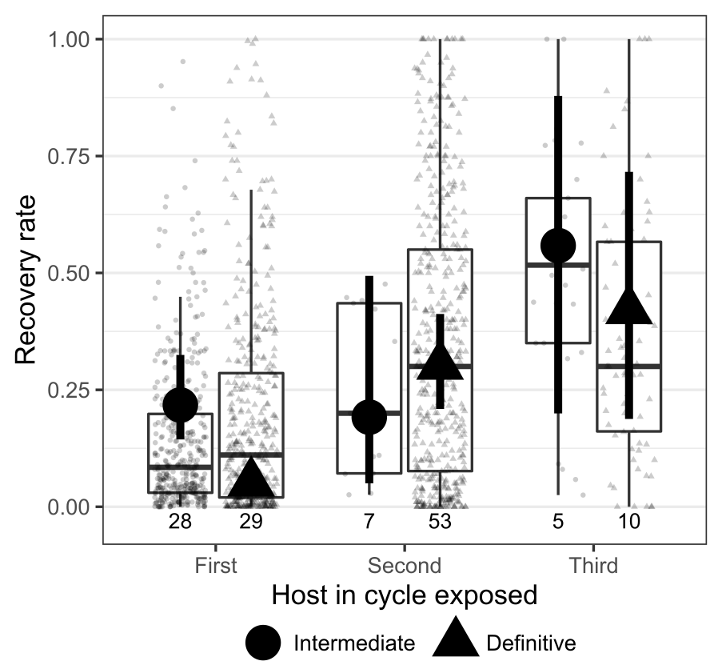

Many parasitic worms have complex life cycles in which they infect multiple hosts in succession. In this repository, we explore the how worm infectivity varies across the stages of a complex life cycle.

# Background

Parasitic worms like acanthocephalans, cestodes, trematodes, and nematodes (i.e. helminths) lead perilous lives. Before reproducing, they successively infect multiple hosts from dissimilar taxa and thus face different physiologies and immune systems. They are usually trophically transmitted, with one host being eaten by the next host, and in extreme cases, worms only reproduce after being transmitted through 4 or 5 hosts. At every step in these complex life cycles, there is a chance that parasites will not encounter or successfully infect the next host, so longer life cycles (i.e. more consecutive hosts) intuitively seem more hazardous than shorter life cycles. The accumulation of risk with multiple transmission steps is a fundamental cost of complex life cycles, but it can be minimized if worms are highly efficient at establishing infection at each step of their life cycle. This is the first study to compare establishment probabilities across multiple parasite life stages.

# Data

The main data source for this study is a [database](https://esajournals.onlinelibrary.wiley.com/doi/full/10.1002/ecy.1680) I published on the life cycles of parasitic worms. Spencer Froelick went through over a thousand studies from this database and extracted helminth recovery rates from experimental infections. Specifically, we recorded recovery rates, the percent of worms recovered from an administered dose. We collected 1659 recovery rates from 153 studies for 127 parasite species (10 acanthocephalans, 29 cestodes, and 88 nematodes), reflecting the experimental exposure of 16,913 individual hosts. The compiled data is [here](data/er_combined.csv).

# Results

We tested whether parasite recovery 1) increases with life cycle progression, 2) increases with worm size, and 3) decreases with host size. Our full analysis can be found [here](analyses/3_establishment_rate_analyses/ER_analysis.md).

Our major findings were that helminth recovery increased with life cycle progression, e.g. worms had better success infecting the second host in their life cycle compared to the first host.

Increased recovery at later life stages appeared to be drive by larval worm size. Bigger worms had higher establishment rates, both within and across life sstages.

We also explored taxonomic bias in our data (see [here](analyses/4_quantifying_taxbias_for_reviewers/explore_biases_fam_lev.md)) and tested whether certain worm families have a disproportionate impact on the results (see [here](analyses/4_quantifying_taxbias_for_reviewers/leave_one_out.md)).

# Conclusions

Helminths have a better chance of establishing infection at each successive life stage. This increase seems to be driven by growth, with larger parasites having higher establishment rates. Thus, growing in the small and short-lived hosts at the start of a complex life cycle, though dangerous, may substantially improve parasites’ chances of completing their life cycle.

# Reference

Froelick, S., Gramolini, L., and Benesh, D.P. 2021. Comparative analysis of helminth infectivity: growth in intermediate hosts increases establishment rates in the next host. Proceedings B. In press.