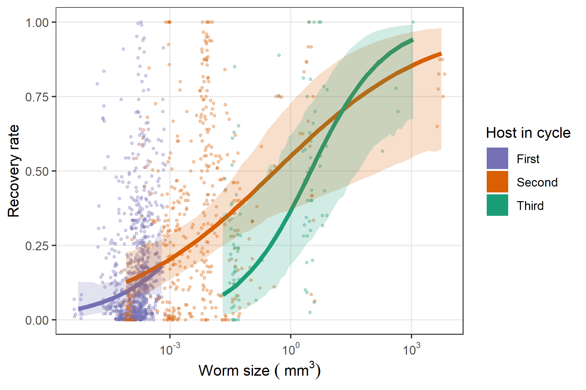

In this repository, we explore the how worm infectivity varies across the stages of a complex life cycle.

# Background

# Data

The main data source for this study is a [database](https://esajournals.onlinelibrary.wiley.com/doi/full/10.1002/ecy.1680) I published on the life cycles of parasitic worms. Spencer Froelick went through over a thousand studies from this database and extracted helminth recovery rates from experimental infections. Specifically, we recorded recovery rates, the percent of worms recovered from an administered dose.

# Results

Recovery increased with life cycle progression.

Mainly because recovery increased with larval worm size.

# Conclusions

# Reference

Add when appropriate...