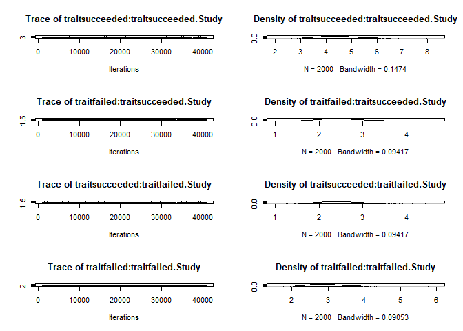
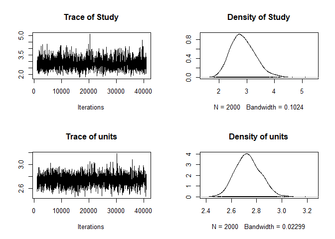
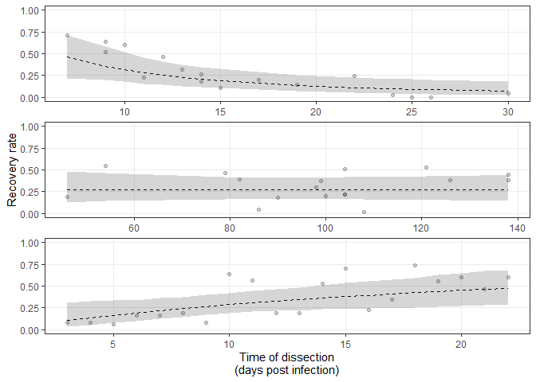
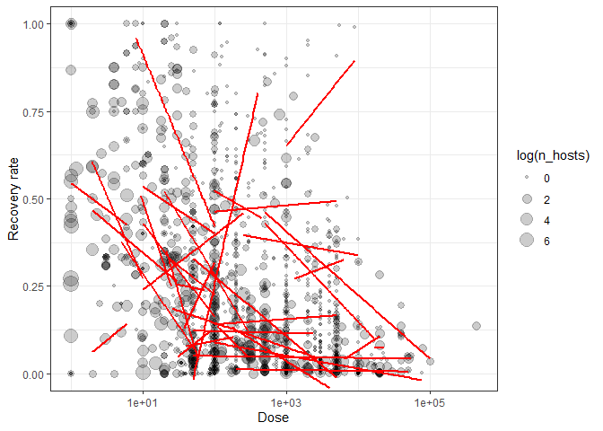
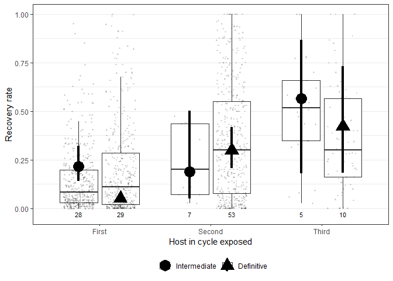

Parasitic worms often have complex life cycles, where they infect multiple hosts in succession before reproducing. Each step in the life cycle involves a risk, as some parasites will fail to infect the next host in the cycle. But is this risk consistent? Using a dataset of experimental infections from over a hundred worms, we examine what impacts how likely it is for parasites to establish infection in their next hosts.


# Descriptive stats

Number of infections (rows):


```
## [1] 2610
```

Number of species:


```
## [1] 127
```
Number of species in each phyla:

<div class="kable-table">

|parasite_phylum | n_distinct(Species)|
|:---------------|-------------------:|
|Acanthocephala  |                  10|
|Nematoda        |                  88|
|Platyhelminthes |                  29|

</div>

Number of stages:


```
## [1] 157
```

Number of studies:


```
## [1] 153
```

Total number of exposed hosts:


```
## [1] 16913
```

Summary of doses:


```
##    Min. 1st Qu.  Median    Mean 3rd Qu.    Max. 
##       1      40     175    5211    2000 1000000
```

Summary of recoveries:


```
##     Min.  1st Qu.   Median     Mean  3rd Qu.     Max. 
##      0.0      3.0     15.0   1179.8     98.9 650000.0
```

Doses and thus recoveries vary over a large range.

# Models

For statistical modeling, we round the number of established/not established worms to integer values. In this way, we can fit logistic regression models, instead of treating recovery rate as a continuous variable.


## Model structure

First, I compare how different model structures perform. I fit models with `MCMCglmm` as it can also be used for phylogenetic analyses.

Here are the different tested models: (1) recovery rate as continuous response, (2) recovery rate as proportion (recovered and not recovered round to integers), (3) bivariate with log recovered and log dose as response variables, (4) bivariate with recovered/not recovered as counts (bivariate poisson). Notably, an error term was included in the GLMM to account for overdispersion (additive overdispersion - equivalent to adding an obs-level random effect to `glmer`). The preliminary models include several presumably important predictors, including time after infection, parasite stage, parasite size, and target host body mass. The models include study as a random effect, but not phylogeny (yet). 


The most complex model (bivariate poisson) had decent mixing for the random effects, so the models did not have fitting issues.

<!-- --><!-- -->

For each model, I extract their predictions.


Then I compare predictions from different models with observed values. The bivariate LMM is the worse - it has many predicted recovery rates above 1.

<!-- -->

When reduced to only plausible values, the univariate GLMM model looks best.

<!-- -->
Residual plots. The bivariate LMM is the worst. The univariate GLMM looks the best.

<!-- -->


Another way to check model fit is to compare the distribution of predictions with that of the observations. Here are density plots for the predicted values. We can see that some models yield predictions more closely matching the data than others, but it is a little hard to tell with the substantial right-skew in the data.

<!-- -->

Here are the distributions overlapping. The univariate GLMM performs best, i.e. it comes closest to the observed data distribution.

<!-- -->

The chains for the variance components in this "best" model mixed fine.

<!-- -->

In these models, we included several presumably important predictors. We test these more formally below, but here's the model summary:


```
## 
##  Iterations = 1001:40981
##  Thinning interval  = 20
##  Sample size  = 2000 
## 
##  DIC: 5420465 
## 
##  G-structure:  ~Study
## 
##       post.mean l-95% CI u-95% CI eff.samp
## Study     2.866    2.024    3.718     1810
## 
##  R-structure:  ~units
## 
##       post.mean l-95% CI u-95% CI eff.samp
## units     2.732    2.543    2.922     1571
## 
##  Location effects: cbind(succeeded, failed) ~ log_dpi + nh_fac * to_int_def + log_ws + log_hm 
## 
##                              post.mean l-95% CI u-95% CI eff.samp  pMCMC    
## (Intercept)                    2.31523  1.40363  3.26195     2000 <5e-04 ***
## log_dpi                       -0.23115 -0.31948 -0.15352     2023 <5e-04 ***
## nh_fac2                       -0.90883 -2.20472  0.32807     2000  0.142    
## nh_fac3                       -0.55404 -2.27676  1.19867     1832  0.515    
## to_int_defDefinitive          -1.63280 -2.29136 -0.99005     2000 <5e-04 ***
## log_ws                         0.36340  0.28322  0.44614     1833 <5e-04 ***
## log_hm                        -0.07099 -0.13513 -0.01321     2000  0.019 *  
## nh_fac2:to_int_defDefinitive   2.48038  1.02370  3.80736     1725 <5e-04 ***
## nh_fac3:to_int_defDefinitive   1.09302 -0.69890  2.76867     1861  0.245    
## ---
## Signif. codes:  0 '***' 0.001 '**' 0.01 '*' 0.05 '.' 0.1 ' ' 1
```

The model suggests that (i) recovery goes down with time post infection, (ii) recovery is higher in second definitive hosts and lower in first definitive hosts, (iii) that large larvae have higher establishment rates, (iv) that establishment is unrelated to host mass, and (v) considerable residual variance is between studies.

## Level of analysis - host or condition?

The data were often collected at the level of individual hosts. For example, a study may have infected 5 hosts and then dissected them at 5 different time points. Or those 5 hosts may have been given different doses. We did not pool these hosts to be at the 'study level' because we wanted to account for variation due to e.g. when hosts were dissected. 

However, some studies had a single condition, such as 100 hosts each receiving 2 worm larva. The results of such an experiment may be reported as a mean abundance (i.e. worms per exposed host). From such results, we know the number of parasites given and the number recovered, but not their distribution among hosts. Such results are at the study level.

Logisitc regression accounts for the number of trials (worms given) and the number of successes (worms recovered), so it should not matter that dataset is a mix of results at the host level and the study level - the trials do not change. Nonetheless, let's compare models fit at either level. We convert the dataframe to the 'condition' level. Any infections within a study using e.g. different host species, doses, or dissection times are kept separate, whereas any infection under the same conditions are pooled.


Now we re-fit the logistic regression from above, but at the 'condition' level. We fit them with `lmer` since this is faster.


The fixed effect parameters are almost identical, even though the model in which rows were sometimes individual hosts have more "observations".

<!-- -->

The estimated SE associated with each term is also the same in the two models.

<!-- -->

The random effects are also very similar, but they differ in ways that we would expect. By pooling, the residual variance goes down because there are fewer points within studies. The between study variance also goes down slightly, presumably because pooling makes the study effects more variable.


```
##  Groups   Name        Std.Dev.
##  obs      (Intercept) 1.6210  
##  study_rs (Intercept) 1.5833
```

```
##  Groups   Name        Std.Dev.
##  obs      (Intercept) 1.480   
##  study_rs (Intercept) 1.338
```

We can also compare the R^2^ of the two models.


They are similar, but pooling reduces the variance explained.

<div class="kable-table">

|       VF|       VR|       VD|       VE| marg_r2| cond_r2| study_var_explained|
|--------:|--------:|--------:|--------:|-------:|-------:|-------------------:|
| 2.246659| 2.506829| 3.289868| 2.627702|   0.211|   0.445|               0.234|
| 1.243675| 1.790191| 3.289868| 2.190458|   0.146|   0.356|               0.210|

</div>

Since we proceed mainly at the condition level, let's re-calculate some of the descriptive statistics. Number of recovery rates (rows):


```
## [1] 1659
```

Number of species:


```
## [1] 127
```

Number of stages:


```
## [1] 157
```

Number of studies:


```
## [1] 153
```

Total number of exposed hosts:


```
## [1] 16913
```
Proportion without worm size:


```
## [1] 0.1440627
```

Proportion without host mass: 


```
## [1] 0.0006027728
```
Proportion without host or parasite size


```
## [1] 0.1446655
```

<div class="kable-table">

|host_type2   | number_exp_hosts|
|:------------|----------------:|
|bird         |             1224|
|fish         |             2720|
|herp         |               67|
|invertebrate |            10358|
|mammal       |             2544|

</div>


## Weights

Most experimental infections are based on single individuals, but some experiments report infection rates from groups of individuals.

<!-- -->


We would like to give experiments with multiple individuals more weight, but it is tricky to know how. Should an infection of 10 hosts have a 10-fold higher weight in the analysis than an infection with one animal? Or 2-fold, if on a log10 scale? Let's try weighting the analysis on a log-10 scale, and then we'll compare a non-phylogenetic model with and without weighting.


The fixed effects are essentially identical in the models with or without weighting, either at the host and condition level.

<!-- -->

Or at the condition level. 

<!-- -->

The estimated SE associated with each term is also the same in the two models.

<!-- -->

Maybe weights have little impact because they are unrelated to recovery rate. Experiments given higher weights are not more likely to have a high or low recovery rate.

<!-- -->

Given that (i) it is not clear how to weight by sample size and (ii) it doesn't affect the parameters, I proceed without weighting by sample size.


## Random slopes

### Time of dissection 

We did not average at the study level, because there are some important sources of variation within studies, like different dissection times. In the previous models, we fit a single time-dependent decrease in recovery. This may be a little disingenuous because different parasite species or stages may be lost from hosts at different rates. Here is the relationship over the full data (infections pooled at condition level): 

<!-- -->

As expected, recovery rates go down with days post infection, but there is a lot of variation. Also, it is not clear that the relationship is linear. For example, the dashed line is the relationship with log time, which assume that hazards are exponential (i.e. they don't accumulate linearly).

Given that hosts were dissected on different time schedules in different studies, each study could have a different relationship with time. Here is a plot showing time-dependent recovery in 49 studies. We see that the relationship is usually linear, though sometimes the log relationship fits better (dashed lines). We can also see that sometimes there is a negative relationship, sometimes none, and sometimes a positive relationship.

<!-- -->

Thus, let's compare three models: 1) studies differ but have the same time effect (random intercepts), 2) study x time (random slopes), and 3) study x log time.


The random slopes model was a clear improvement, regardless whether time was untransformed...

<div class="kable-table">

|      | npar|      AIC|      BIC|    logLik| deviance|    Chisq| Df| Pr(>Chisq)|
|:-----|----:|--------:|--------:|---------:|--------:|--------:|--:|----------:|
|m2_ri |   11| 15704.84| 15762.67| -7841.420| 15682.84|       NA| NA|         NA|
|m2_rs |   13| 15635.17| 15703.52| -7804.586| 15609.17| 73.66744|  2|          0|

</div>

...or log transformed.

<div class="kable-table">

|       | npar|      AIC|      BIC|    logLik| deviance|    Chisq| Df| Pr(>Chisq)|
|:------|----:|--------:|--------:|---------:|--------:|--------:|--:|----------:|
|m2_ril |   11| 15730.87| 15788.70| -7854.435| 15708.87|       NA| NA|         NA|
|m2_rsl |   13| 15621.70| 15690.05| -7797.849| 15595.70| 113.1716|  2|          0|

</div>

The random slopes model with log time was also a better fit than the model with untransformed time.

<div class="kable-table">

|       | npar|      AIC|      BIC|    logLik| deviance|   Chisq| Df| Pr(>Chisq)|
|:------|----:|--------:|--------:|---------:|--------:|-------:|--:|----------:|
|m2_rs  |   13| 15635.17| 15703.52| -7804.586| 15609.17|      NA| NA|         NA|
|m2_rsl |   13| 15621.70| 15690.05| -7797.849| 15595.70| 13.4733|  0|          0|

</div>

Calculating R^2^ values for random slope models is more complex than for random intercept models, because the variance explained by the random effects depends on the levels of the random effect (Study) *and* the covariate values (time). We modified code given [here](https://besjournals.onlinelibrary.wiley.com/doi/full/10.1111/2041-210X.12225) to calculate R^2^ for random slope models. We can see how the conditional R^2^ goes up as we include random slopes, though it does not increase further when we use with log time. The reason is that the overall error variance goes down when we use log time, but so does the variance between studies. This suggests that using log time better accounts for variation within studies, thereby reducing the differences between studies.

<div class="kable-table">

|step                   | df_used|       VF|       VR|       VD|       VE| marg_r2| cond_r2| study_var_explained|
|:----------------------|-------:|--------:|--------:|--------:|--------:|-------:|-------:|-------------------:|
|random int             |      NA| 1.350696| 1.852397| 3.289868| 2.135002|   0.157|   0.371|               0.214|
|random slope           |       0| 1.235380| 2.834618| 3.289868| 1.851324|   0.134|   0.442|               0.308|
|random slope, log time |       0| 1.218904| 3.106573| 3.289868| 1.756758|   0.130|   0.462|               0.332|

</div>

Here is the summary of the simplest random slopes model (i.e. just time, study, and their interaction). Interestingly, the fixed effect of dpi is only weakly negative. Both the random intercept term (studies differ in mean recovery) and the random slope term (studies differ in how recovery changes with time) are positive. The covariance tends to be negative, indicating that studies with above average recoveries tend to be associated with stronger decreases over time. Conversely, if recovery is low to begin with, then it has more of a chance to increase (positive slopes).


```
## Generalized linear mixed model fit by maximum likelihood (Laplace
##   Approximation) [glmerMod]
##  Family: binomial  ( logit )
## Formula: cbind(succeeded, failed) ~ log_dpi + (1 + log_dpi | study_rs) +  
##     (1 | obs)
##    Data: filter(datx, !is.na(log_ws), !is.na(log_hm))
## 
##      AIC      BIC   logLik deviance df.resid 
##  15701.2  15732.8  -7844.6  15689.2     1413 
## 
## Scaled residuals: 
##      Min       1Q   Median       3Q      Max 
## -1.55106 -0.06584  0.00171  0.04310  1.61259 
## 
## Random effects:
##  Groups   Name        Variance Std.Dev. Corr 
##  obs      (Intercept) 1.8636   1.3652        
##  study_rs (Intercept) 7.2130   2.6857        
##           log_dpi     0.5684   0.7539   -0.79
## Number of obs: 1419, groups:  obs, 1419; study_rs, 146
## 
## Fixed effects:
##             Estimate Std. Error z value Pr(>|z|)   
## (Intercept)  -0.9133     0.3210  -2.845  0.00444 **
## log_dpi      -0.1671     0.0919  -1.819  0.06896 . 
## ---
## Signif. codes:  0 '***' 0.001 '**' 0.01 '*' 0.05 '.' 0.1 ' ' 1
## 
## Correlation of Fixed Effects:
##         (Intr)
## log_dpi -0.873
```

This plot shows how slopes and intercepts are negatively related at the level of study. This correlation, though, disappears when the time variable is centered (not shown).

<!-- -->

Since the random slopes model appears to be superior, let's check the predictions. Here are the random slope predictions within studies. The model seems to capture the relationships well.

<!-- -->

The number of studies where recovery increases looks similar to the number that decreases. Let's check each study individually. Here are the number of studies with at least 4 dissection times


```
## [1] 84
```

We fit a simple logistic regression to each one to test whether recovery usually increases or decreases over time.


Here's the distribution of regression coefficients.

<!-- -->

There were more studies with negative coefficients than positive coefficients, but not many. Negative coefficients (decreased recover over time) were a bit more likely to be statistically significant (P < 0.001) than positive coefficients.

<div class="kable-table">

|beta_dir |  n| sigs| perc_sig|
|:--------|--:|----:|--------:|
|neg      | 46|   37|    0.804|
|pos      | 38|   25|    0.658|

</div>

How quickly recovery decreases with time is not dependent on life stage, so e.g. recovery does not decrease faster for worms in the second host compared to the first host.

<!-- -->

One worry is if model fit varies with time post exposure, such as if there was systemic undercounting in early dissections. The residual plots across studies do not suggest that recovery rates are over- or underestimated at different dpi.

<!-- -->

Let's make some plots with CIs for the change in recovery with time. We'll use `MCMCglmm` to fit the models.


Here is the overall decrease in recovery with time, as predicted by the random intercepts model.

<!-- -->

Here is the same plot but the predictions are from the random slopes model. They are similar, though the CI is wider in the random slopes model.


<!-- -->


We can also pick a few studies for a manuscript figure that illustrates the different time by recovery relationships.


<!-- -->


### Dose

Another researcher-controlled variable that varied within studies was dose. Some studies used multiple doses. Recovery rates might increase with dose (e.g. more worms overwhelm immune responses) or decrease with dose (competition among parasites, increased immune response). Here's how the pattern looks across the studies with multiple doses. Often the relationship is flat or decreasing. And it is usually linear as log-transforming dose did not provide a better fit in most cases.

<!-- -->

However, across the whole data dose varies by several orders of magnitude, so a linear relationship (solid line) does not fit the data well. Dose probably needs to be log-transformed for analyses. 

<!-- -->

Here is the same plot, but with the x-axis log transformed. The relationship between recovery and log dose (dashed line) fits better. Higher doses are associated with lower recovery. This suggests that researchers use higher doses when lower recovery rates are expected *OR* that higher doses cause lower recovery. 

<!-- -->

At least within studies, higher doses seem to cause lower recovery. The red lines on the next plot are the fits for each study and they are often negative.

<!-- -->

Given the broad range of doses, it is probably better to use log dose in the analyses. For example, when we add untransformed dose as a fixed effect to the random-intercpt model we fitted above, the effect is weak.

<div class="kable-table">

|       | npar|      AIC|      BIC|    logLik| deviance|    Chisq| Df| Pr(>Chisq)|
|:------|----:|--------:|--------:|---------:|--------:|--------:|--:|----------:|
|m2_ril |   11| 15730.87| 15788.70| -7854.435| 15708.87|       NA| NA|         NA|
|m2_rid |   12| 15729.12| 15792.22| -7852.561| 15705.12| 3.747499|  1|  0.0528866|

</div>

But it is very clear with log-transformed dose.

<div class="kable-table">

|        | npar|      AIC|     BIC|    logLik| deviance|    Chisq| Df| Pr(>Chisq)|
|:-------|----:|--------:|-------:|---------:|--------:|--------:|--:|----------:|
|m2_ril  |   11| 15730.87| 15788.7| -7854.435| 15708.87|       NA| NA|         NA|
|m2_rild |   12| 15649.11| 15712.2| -7812.555| 15625.11| 83.76094|  1|          0|

</div>

A random slopes model with untransformed dose also has numerical issues with fitting, so I continue with log dose.


Let's compare three models: 1) studies differ but have the same dose relationship (random intercepts), 2) study x dose (random slopes), and 3) with both random slopes terms (dose and dpi).


Adding a dose random slopes term to a random intercept model is an improvement...

<div class="kable-table">

|        | npar|      AIC|      BIC|    logLik| deviance|    Chisq| Df| Pr(>Chisq)|
|:-------|----:|--------:|--------:|---------:|--------:|--------:|--:|----------:|
|m2_rild |   12| 15649.11| 15712.20| -7812.555| 15625.11|       NA| NA|         NA|
|m2_rsd  |   14| 15587.66| 15661.27| -7779.829| 15559.66| 65.45142|  2|          0|

</div>

...as is adding the dose random slopes term to a model that already includes a random slopes term for time dpi.

<div class="kable-table">

|                                 | npar|      AIC|      BIC|    logLik| deviance|    Chisq| Df| Pr(>Chisq)|
|:--------------------------------|----:|--------:|--------:|---------:|--------:|--------:|--:|----------:|
|update(m2_rsl, . ~ . + log_dose) |   14| 15540.37| 15613.97| -7756.183| 15512.37|       NA| NA|         NA|
|m2_rs2                           |   17| 15479.02| 15568.40| -7722.512| 15445.02| 67.34315|  3|          0|

</div>

The main effect of dose explains about 4% of variation in recovery, whereas the random slopes explains just 1-2%. By contrast, dissection time random effect explains more of the variation within studies (~10%). This suggests that studies with different recovery rates use different doses and that dose explains relatively little variation within studies.

<div class="kable-table">

|step                             | df_used|       VF|       VR|       VD|       VE| marg_r2| cond_r2| study_var_explained|
|:--------------------------------|-------:|--------:|--------:|--------:|--------:|-------:|-------:|-------------------:|
|random int, without dose         |      NA| 1.243871| 1.790912| 3.289868| 2.191131|   0.146|   0.356|               0.210|
|random int, dose main effect     |       1| 1.616886| 1.800281| 3.289868| 2.031410|   0.185|   0.391|               0.206|
|random slope for dose            |       0| 1.221477| 2.232896| 3.289868| 1.872814|   0.142|   0.401|               0.259|
|two random slopes, dose and time |       0| 1.239866| 3.820611| 3.289868| 1.474024|   0.126|   0.515|               0.389|

</div>

Let's check the predictions. Here are the predicted recoveries given the study by dose interaction (no fixed effects). They look good, but it is also clear that these relationships vary less than the study x time relationships.


<!-- -->

Like we did for dissection times, let's fit a logistic regression to each study with at least 4 different doses. There are only 27 of these studies.


```
## [1] 27
```

We fit a simple logistic regression to each one to test whether recovery usually increases or decreases over time.


Here's the distribution of regression coefficients. There's a negative skew.

<!-- -->

There were twice as many studies with negative coefficients than positive coefficients, and they were much more likely to be considered significant (P < 0.001).

<div class="kable-table">

|beta_dir |  n| sigs| perc_sig|
|:--------|--:|----:|--------:|
|neg      | 18|   15|    0.833|
|pos      |  9|    5|    0.556|

</div>

So dose explains some variation within studies, but much less than dissection time. And dose seems to explain a fair amount of the differences between studies. However, this is also the main variation we are trying to parse. I think that doses are chosen in response to different recovery rates by researchers, not the other way around (i.e. using high doses is not why recovery rates are lower).

Since dose is incorporated into the response variable and since it probably does not cause the large variation across studies by itself, I leave it out of the main models, but consider it again at the end of the notebook.

## Phylogenetic model

Now let's add phylogeny into the model. We fit `MCMCglmm` models because it can incorporate phylogeny as random effects (phylogenetic covariance matrix). We want to assess whether phylogeny accounts for variation beyond study, since studies are usually on one species or a few closely related species. 

But first, let's compare the 3 major helminth groups to see if the main trends (shown later) are robust across taxa.


Recovery increases with life cycle progression, though in acanths and cestodes establishment in the third host is not necessarily better than in the second host.

<!-- -->
In all groups, establishment increases with worm size.

<!-- -->
And there was a weak tendency for establishment to decrease with host size within life stages but not across them.

<!-- -->

So it does not look like there are big effects at the highest taxonomic level. Now we'll add phylogeny to the model three ways: 1) by itself, 2) to a model with just the study effect, and 3) to a model with study and the main fixed effects. This tests whether phylogeny explains variation alone, beyond study, and beyond life cycle characteristics, respectively. 


When we compare models with DIC, we find that a model with just a phylogenetic effect is not clearly better than one with just a study effect (random intercept).


```
## delta DIC, study-only (random intercept) vs phylogeny-only model: -3.94 (higher is better)
```

Adding phylogeny to the random slopes model is also not an obvious improvement


```
## delta DIC, study-only (random slopes) vs phylogeny+random slopes: 1.45 (higher is better)
```

And here's what happens when we add phylogeny to the model with several fixed effects (stage, worm and host size).


```
## delta DIC, without vs with phylogeny when fixed effects in model: 2.92 (higher is better)
```

In the phylogeny-only model, the phylogeny variance component is very large relatively to the residual variance, it is almost certainly inflated. Maybe some branches are associated with complete separation (100% recovery rates).

<!-- -->
When we add phylogeny to the random slopes model, it is much lower and not clearly different from zero, either without fixed effects...

<!-- -->

...or with fixed effects.

<!-- -->

The phylogenetic effect competes with the study effect - when we add phylogeny to a model with just study (random intercept) their variance components are negatively correlated (not shown). This makes sense. A given study usually focused on a single parasite species, so phylogeny and study should explain some of the same variation. 

One way to check this is to see whether 1 study corresponds to 1 species.


Most species (75.6%) were represented by a single study, but for 31 species, recovery rates were obtained from multiple studies.


An even higher percent of life stages (80.9%) were represented by a single study, suggesting some species have multiple studies in the data because the different studies cover different life stages.

Therefore, we would expect models that use species as the random effect to be very comparable to models with study as the random effect. To check, we fit models with just a study or species random effect (no fixed effects) and then calculate how much variation is explained by each.


Study alone explained more variation than species alone.


```
## Variance explained by study: 0.32
```

```
## Variance explained by species: 0.22
```
This makes sense because different stages from the same species can have quite different establishment rates and experiments with different stages are usually from different studies. When we use the combination of species and stage, the variance explained increases, but it is still less than study alone.


```
## Variance explained by species-stage: 0.27
```
When we add species or species-stage to the study-only model, the explained variance increases only slightly, suggesting species does not explain much variation beyond that accounted for by study.


```
## Variance explained by study and species together: 0.33
```

```
## Variance explained by study and species-stage together: 0.33
```
Surprisingly, though, the likelihood ratio test comparing a "study" model and a "study + species-stage" model was significant, suggesting that the multiple studies from a given species might be consistent. 

<div class="kable-table">

|     | npar|      AIC|      BIC|    logLik| deviance|    Chisq| Df| Pr(>Chisq)|
|:----|----:|--------:|--------:|---------:|--------:|--------:|--:|----------:|
|m1   |    3| 15842.53| 15858.30| -7918.263| 15836.53|       NA| NA|         NA|
|m3.1 |    4| 15828.59| 15849.62| -7910.293| 15820.59| 15.94122|  1|   6.53e-05|

</div>
Here is an attempt to plot this result. The plot shows the life stages, for which there were multiple studies in the data. The smaller black points are the recovery rates from within each study (e.g., different time points post infection), whereas the larger blue points are the average recovery rate for a study. Sometimes the points cluster (indicating a species identity effect) but sometimes they do not (implying a study effect).

<!-- -->

Some of the similarity among life stages across studies is probably due to a stage's characteristics, like parasite size and host size. Therefore, let's again add species, but now to a model with fixed effects like time post infection, stage, worm size, and host size.


As before, species identity does not explain much (residual) variation beyond stage.


```
## Variance explained by study: 0.25
```

```
## Variance explained by study and species-stage together: 0.26
```
Yet adding it still improves the model slightly.

<div class="kable-table">

|        | npar|      AIC|      BIC|    logLik| deviance|    Chisq| Df| Pr(>Chisq)|
|:-------|----:|--------:|--------:|---------:|--------:|--------:|--:|----------:|
|m1_fe   |   11| 15730.87| 15788.70| -7854.435| 15708.87|       NA| NA|         NA|
|m3_fe.1 |   12| 15725.62| 15788.72| -7850.812| 15701.62| 7.247082|  1|  0.0071016|

</div>
We would expect fixed effects to explain some of the differences between species, so we expect the variance component for species to decrease. Indeed it does.


```
## Variance component for species-stage without fixed effects: 0.603 
##  Variance component for species-stage with fixed effects: 0.304 
##  Percent decrease: 0.5
```
By contrast, the study effect decreased much less.


```
## Variance component for study without fixed effects: 2.107 
##  Variance component for study with fixed effects: 1.593 
##  Percent decrease: 0.24
```
Thus, much of the consistency in establishment across studies for a given species is explained by things like host number, worm size, etc. We should keep this in mind for the phylogenetic models, which also include 'species' as the tips of the phylogeny. Returning to the phylogenetic models...

Let's compare R^2^ values for the models with and without phylogeny.


Weirdly, the R^2^ table suggests phylogeny alone has a huge effect compared to study alone (with or without random slopes). This is due to the very large variance component for the phylogenetic effect.


<div class="kable-table">

|model                   |r2m                 |r2c                 |
|:-----------------------|:-------------------|:-------------------|
|study only, random int  |0.011 [0.004-0.021] |0.324 [0.265-0.384] |
|study only, rand slopes |0.005 [0-0.023]     |0.437 [0.374-0.502] |
|phylogeny only          |0 [0-0]             |0.672 [0.523-0.793] |

</div>

This seeming importance of phylogeny disappears when we add it to a model with random slopes. It explains little variation beyond that explained by the study effect.

<div class="kable-table">

|model                   |r2m             |r2c                 |
|:-----------------------|:---------------|:-------------------|
|study only, rand slopes |0.005 [0-0.023] |0.437 [0.374-0.502] |
|rand slopes + phylogeny |0.004 [0-0.019] |0.478 [0.401-0.576] |

</div>

Phylogeny might account for some variation beyond that explained by study in a model with multiple fixed effects. However, this phylogenetic effect bordered zero.

<div class="kable-table">

|model                                     |r2m                 |r2c                 |
|:-----------------------------------------|:-------------------|:-------------------|
|random slopes + fixed effects             |0.127 [0.082-0.181] |0.47 [0.407-0.538]  |
|random slopes + fixed effects + phylogeny |0.168 [0.114-0.231] |0.574 [0.482-0.686] |

</div>

I would not actually predict a strong phylogenetic effect, because different life stages from closely related species might have very different infection probabilities. Also, recovery rates are variable and measured with considerable error, making phylogenetic effects harder to detect. 

Since "study" and "species" overlap substantially, maybe we should just look at higher taxonomic levels. Since studies usually focus on the same species, maybe we can detect taxonomic/phyla effects by looking at whether e.g. parasite families have similar recovery rates across studies. To test this, we replace parasite phylogeny with taxonomy in the model, but only the higher taxonomic levels (i.e. phylum, class, order, and family - presumably those levels won't overlap much with the study effect). 


When we fit that model, we see that the taxonomic effects are usually near zero. This suggests species from the same order, family, etc. do not have more similar recovery rates than we would expect.

<!-- -->

Here is the change in DIC when adding taxonomy to a model with fixed effects.


```
## delta DIC, random slopes&fixed effx vs +taxonomy: 2.15 (higher is better)
```

And the R^2^ values goes up when we add taxonomy, though the conditional R^2^ has a wide range because the taxonomic effects were hard to estimate.


<div class="kable-table">

|model                                    |r2m                 |r2c                 |
|:----------------------------------------|:-------------------|:-------------------|
|random slopes + fixed effects            |0.127 [0.082-0.181] |0.47 [0.407-0.538]  |
|random slopes + fixed effects + taxonomy |0.124 [0.008-0.202] |0.618 [0.473-0.978] |

</div>

When we fit the taxonomic model with `lmer` and then perform a likelihood ratio test to see if adding taxonomy improves the model, it is not significant.

<div class="kable-table">

|          | npar|      AIC|      BIC|    logLik| deviance|    Chisq| Df| Pr(>Chisq)|
|:---------|----:|--------:|--------:|---------:|--------:|--------:|--:|----------:|
|m2_rsl    |   13| 15621.70| 15690.05| -7797.849| 15595.70|       NA| NA|         NA|
|m2_rs_tax |   17| 15628.41| 15717.80| -7797.207| 15594.41| 1.283706|  4|   0.864134|

</div>

The variance components for study and most higher taxonomic levels are uncorrelated, with the exception of parasite family (some studies might be the only ones on a particular worm family). This suggests the negative correlation between study and phylogenetic effects in the previous models is due to the same species/genera being studied.


```
##                                  (Intercept):(Intercept).study_rs
## (Intercept):(Intercept).study_rs                             1.00
## log_dpi:(Intercept).study_rs                                -0.94
## (Intercept):log_dpi.study_rs                                -0.94
## log_dpi:log_dpi.study_rs                                     0.75
## parasite_phylum                                              0.05
## parasite_class                                               0.02
## parasite_order                                               0.09
## parasite_family                                             -0.10
## units                                                       -0.20
##                                  log_dpi:(Intercept).study_rs
## (Intercept):(Intercept).study_rs                        -0.94
## log_dpi:(Intercept).study_rs                             1.00
## (Intercept):log_dpi.study_rs                             1.00
## log_dpi:log_dpi.study_rs                                -0.91
## parasite_phylum                                         -0.03
## parasite_class                                           0.00
## parasite_order                                          -0.09
## parasite_family                                          0.01
## units                                                    0.21
##                                  (Intercept):log_dpi.study_rs
## (Intercept):(Intercept).study_rs                        -0.94
## log_dpi:(Intercept).study_rs                             1.00
## (Intercept):log_dpi.study_rs                             1.00
## log_dpi:log_dpi.study_rs                                -0.91
## parasite_phylum                                         -0.03
## parasite_class                                           0.00
## parasite_order                                          -0.09
## parasite_family                                          0.01
## units                                                    0.21
##                                  log_dpi:log_dpi.study_rs parasite_phylum
## (Intercept):(Intercept).study_rs                     0.75            0.05
## log_dpi:(Intercept).study_rs                        -0.91           -0.03
## (Intercept):log_dpi.study_rs                        -0.91           -0.03
## log_dpi:log_dpi.study_rs                             1.00            0.01
## parasite_phylum                                      0.01            1.00
## parasite_class                                      -0.02            0.03
## parasite_order                                       0.03            0.01
## parasite_family                                      0.02           -0.03
## units                                               -0.22           -0.03
##                                  parasite_class parasite_order parasite_family
## (Intercept):(Intercept).study_rs           0.02           0.09           -0.10
## log_dpi:(Intercept).study_rs               0.00          -0.09            0.01
## (Intercept):log_dpi.study_rs               0.00          -0.09            0.01
## log_dpi:log_dpi.study_rs                  -0.02           0.03            0.02
## parasite_phylum                            0.03           0.01           -0.03
## parasite_class                             1.00           0.09            0.03
## parasite_order                             0.09           1.00            0.15
## parasite_family                            0.03           0.15            1.00
## units                                     -0.03          -0.07           -0.02
##                                  units
## (Intercept):(Intercept).study_rs -0.20
## log_dpi:(Intercept).study_rs      0.21
## (Intercept):log_dpi.study_rs      0.21
## log_dpi:log_dpi.study_rs         -0.22
## parasite_phylum                  -0.03
## parasite_class                   -0.03
## parasite_order                   -0.07
## parasite_family                  -0.02
## units                             1.00
```

Here's a plot showing how the VC estimates for parasite order are unrelated to those for study.

<!-- -->

We can also make a plot to confirm that recovery rates do not vary with taxonomy. Let's look at parasite families. The black points are observed recovery rates, while the red points are the medians for the family. It looks like some families might have higher infection rates than others, but recall that these may be single studies.

<!-- -->

When we take the average recovery for a study, then the differences among parasite families are much less conspicuous.

<!-- -->

When we make the same plot for parasite orders, which is less confounded with "study", we see few compelling differences.

<!-- -->

What about the fixed effects? Are they the same with or without a phylogenetic random effect? They are rather tightly correlated, suggesting that a model with or without phylogeny will not impact the conclusions.


<!-- -->

So, phylogeny does not have a clear effect on recovery, at least independent from study effects. Since phylogeny (1) does not affect the fixed effects, (2) is hard to estimate, and (3) intuitively should be low in this dataset, we leave it out of the main analysis.

# Model series for hypothesis testing

We now want to build a series of models. We'll use our random slopes model as the "base" model: it includes just study and days until dissection. We then add terms to this model to test explicit hypotheses. 

Here is the base model summary:


```
## 
##  Iterations = 1001:40981
##  Thinning interval  = 20
##  Sample size  = 2000 
## 
##  DIC: 5561848 
## 
##  G-structure:  ~us(1 + log_dpi):study_rs
## 
##                                  post.mean l-95% CI u-95% CI eff.samp
## (Intercept):(Intercept).study_rs    7.2501    3.966  10.6561     1852
## log_dpi:(Intercept).study_rs       -1.6283   -2.544  -0.8279     1834
## (Intercept):log_dpi.study_rs       -1.6283   -2.544  -0.8279     1834
## log_dpi:log_dpi.study_rs            0.6075    0.361   0.8684     1822
## 
##  R-structure:  ~units
## 
##       post.mean l-95% CI u-95% CI eff.samp
## units      1.88     1.71    2.062     1349
## 
##  Location effects: cbind(succeeded, failed) ~ log_dpi 
## 
##             post.mean l-95% CI u-95% CI eff.samp pMCMC   
## (Intercept)  -0.91497 -1.54247 -0.28684     2261 0.010 **
## log_dpi      -0.16579 -0.35403  0.02361     2000 0.081 . 
## ---
## Signif. codes:  0 '***' 0.001 '**' 0.01 '*' 0.05 '.' 0.1 ' ' 1
```

Now let's get to hypothesis testing. Throughout we use the random slopes model with log-transformed time.

### Hypothesis 1: recovery rates are higher later in the life cycle

First, we test whether parasite life stage impacts establishment, specifically whether the parasite is infecting the first, second, third host, etc. To test this, we add 'step in cycle' to model.


When we look at the parameter estimates, we see that recovery is significantly higher in second hosts than first hosts. The difference between second and third hosts is not significant.


```
## 
##  Iterations = 1001:40981
##  Thinning interval  = 20
##  Sample size  = 2000 
## 
##  DIC: 5561849 
## 
##  G-structure:  ~us(1 + log_dpi):study_rs
## 
##                                  post.mean l-95% CI u-95% CI eff.samp
## (Intercept):(Intercept).study_rs    6.2009   3.3493   9.3379     1615
## log_dpi:(Intercept).study_rs       -1.4274  -2.2672  -0.6765     1833
## (Intercept):log_dpi.study_rs       -1.4274  -2.2672  -0.6765     1833
## log_dpi:log_dpi.study_rs            0.5449   0.3159   0.8008     2000
## 
##  R-structure:  ~units
## 
##       post.mean l-95% CI u-95% CI eff.samp
## units     1.889    1.724    2.067     1553
## 
##  Location effects: cbind(succeeded, failed) ~ log_dpi + nh_fac 
## 
##             post.mean  l-95% CI  u-95% CI eff.samp  pMCMC    
## (Intercept) -1.608839 -2.270255 -0.935777     1761 <5e-04 ***
## log_dpi     -0.172243 -0.350553  0.003743     2000  0.057 .  
## nh_fac2      1.220776  0.651433  1.898711     2000 <5e-04 ***
## nh_fac3      1.960221  0.800342  3.005167     1812 <5e-04 ***
## ---
## Signif. codes:  0 '***' 0.001 '**' 0.01 '*' 0.05 '.' 0.1 ' ' 1
```

Model DIC is not much better with parasite stage, although the term was significant.


```
## delta DIC, with and without 'next host': -0.93 (higher is better)
```

The R^2^ table elucidates this contradiction. The overall model fit is not better. Instead, the fixed effect of stage now explains about 5% of the variation, which was subtracted from the "study" variation. In essence, different studies usually focus on different life stages, which in turn differ in their infection rates.

<div class="kable-table">

|model                        |r2m                 |r2c                 |
|:----------------------------|:-------------------|:-------------------|
|base random slopes, log time |0.005 [0-0.023]     |0.437 [0.374-0.502] |
|parasite stage               |0.059 [0.023-0.107] |0.431 [0.37-0.495]  |

</div>

So life cycle step is important in determining infection rates. Let's plot the predicted means for different life stages at day one post infection (the intercept). Recovery rates increase with life cycle length, but the difference between 2nd and 3rd stage larva is not clear, since CIs overlap. For all stages, predicted recoveries are higher than observed ones. This is because most hosts were dissected after several days or even weeks.


<!-- -->

When we plot the predictions at the median time of dissection (18 days), then predictions better match observed medians.


<!-- -->

Here are those predicted means:

<div class="kable-table">

|nh_fac |       fit|       lwr|       upr|
|:------|---------:|---------:|---------:|
|1      | 0.1084487| 0.0730624| 0.1585340|
|2      | 0.2919546| 0.2140211| 0.3948156|
|3      | 0.4658982| 0.2481689| 0.7080224|

</div>

The differences among life stages were similar when estimated 1 or 18 dpi (though the CIs are obviously lower at the median of 18 dpi) because dissection times did not differ much among life stages.

<!-- -->

### Hypothesis 2: recovery rates differ in intermediate vs definitive hosts

The first host in a cycle can be an intermediate host (in a complex cycle) or a definitive host (in a direct cycle). Does this matter? To test this hypothesis, we distinguish between cases where worms infect intermediate vs definitive hosts. Before entering this term into a model, let's make sure that there are enough species and studies at each combination of life stage and host type. Here are the number of species in the different combinations. There are fewer intermediate host infections later in the life cycle, as expected.


```
##       to_int_def
## nh_fac Intermediate Definitive
##      1           28         29
##      2            7         53
##      3            5         10
```

Here are the number of studies:


```
##       to_int_def
## nh_fac Intermediate Definitive
##      1           33         34
##      2            9         57
##      3            5         11
```

Both tables suggest that there are several species and studies in each combination of life stage and int/def, so it is reasonable to add it to the mixed model.


The model suggests parasites have lower recovery rates in definitive hosts than in intermediate hosts.


```
## 
##  Iterations = 1001:40981
##  Thinning interval  = 20
##  Sample size  = 2000 
## 
##  DIC: 5561847 
## 
##  G-structure:  ~us(1 + log_dpi):study_rs
## 
##                                  post.mean l-95% CI u-95% CI eff.samp
## (Intercept):(Intercept).study_rs    6.9402    4.017  10.4417     1262
## log_dpi:(Intercept).study_rs       -1.5172   -2.325  -0.7194     1709
## (Intercept):log_dpi.study_rs       -1.5172   -2.325  -0.7194     1709
## log_dpi:log_dpi.study_rs            0.5677    0.341   0.8148     1644
## 
##  R-structure:  ~units
## 
##       post.mean l-95% CI u-95% CI eff.samp
## units     1.811    1.656     1.99     1740
## 
##  Location effects: cbind(succeeded, failed) ~ log_dpi + nh_fac + to_int_def 
## 
##                      post.mean  l-95% CI  u-95% CI eff.samp  pMCMC    
## (Intercept)          -0.883051 -1.618425 -0.114897     2000  0.027 *  
## log_dpi              -0.182600 -0.358241  0.006125     2000  0.048 *  
## nh_fac2               1.712861  1.009570  2.369527     2000 <5e-04 ***
## nh_fac3               2.219322  1.063941  3.357428     1766 <5e-04 ***
## to_int_defDefinitive -1.333255 -1.846001 -0.863436     1843 <5e-04 ***
## ---
## Signif. codes:  0 '***' 0.001 '**' 0.01 '*' 0.05 '.' 0.1 ' ' 1
```

Model DIC is not much better though.


```
## delta DIC, with int vs def: 2.25 (higher is better)
```

Nor is it clear that recovery rates at a given life stage depend on whether the host is an intermediate or definitive host.


```
## delta DIC, with stage x int/def interaction: 1.63 (higher is better)
```

Here's how R^2^ changes. Like for parasite stage, the total variance explained does not increase much by adding the intermediate vs definitive host distinction, but more variation is attributed to the fixed effects.

<div class="kable-table">

|model                 |r2m                 |r2c                 |
|:---------------------|:-------------------|:-------------------|
|base + parasite stage |0.059 [0.023-0.107] |0.431 [0.37-0.495]  |
|+ to int vs def       |0.08 [0.044-0.131]  |0.475 [0.412-0.541] |
|+ stage by int vs def |0.096 [0.056-0.146] |0.487 [0.424-0.547] |

</div>

And here's the plot. Predicted means are at the median dissection time (18 dpi). Infections of first intermediate hosts are more successful than infection of first definitive hosts. But the opposite is true for second hosts.


<!-- -->

The higher recovery in first or second intermediate hosts might be due to being dissected later, i.e. the model thinks the observed recovery rates are lower than they would be if they were dissected earlier.

<!-- -->
Here are the median dissection times.

<div class="kable-table">

|nh_fac |to_int_def   | dpi|
|:------|:------------|---:|
|1      |Intermediate |  21|
|1      |Definitive   |  14|
|2      |Intermediate |  30|
|2      |Definitive   |  22|
|3      |Intermediate |  14|
|3      |Definitive   |  15|

</div>

But it likely is due to worms having larger infective stages when the next host is the definitive host.

<!-- -->

Thus, this term needs to be disentangled from our next model predictor, worm size. But before moving onto that, let's make a manuscript figure.


<!-- -->

### Hypothesis 3: recovery rates increase with worm size

Since later life stages targeting definitive hosts have better establishment rates, is this because they are larger? Let's add the size of infective parasite stages into the model. Moreover, if worm size drives the pattern, we expect the effect of "step" and the "int vs def" distinction to decrease once size is added. And there should not be an interaction between next host and parasite size.


The worm size term is significant. Moreover, the difference among life stages decreased.


```
## 
##  Iterations = 1001:40981
##  Thinning interval  = 20
##  Sample size  = 2000 
## 
##  DIC: 5561848 
## 
##  G-structure:  ~us(1 + log_dpi):study_rs
## 
##                                  post.mean l-95% CI u-95% CI eff.samp
## (Intercept):(Intercept).study_rs    6.6233   3.6154  10.0698     1695
## log_dpi:(Intercept).study_rs       -1.4987  -2.3214  -0.7373     1789
## (Intercept):log_dpi.study_rs       -1.4987  -2.3214  -0.7373     1789
## log_dpi:log_dpi.study_rs            0.5426   0.3247   0.7977     1873
## 
##  R-structure:  ~units
## 
##       post.mean l-95% CI u-95% CI eff.samp
## units       1.8    1.634    1.959     1575
## 
##  Location effects: cbind(succeeded, failed) ~ log_dpi + nh_fac * to_int_def + log_ws 
## 
##                              post.mean  l-95% CI  u-95% CI eff.samp  pMCMC    
## (Intercept)                   1.998388  0.711959  3.411946     2000  0.004 ** 
## log_dpi                      -0.166568 -0.340576  0.004192     2000  0.061 .  
## nh_fac2                      -0.963725 -2.458712  0.563360     2000  0.219    
## nh_fac3                      -1.893616 -4.034035  0.358366     2241  0.106    
## to_int_defDefinitive         -1.656117 -2.187367 -1.139908     2000 <5e-04 ***
## log_ws                        0.305400  0.187522  0.434280     2000 <5e-04 ***
## nh_fac2:to_int_defDefinitive  1.725831  0.110572  3.215256     2000  0.033 *  
## nh_fac3:to_int_defDefinitive  1.674631 -0.298394  3.542766     2000  0.096 .  
## ---
## Signif. codes:  0 '***' 0.001 '**' 0.01 '*' 0.05 '.' 0.1 ' ' 1
```

Again, despite being significant, adding worm size is not a huge improvement, as judged by DIC.


```
## delta DIC, after adding parasite size: -0.47 (higher is better)
```

Neither is adding a worm size by stage interaction


```
## delta DIC, after adding parasite size x stage: 3.33 (higher is better)
```
Here is the summary from the more complex model with a worm size by stage interaction. Most of the interactions with worm size are not significant.


```
## 
##  Iterations = 1001:40981
##  Thinning interval  = 20
##  Sample size  = 2000 
## 
##  DIC: 5561845 
## 
##  G-structure:  ~us(1 + log_dpi):study_rs
## 
##                                  post.mean l-95% CI u-95% CI eff.samp
## (Intercept):(Intercept).study_rs    7.2827    4.057  10.6493     1872
## log_dpi:(Intercept).study_rs       -1.6556   -2.584  -0.8961     1855
## (Intercept):log_dpi.study_rs       -1.6556   -2.584  -0.8961     1855
## log_dpi:log_dpi.study_rs            0.5754    0.334   0.8151     1834
## 
##  R-structure:  ~units
## 
##       post.mean l-95% CI u-95% CI eff.samp
## units     1.783    1.636    1.969     1761
## 
##  Location effects: cbind(succeeded, failed) ~ log_dpi + nh_fac * to_int_def * log_ws 
## 
##                                     post.mean  l-95% CI  u-95% CI eff.samp
## (Intercept)                           8.11880   2.56052  13.27600     2000
## log_dpi                              -0.15823  -0.33915   0.00893     2000
## nh_fac2                              -8.23289 -15.21754  -0.47969     2099
## nh_fac3                              -8.45477 -14.17858  -2.87996     1958
## to_int_defDefinitive                 -3.77416 -10.85863   4.43017     2000
## log_ws                                0.96737   0.38709   1.53100     2075
## nh_fac2:to_int_defDefinitive          4.55815  -5.28758  13.46332     2307
## nh_fac3:to_int_defDefinitive          4.26843  -3.62839  12.43916     2000
## nh_fac2:log_ws                       -0.83287  -1.78842   0.12892     2221
## nh_fac3:log_ws                       -0.51761  -1.27696   0.16462     2000
## to_int_defDefinitive:log_ws          -0.21752  -1.11287   0.64317     2000
## nh_fac2:to_int_defDefinitive:log_ws   0.30622  -0.96464   1.38364     2379
## nh_fac3:to_int_defDefinitive:log_ws   0.30085  -0.71048   1.33024     2000
##                                      pMCMC    
## (Intercept)                          0.003 ** 
## log_dpi                              0.074 .  
## nh_fac2                              0.032 *  
## nh_fac3                              0.002 ** 
## to_int_defDefinitive                 0.342    
## log_ws                              <5e-04 ***
## nh_fac2:to_int_defDefinitive         0.349    
## nh_fac3:to_int_defDefinitive         0.295    
## nh_fac2:log_ws                       0.095 .  
## nh_fac3:log_ws                       0.146    
## to_int_defDefinitive:log_ws          0.601    
## nh_fac2:to_int_defDefinitive:log_ws  0.616    
## nh_fac3:to_int_defDefinitive:log_ws  0.559    
## ---
## Signif. codes:  0 '***' 0.001 '**' 0.01 '*' 0.05 '.' 0.1 ' ' 1
```

Here's how R^2^ changes. The marginal R^2^ again increased at the expense of study-level variation, suggesting that some of the differences among studies is related to different sizes of infective stages. Adding the worm x stage interaction does not explain much variation either. Interestingly, worm size only explains 1-2% of the variation beyond that accounted for life stage, but by itself it explains 7% of the variation, nearly as much as life stage alone. Thus, worm size may explain the differences among stages.

<div class="kable-table">

|model                       |r2m                 |r2c                 |
|:---------------------------|:-------------------|:-------------------|
|base, stage, and int vs def |0.096 [0.056-0.146] |0.487 [0.424-0.547] |
|+ worm size                 |0.113 [0.075-0.154] |0.466 [0.406-0.532] |
|+ stage by worm size        |0.123 [0.084-0.172] |0.478 [0.419-0.54]  |
|base + worm size            |0.075 [0.042-0.116] |0.411 [0.353-0.472] |

</div>
Now let's look at the worm size parameter, first without life stage in the model. Here is the posterior distribution for exp(worm size), i.e. the odds ratio. It suggests that a 1 unit increase in log worm size is associated with 1.36 times better odds of infection. Note the odds are not the same as probability - the change in odds depends on the baseline infection probability. For example, if the baseline infection probability is 10%, then a 1 unit increase in log worm size increases infection probability 13.6% (0.1 x odds ratio). But if the baseline is 50%, then the infection probability increases to 68% (0.5 x odds ratio).


```
## 
## Iterations = 1001:40981
## Thinning interval = 20 
## Number of chains = 1 
## Sample size per chain = 2000 
## 
## 1. Empirical mean and standard deviation for each variable,
##    plus standard error of the mean:
## 
##           Mean             SD       Naive SE Time-series SE 
##       1.283287       0.047306       0.001058       0.001058 
## 
## 2. Quantiles for each variable:
## 
##  2.5%   25%   50%   75% 97.5% 
## 1.194 1.251 1.282 1.314 1.381
```
Since worm size is log transformed, we need to interpret this coefficient with regards to proportional change. A change in 1 log unit corresponds to a exp(1) or 2.72-fold increase in worm size, so the odds ratio suggests the odds go up 36% with a 2.72-fold increase in worm size. We can express this with more intuitive percents. Here is the predicted percent increase in the odds of infection with a 10% increase in worm size.


```
## 
## Iterations = 1001:40981
## Thinning interval = 20 
## Number of chains = 1 
## Sample size per chain = 2000 
## 
## 1. Empirical mean and standard deviation for each variable,
##    plus standard error of the mean:
## 
##           Mean             SD       Naive SE Time-series SE 
##      0.0239978      0.0035909      0.0000803      0.0000803 
## 
## 2. Quantiles for each variable:
## 
##    2.5%     25%     50%     75%   97.5% 
## 0.01702 0.02160 0.02398 0.02635 0.03123
```
And for a 100% increase (2-fold increase):


```
## 
## Iterations = 1001:40981
## Thinning interval = 20 
## Number of chains = 1 
## Sample size per chain = 2000 
## 
## 1. Empirical mean and standard deviation for each variable,
##    plus standard error of the mean:
## 
##           Mean             SD       Naive SE Time-series SE 
##      0.1885618      0.0303480      0.0006786      0.0006786 
## 
## 2. Quantiles for each variable:
## 
##   2.5%    25%    50%    75%  97.5% 
## 0.1306 0.1682 0.1881 0.2083 0.2506
```
we can double check our calculation by refitting the model, but using log base 2 instead of ln. In this case the exp coefficient should correspond to the change in the odds with a doubling of worm size.


```
##   log_ws2 
## 0.1894537
```

The odds ratio for worm size is a bit higher in the model including life stage.


```
## 
## Iterations = 1001:40981
## Thinning interval = 20 
## Number of chains = 1 
## Sample size per chain = 2000 
## 
## 1. Empirical mean and standard deviation for each variable,
##    plus standard error of the mean:
## 
##           Mean             SD       Naive SE Time-series SE 
##       1.359841       0.085226       0.001906       0.001906 
## 
## 2. Quantiles for each variable:
## 
##  2.5%   25%   50%   75% 97.5% 
## 1.198 1.302 1.359 1.419 1.535
```

We want to plot predictions for different combinations of worm size and life stage. Let's make a new dataframe with the combinations of fixed effects at which we would like to predict recovery rate. Then we re-fit the model and extract the predictions and CI for plotting.


We see that much of the variation across life stages can be explained by worm size. This suggests worm size is an important factor driving the increase in establishment with life cycle steps.


<!-- -->

Plot is maybe better in separate panels, though the int vs def distinction is less clear...

<!-- -->

We can also make the same plot, but without the int vs def host distinction.


<!-- -->
Here are the number of species in each group in the plot above. They differ slightly from those in figure 2, because a few species with facultative life cycles can infect different kinds of hosts at the same life stage (e.g. the first host for Toxocara can be an intermediate or definitive host).

<div class="kable-table">

|nh_fac | n_sp| n_fams|
|:------|----:|------:|
|1      |   54|     30|
|2      |   60|     30|
|3      |   14|      8|

</div>

It certainly looks like this pattern is consistent across the wide span of larval sizes. But some of the trend could be driven by detection bias. For example, small worms are harder to find and count. Thus, let's check if recovery still increases with worm size when we restrict the data to the largest third of worm stages.


After restricting the data to large worm stages that are unlikely to be overlooked, we still see a positive relationship between worm size and recovery in a model with just random slopes.


```
## 
##  Iterations = 1001:40981
##  Thinning interval  = 20
##  Sample size  = 2000 
## 
##  DIC: 53430.75 
## 
##  G-structure:  ~us(1 + log_dpi):study_rs
## 
##                                  post.mean l-95% CI u-95% CI eff.samp
## (Intercept):(Intercept).study_rs    4.5766   0.7444  10.0424     1394
## log_dpi:(Intercept).study_rs       -1.0804  -2.4634  -0.1093     1535
## (Intercept):log_dpi.study_rs       -1.0804  -2.4634  -0.1093     1535
## log_dpi:log_dpi.study_rs            0.4989   0.1858   0.9095     1665
## 
##  R-structure:  ~units
## 
##       post.mean l-95% CI u-95% CI eff.samp
## units      1.12   0.8751    1.375     1736
## 
##  Location effects: cbind(succeeded, failed) ~ log_dpi + log_ws 
## 
##             post.mean l-95% CI u-95% CI eff.samp pMCMC   
## (Intercept)   0.65356 -0.31991  1.58335     2000 0.155   
## log_dpi      -0.17239 -0.45993  0.08843     2000 0.215   
## log_ws        0.17848  0.04808  0.31907     1808 0.009 **
## ---
## Signif. codes:  0 '***' 0.001 '**' 0.01 '*' 0.05 '.' 0.1 ' ' 1
```


### Hypothesis 4: recovery rates depend on host mass

And what about hosts? Since hosts get larger as life cycles progress, this could drive the increase in recovery rates with "step". And might host mass actually explain recovery better than parasite size? Or do they interact, with comparably sized worms having a better chance at infecting a large or small host?


When we added host mass to a model without parasite size, but with stage in the cycle, recovery rates decreased with host mass. This is not what we would expect if changes in host mass drove the pattern across life cycles (i.e. recovery rates were higher in latter stages where hosts were bigger), but rather suggests that host mass might explain variation within stages.


```
## 
##  Iterations = 1001:40981
##  Thinning interval  = 20
##  Sample size  = 2000 
## 
##  DIC: 5561847 
## 
##  G-structure:  ~us(1 + log_dpi):study_rs
## 
##                                  post.mean l-95% CI u-95% CI eff.samp
## (Intercept):(Intercept).study_rs    7.5956   4.3953  11.3495     1831
## log_dpi:(Intercept).study_rs       -1.6258  -2.5552  -0.8391     1701
## (Intercept):log_dpi.study_rs       -1.6258  -2.5552  -0.8391     1701
## log_dpi:log_dpi.study_rs            0.5917   0.3494   0.8590     1771
## 
##  R-structure:  ~units
## 
##       post.mean l-95% CI u-95% CI eff.samp
## units     1.771    1.607    1.934     1664
## 
##  Location effects: cbind(succeeded, failed) ~ log_dpi + nh_fac * to_int_def + log_hm 
## 
##                              post.mean l-95% CI u-95% CI eff.samp  pMCMC    
## (Intercept)                   -0.70282 -1.46643  0.06770     2000  0.085 .  
## log_dpi                       -0.15309 -0.32405  0.04945     2275  0.103    
## nh_fac2                       -0.19362 -1.65422  1.46725     2210  0.810    
## nh_fac3                        2.02079  0.13441  3.73427     2000  0.029 *  
## to_int_defDefinitive          -1.11323 -1.71641 -0.47924     2000 <5e-04 ***
## log_hm                        -0.10125 -0.16824 -0.03703     1799  0.004 ** 
## nh_fac2:to_int_defDefinitive   2.32788  0.73275  4.04985     2455  0.005 ** 
## nh_fac3:to_int_defDefinitive   0.72030 -1.10076  2.85724     2131  0.479    
## ---
## Signif. codes:  0 '***' 0.001 '**' 0.01 '*' 0.05 '.' 0.1 ' ' 1
```

Host mass alone explained about the same amount of variation as parasite size did, after accounting for stage. But when we consider host mass in the absence of stage data, it explains much less variance. This suggests recovery may vary with host mass within stages.

<div class="kable-table">

|model                         |r2m                 |r2c                 |
|:-----------------------------|:-------------------|:-------------------|
|base, stage, and int vs def   |0.096 [0.056-0.146] |0.487 [0.424-0.547] |
|+ host mass without worm size |0.119 [0.073-0.172] |0.513 [0.443-0.58]  |
|+ worm size without host mass |0.113 [0.075-0.154] |0.466 [0.406-0.532] |
|base + host mass              |0.039 [0.014-0.075] |0.492 [0.424-0.567] |

</div>

Here's how adding host mass impacts DIC.


```
## delta DIC, after adding host mass to stage model: 0.45 (higher is better)
```

Let's look at the host mass parameter, first without life stage in the model and then with it. Here is the posterior distribution for the odds ratio without stage.


```
## 
## Iterations = 1001:40981
## Thinning interval = 20 
## Number of chains = 1 
## Sample size per chain = 2000 
## 
## 1. Empirical mean and standard deviation for each variable,
##    plus standard error of the mean:
## 
##           Mean             SD       Naive SE Time-series SE 
##      0.8772484      0.0267727      0.0005987      0.0005987 
## 
## 2. Quantiles for each variable:
## 
##   2.5%    25%    50%    75%  97.5% 
## 0.8259 0.8599 0.8775 0.8958 0.9284
```

It suggests the odds decrease 12% for a 1 unit change in host mass. Here is the predicted percent decrease in the odds of infection with a 10% increase in host mass...


```
## 
## Iterations = 1001:40981
## Thinning interval = 20 
## Number of chains = 1 
## Sample size per chain = 2000 
## 
## 1. Empirical mean and standard deviation for each variable,
##    plus standard error of the mean:
## 
##           Mean             SD       Naive SE Time-series SE 
##      1.244e-02      2.876e-03      6.432e-05      6.432e-05 
## 
## 2. Quantiles for each variable:
## 
##     2.5%      25%      50%      75%    97.5% 
## 0.007059 0.010436 0.012379 0.014286 0.018066
```
...and for a doubling of host mass.


```
## 
## Iterations = 1001:40981
## Thinning interval = 20 
## Number of chains = 1 
## Sample size per chain = 2000 
## 
## 1. Empirical mean and standard deviation for each variable,
##    plus standard error of the mean:
## 
##           Mean             SD       Naive SE Time-series SE 
##      0.0868701      0.0193240      0.0004321      0.0004321 
## 
## 2. Quantiles for each variable:
## 
##    2.5%     25%     50%     75%   97.5% 
## 0.05021 0.07346 0.08660 0.09936 0.12418
```
Surprisingly, the odds ratio for host mass get closer to 1 (smaller effect) when we control for life stage.


```
## 
## Iterations = 1001:40981
## Thinning interval = 20 
## Number of chains = 1 
## Sample size per chain = 2000 
## 
## 1. Empirical mean and standard deviation for each variable,
##    plus standard error of the mean:
## 
##           Mean             SD       Naive SE Time-series SE 
##      0.9042278      0.0306195      0.0006847      0.0007203 
## 
## 2. Quantiles for each variable:
## 
##   2.5%    25%    50%    75%  97.5% 
## 0.8449 0.8822 0.9050 0.9255 0.9634
```

But is the effect of host mass independent of parasite size? And is it consistent across stages? Let's add host mass to models already including parasite size and check its interaction with stage.


Adding a host mass main effect to a model with a worm size x stage interaction is not much of an improvement.


```
## delta DIC, after adding host mass to model with worm size: 0.46 (higher is better)
```

But there might be an interaction between host mass and life stage.


```
## delta DIC, after adding host mass x stage interaction: 0.01 (higher is better)
```

The R^2^ table suggests that allowing host mass to interact with stage explains a few percentage points of the variation, and this does not clearly come at the expense of worm size since overall fit increased.

<div class="kable-table">

|model                           |r2m                 |r2c                 |
|:-------------------------------|:-------------------|:-------------------|
|base, stage x worm size         |0.123 [0.084-0.172] |0.478 [0.419-0.54]  |
|+ host mass                     |0.16 [0.114-0.212]  |0.511 [0.448-0.575] |
|+ host mass x stage interaction |0.175 [0.125-0.23]  |0.523 [0.458-0.59]  |

</div>

The step x host mass interaction terms were generally not significant but they did vary in sign.


```
## 
##  Iterations = 1001:40981
##  Thinning interval  = 20
##  Sample size  = 2000 
## 
##  DIC: 5561844 
## 
##  G-structure:  ~us(1 + log_dpi):study_rs
## 
##                                  post.mean l-95% CI u-95% CI eff.samp
## (Intercept):(Intercept).study_rs    8.0424   4.6070  11.9709     1758
## log_dpi:(Intercept).study_rs       -1.8000  -2.7644  -0.9629     1770
## (Intercept):log_dpi.study_rs       -1.8000  -2.7644  -0.9629     1770
## log_dpi:log_dpi.study_rs            0.6072   0.3662   0.8776     1803
## 
##  R-structure:  ~units
## 
##       post.mean l-95% CI u-95% CI eff.samp
## units     1.746    1.592     1.91     1697
## 
##  Location effects: cbind(succeeded, failed) ~ log_dpi + nh_fac * to_int_def * log_ws + nh_fac * to_int_def * log_hm 
## 
##                                      post.mean   l-95% CI   u-95% CI eff.samp
## (Intercept)                          12.168140   6.381375  17.944406     2000
## log_dpi                              -0.131805  -0.314971   0.043088     2000
## nh_fac2                             -12.087611 -19.642132  -3.949445     1851
## nh_fac3                             -13.276888 -20.045326  -6.658026     1979
## to_int_defDefinitive                 -5.236258 -14.205636   3.843620     1743
## log_ws                                1.395395   0.748247   1.978505     2000
## log_hm                               -0.152646  -0.233634  -0.075155     1972
## nh_fac2:to_int_defDefinitive          7.480356  -2.823561  17.868014     2000
## nh_fac3:to_int_defDefinitive          5.478807  -4.697905  15.301399     1837
## nh_fac2:log_ws                       -1.200558  -2.213110  -0.168600     1856
## nh_fac3:log_ws                       -0.897904  -1.603850  -0.121220     1876
## to_int_defDefinitive:log_ws          -0.456997  -1.400270   0.535058     1757
## nh_fac2:log_hm                        0.345411  -0.206880   0.890641     1674
## nh_fac3:log_hm                        0.251948  -0.297823   0.854886     2000
## to_int_defDefinitive:log_hm           0.009329  -0.202899   0.206464     1801
## nh_fac2:to_int_defDefinitive:log_ws   0.500212  -0.710182   1.817013     2000
## nh_fac3:to_int_defDefinitive:log_ws   0.530889  -0.628560   1.571889     1656
## nh_fac2:to_int_defDefinitive:log_hm  -0.443768  -1.107570   0.124779     1655
## nh_fac3:to_int_defDefinitive:log_hm   0.027527  -0.676185   0.730065     2030
##                                      pMCMC    
## (Intercept)                         <5e-04 ***
## log_dpi                              0.140    
## nh_fac2                              0.006 ** 
## nh_fac3                             <5e-04 ***
## to_int_defDefinitive                 0.250    
## log_ws                              <5e-04 ***
## log_hm                              <5e-04 ***
## nh_fac2:to_int_defDefinitive         0.162    
## nh_fac3:to_int_defDefinitive         0.307    
## nh_fac2:log_ws                       0.020 *  
## nh_fac3:log_ws                       0.022 *  
## to_int_defDefinitive:log_ws          0.346    
## nh_fac2:log_hm                       0.235    
## nh_fac3:log_hm                       0.363    
## to_int_defDefinitive:log_hm          0.920    
## nh_fac2:to_int_defDefinitive:log_ws  0.441    
## nh_fac3:to_int_defDefinitive:log_ws  0.343    
## nh_fac2:to_int_defDefinitive:log_hm  0.159    
## nh_fac3:to_int_defDefinitive:log_hm  0.929    
## ---
## Signif. codes:  0 '***' 0.001 '**' 0.01 '*' 0.05 '.' 0.1 ' ' 1
```

Let's plot these host mass effects.


These are the model predictions without accounting for worm size (i.e. just host mass in the model). There are not clear, consistent trends.

<!-- -->

Let's look at the same plot, but while controlling for worm size - the predicted values in the next plot are for the average worm size in each stage. It does not differ much from the previous plot.


<!-- -->

Better in two panels?

<!-- -->

We can make the same plot, but just distinguishing host in cycle, not int vs def.


<!-- -->
It looks like the slope is most negative for first hosts and then increases with life cycle progression. Let's check the parameter estimates. Here is the estimated "first host" slope:


```
## 
## Iterations = 1001:40981
## Thinning interval = 20 
## Number of chains = 1 
## Sample size per chain = 2000 
## 
## 1. Empirical mean and standard deviation for each variable,
##    plus standard error of the mean:
## 
##           Mean             SD       Naive SE Time-series SE 
##     -0.1650946      0.0321490      0.0007189      0.0007189 
## 
## 2. Quantiles for each variable:
## 
##    2.5%     25%     50%     75%   97.5% 
## -0.2302 -0.1861 -0.1652 -0.1430 -0.1040
```
"Second host" slope:


```
## 
## Iterations = 1001:40981
## Thinning interval = 20 
## Number of chains = 1 
## Sample size per chain = 2000 
## 
## 1. Empirical mean and standard deviation for each variable,
##    plus standard error of the mean:
## 
##           Mean             SD       Naive SE Time-series SE 
##      -0.091197       0.072667       0.001625       0.001842 
## 
## 2. Quantiles for each variable:
## 
##     2.5%      25%      50%      75%    97.5% 
## -0.22573 -0.14084 -0.09176 -0.04335  0.05557
```
And "third host" slope:


```
## 
## Iterations = 1001:40981
## Thinning interval = 20 
## Number of chains = 1 
## Sample size per chain = 2000 
## 
## 1. Empirical mean and standard deviation for each variable,
##    plus standard error of the mean:
## 
##           Mean             SD       Naive SE Time-series SE 
##       0.008225       0.153093       0.003423       0.003577 
## 
## 2. Quantiles for each variable:
## 
##      2.5%       25%       50%       75%     97.5% 
## -0.294716 -0.094208  0.007276  0.111541  0.296576
```

The first host slope is significantly negative, but the second and third host slopes are not significantly different from zero (or the first host slope).

Finally, we can check whether worm size and host size interact. In other words, is being big relatively more important when the next host is big (or small)?


Let's first check without stage x covariate interactions. That is, we'll add the worm size by host mass interaction to a model with just stage. The interaction term is not significant.


```
## 
##  Iterations = 1001:40981
##  Thinning interval  = 20
##  Sample size  = 2000 
## 
##  DIC: 5561846 
## 
##  G-structure:  ~us(1 + log_dpi):study_rs
## 
##                                  post.mean l-95% CI u-95% CI eff.samp
## (Intercept):(Intercept).study_rs    7.0597   4.1361  10.6864     1527
## log_dpi:(Intercept).study_rs       -1.5814  -2.4468  -0.7992     1577
## (Intercept):log_dpi.study_rs       -1.5814  -2.4468  -0.7992     1577
## log_dpi:log_dpi.study_rs            0.5642   0.3247   0.8165     1629
## 
##  R-structure:  ~units
## 
##       post.mean l-95% CI u-95% CI eff.samp
## units     1.771    1.601    1.929     1645
## 
##  Location effects: cbind(succeeded, failed) ~ log_dpi + nh_fac * to_int_def + log_ws * log_hm 
## 
##                              post.mean  l-95% CI  u-95% CI eff.samp  pMCMC    
## (Intercept)                   2.689487  0.434320  4.618628     2000  0.013 *  
## log_dpi                      -0.145149 -0.324243  0.029933     2000  0.104    
## nh_fac2                      -1.210024 -2.795685  0.315197     1116  0.143    
## nh_fac3                      -1.769027 -4.202153  0.431267     1728  0.133    
## to_int_defDefinitive         -1.103011 -1.689736 -0.424641     2000 <5e-04 ***
## log_ws                        0.373176  0.157687  0.564023     2000 <5e-04 ***
## log_hm                       -0.158947 -0.361321  0.028068     2000  0.111    
## nh_fac2:to_int_defDefinitive  1.866709  0.184242  3.332250     2000  0.022 *  
## nh_fac3:to_int_defDefinitive  1.373984 -0.648398  3.239362     2000  0.168    
## log_ws:log_hm                -0.006185 -0.026598  0.017375     2000  0.596    
## ---
## Signif. codes:  0 '***' 0.001 '**' 0.01 '*' 0.05 '.' 0.1 ' ' 1
```

And the R^2^ value does not increase much with this interaction.

<div class="kable-table">

|model                               |r2m                 |r2c                 |
|:-----------------------------------|:-------------------|:-------------------|
|base, stage, and int vs def         |0.096 [0.056-0.146] |0.487 [0.424-0.547] |
|+ host mass (alone, no worm size)   |0.119 [0.073-0.172] |0.513 [0.443-0.58]  |
|+ worm size (alone, no host mass)   |0.113 [0.075-0.154] |0.466 [0.406-0.532] |
|+ worm size x host mass interaction |0.134 [0.092-0.184] |0.492 [0.423-0.553] |

</div>

Likewise, the host mass by worm size interaction was not significant when added to a model with stage interactions. This is not surprising, given that we already allow worm and host size effects to vary across the steps of the life cycle.


```
## 
##  Iterations = 1001:40981
##  Thinning interval  = 20
##  Sample size  = 2000 
## 
##  DIC: 5561844 
## 
##  G-structure:  ~us(1 + log_dpi):study_rs
## 
##                                  post.mean l-95% CI u-95% CI eff.samp
## (Intercept):(Intercept).study_rs    8.1726   4.3682  11.8894     1701
## log_dpi:(Intercept).study_rs       -1.8290  -2.8284  -0.9936     1816
## (Intercept):log_dpi.study_rs       -1.8290  -2.8284  -0.9936     1816
## log_dpi:log_dpi.study_rs            0.6151   0.3764   0.8957     1856
## 
##  R-structure:  ~units
## 
##       post.mean l-95% CI u-95% CI eff.samp
## units     1.742    1.595    1.911     2000
## 
##  Location effects: cbind(succeeded, failed) ~ log_dpi + nh_fac * to_int_def * log_ws + nh_fac * to_int_def * log_hm + log_ws * log_hm 
## 
##                                      post.mean   l-95% CI   u-95% CI eff.samp
## (Intercept)                          12.188101   5.790406  17.630606     2000
## log_dpi                              -0.133923  -0.320587   0.062562     2000
## nh_fac2                             -12.090987 -19.982100  -4.442588     2000
## nh_fac3                             -13.249007 -20.672952  -6.861196     2000
## to_int_defDefinitive                 -5.504407 -15.545668   3.736000     2000
## log_ws                                1.398317   0.734979   2.015862     2000
## log_hm                               -0.118521  -0.522263   0.328903     2000
## nh_fac2:to_int_defDefinitive          7.518079  -3.006381  17.980054     2000
## nh_fac3:to_int_defDefinitive          5.736949  -4.466178  16.716571     2000
## nh_fac2:log_ws                       -1.198885  -2.177827  -0.161255     2000
## nh_fac3:log_ws                       -0.923019  -1.700438  -0.126471     2000
## to_int_defDefinitive:log_ws          -0.487063  -1.470119   0.646123     2000
## nh_fac2:log_hm                        0.332753  -0.206981   0.882141     2000
## nh_fac3:log_hm                        0.208065  -0.511465   0.959548     2000
## to_int_defDefinitive:log_hm           0.012294  -0.176291   0.218172     2000
## log_ws:log_hm                         0.004063  -0.043068   0.048657     2000
## nh_fac2:to_int_defDefinitive:log_ws   0.491537  -0.759926   1.822020     2000
## nh_fac3:to_int_defDefinitive:log_ws   0.544577  -0.638637   1.605353     2000
## nh_fac2:to_int_defDefinitive:log_hm  -0.440224  -1.077140   0.129111     2000
## nh_fac3:to_int_defDefinitive:log_hm   0.030952  -0.691319   0.684379     2153
##                                      pMCMC    
## (Intercept)                         <5e-04 ***
## log_dpi                              0.165    
## nh_fac2                              0.006 ** 
## nh_fac3                             <5e-04 ***
## to_int_defDefinitive                 0.267    
## log_ws                              <5e-04 ***
## log_hm                               0.580    
## nh_fac2:to_int_defDefinitive         0.157    
## nh_fac3:to_int_defDefinitive         0.274    
## nh_fac2:log_ws                       0.028 *  
## nh_fac3:log_ws                       0.020 *  
## to_int_defDefinitive:log_ws          0.347    
## nh_fac2:log_hm                       0.234    
## nh_fac3:log_hm                       0.565    
## to_int_defDefinitive:log_hm          0.902    
## log_ws:log_hm                        0.860    
## nh_fac2:to_int_defDefinitive:log_ws  0.452    
## nh_fac3:to_int_defDefinitive:log_ws  0.337    
## nh_fac2:to_int_defDefinitive:log_hm  0.148    
## nh_fac3:to_int_defDefinitive:log_hm  0.937    
## ---
## Signif. codes:  0 '***' 0.001 '**' 0.01 '*' 0.05 '.' 0.1 ' ' 1
```

And it explained essentially no additional variation in recovery rates.

<div class="kable-table">

|model                                      |r2m                 |r2c                 |
|:------------------------------------------|:-------------------|:-------------------|
|base, worm size x stage, host mass x stage |0.175 [0.125-0.23]  |0.523 [0.458-0.59]  |
|+ worm size x host mass interaction        |0.174 [0.126-0.232] |0.527 [0.464-0.593] |

</div>

The model is worse, judged by DIC.


```
## delta DIC, after adding host mass x worm size interaction to model with worm size and host mass: 0 (higher is better)
```

We can also compare the worm and host size parameters in a model with just those two terms.


Worm size has twice as large an effect. 


```
## 
##  Iterations = 1001:40981
##  Thinning interval  = 20
##  Sample size  = 2000 
## 
##  DIC: 5561846 
## 
##  G-structure:  ~us(1 + log_dpi):study_rs
## 
##                                  post.mean l-95% CI u-95% CI eff.samp
## (Intercept):(Intercept).study_rs    6.6571   3.7601   9.9183     1678
## log_dpi:(Intercept).study_rs       -1.5267  -2.4117  -0.8105     1661
## (Intercept):log_dpi.study_rs       -1.5267  -2.4117  -0.8105     1661
## log_dpi:log_dpi.study_rs            0.5501   0.3161   0.7911     1749
## 
##  R-structure:  ~units
## 
##       post.mean l-95% CI u-95% CI eff.samp
## units     1.809    1.647    1.972     1778
## 
##  Location effects: cbind(succeeded, failed) ~ log_dpi + log_ws + log_hm 
## 
##             post.mean l-95% CI u-95% CI eff.samp  pMCMC    
## (Intercept)   1.76098  0.91856  2.62510     1821 <5e-04 ***
## log_dpi      -0.14098 -0.30650  0.05274     1818  0.122    
## log_ws        0.30754  0.23512  0.38807     2000 <5e-04 ***
## log_hm       -0.15282 -0.20379 -0.10229     1645 <5e-04 ***
## ---
## Signif. codes:  0 '***' 0.001 '**' 0.01 '*' 0.05 '.' 0.1 ' ' 1
```

In sum, establishment decreases with host mass, though this varies with life stage.

## Hypothesis 5: recover rate over time depends on step in the cycle

Are worms lost faster from the second host than the first host? To test this, let's examine the interaction between time to dissection and step. I'll add this interaction to a model without host mass and worm size and then to a model with those two variables.


Here is how a time x stage interaction impacts DIC. 


```
## delta DIC, added dpi x step interaction to model with just their main effects: -0.4 (higher is better)
```

But the effect is small, as judged by R^2^

<div class="kable-table">

|model                          |r2m                 |r2c                 |
|:------------------------------|:-------------------|:-------------------|
|base, stage                    |0.096 [0.056-0.146] |0.487 [0.424-0.547] |
|+ time dpi x stage interaction |0.108 [0.064-0.158] |0.499 [0.436-0.564] |

</div>

Here is the change in model DIC when this time x stage interaction is added to a model with host and parasite size effects.


```
## delta DIC, added dpi x step interaction to model with just their main effects: -2.09 (higher is better)
```

<div class="kable-table">

|model                                           |r2m                 |r2c                 |
|:-----------------------------------------------|:-------------------|:-------------------|
|with worm and host size, and their interactions |0.175 [0.125-0.23]  |0.523 [0.458-0.59]  |
|+ time dpi x stage interaction                  |0.179 [0.126-0.231] |0.528 [0.465-0.596] |

</div>

And the terms of this time by stage interaction are not significant.


```
## 
##  Iterations = 1001:40981
##  Thinning interval  = 20
##  Sample size  = 2000 
## 
##  DIC: 5561846 
## 
##  G-structure:  ~us(1 + log_dpi):study_rs
## 
##                                  post.mean l-95% CI u-95% CI eff.samp
## (Intercept):(Intercept).study_rs    7.6767   4.3347  11.6756     1622
## log_dpi:(Intercept).study_rs       -1.7836  -2.7260  -0.9072     1703
## (Intercept):log_dpi.study_rs       -1.7836  -2.7260  -0.9072     1703
## log_dpi:log_dpi.study_rs            0.6383   0.3585   0.9197     1851
## 
##  R-structure:  ~units
## 
##       post.mean l-95% CI u-95% CI eff.samp
## units     1.731    1.563    1.897     1727
## 
##  Location effects: cbind(succeeded, failed) ~ log_dpi * nh_fac * to_int_def + nh_fac * to_int_def * log_ws + nh_fac * to_int_def * log_hm 
## 
##                                      post.mean  l-95% CI  u-95% CI eff.samp
## (Intercept)                           11.26525   5.30177  16.93687     2000
## log_dpi                                0.16477  -0.17421   0.50134     2000
## nh_fac2                              -10.31830 -23.09397   2.10210     2000
## nh_fac3                              -11.63477 -21.65248  -2.82612     1994
## to_int_defDefinitive                  -3.65236 -12.35669   5.69189     2000
## log_ws                                 1.38847   0.80273   2.02343     2000
## log_hm                                -0.15668  -0.24139  -0.07714     2000
## log_dpi:nh_fac2                       -0.46822  -2.39794   1.27358     2000
## log_dpi:nh_fac3                       -0.44264  -1.94901   0.93983     2000
## log_dpi:to_int_defDefinitive          -0.55339  -0.98682  -0.17785     1861
## nh_fac2:to_int_defDefinitive           5.21552  -8.38729  20.21999     1869
## nh_fac3:to_int_defDefinitive           1.85018 -10.56988  13.24288     2000
## nh_fac2:log_ws                        -1.15138  -2.27157   0.03119     2619
## nh_fac3:log_ws                        -0.93017  -1.72449  -0.14051     2000
## to_int_defDefinitive:log_ws           -0.43483  -1.46449   0.51139     2000
## nh_fac2:log_hm                         0.35006  -0.19277   0.88804     2000
## nh_fac3:log_hm                         0.23669  -0.35334   0.85488     2000
## to_int_defDefinitive:log_hm            0.03636  -0.17638   0.22634     1849
## log_dpi:nh_fac2:to_int_defDefinitive   0.64972  -1.07865   2.64013     2000
## log_dpi:nh_fac3:to_int_defDefinitive   1.12118  -0.50052   2.65841     2000
## nh_fac2:to_int_defDefinitive:log_ws    0.43250  -0.93439   1.82314     2000
## nh_fac3:to_int_defDefinitive:log_ws    0.64245  -0.52755   1.77148     1619
## nh_fac2:to_int_defDefinitive:log_hm   -0.46658  -1.04301   0.10814     1872
## nh_fac3:to_int_defDefinitive:log_hm    0.02511  -0.61549   0.77831     2000
##                                       pMCMC    
## (Intercept)                          <5e-04 ***
## log_dpi                               0.333    
## nh_fac2                               0.117    
## nh_fac3                               0.014 *  
## to_int_defDefinitive                  0.414    
## log_ws                               <5e-04 ***
## log_hm                               <5e-04 ***
## log_dpi:nh_fac2                       0.607    
## log_dpi:nh_fac3                       0.535    
## log_dpi:to_int_defDefinitive          0.004 ** 
## nh_fac2:to_int_defDefinitive          0.467    
## nh_fac3:to_int_defDefinitive          0.744    
## nh_fac2:log_ws                        0.056 .  
## nh_fac3:log_ws                        0.023 *  
## to_int_defDefinitive:log_ws           0.380    
## nh_fac2:log_hm                        0.204    
## nh_fac3:log_hm                        0.438    
## to_int_defDefinitive:log_hm           0.709    
## log_dpi:nh_fac2:to_int_defDefinitive  0.493    
## log_dpi:nh_fac3:to_int_defDefinitive  0.164    
## nh_fac2:to_int_defDefinitive:log_ws   0.518    
## nh_fac3:to_int_defDefinitive:log_ws   0.282    
## nh_fac2:to_int_defDefinitive:log_hm   0.119    
## nh_fac3:to_int_defDefinitive:log_hm   0.965    
## ---
## Signif. codes:  0 '***' 0.001 '**' 0.01 '*' 0.05 '.' 0.1 ' ' 1
```

Let's plot the relationship between time and recovery predicted by the model. 


There are not consistent changes in recovery over time across stages. The predicted relationships are very uncertain (large CIs), which makes sense, since different studies yielded different recovery x time relationships (i.e. the random slopes).

<!-- -->
### Double check phylogeny again

Finally, let's check phylogeny again, now that we have a model full of predictors.


Adding phylogeny to the model is not an improvement by DIC...


```
## delta DIC, saturated model with and without phylogeny: NaN (higher is better)
```

...or by R^2^.

<div class="kable-table">

|model                                           |r2m                 |r2c                 |
|:-----------------------------------------------|:-------------------|:-------------------|
|with worm and host size, and their interactions |0.179 [0.126-0.231] |0.528 [0.465-0.596] |
|+ time dpi x stage interaction                  |0.047 [0.021-0.095] |0.639 [0.545-0.726] |

</div>

The lower bound is also near zero when we look at the trace.

<!-- -->

Thus, phylogeny does not seem important.

# Conclusions

We examined the determinants of establishment rate in worms. It can vary a lot from one study to the next as well as within studies due to e.g. dose or time differences (Fig. 1). Establishment rate tends to increase with life cycle progression, especially when the next host is the definitive host (Fig. 2). This effect is partly driven by worm size, with larger worms having higher establishment rates (Fig. 3). Establishment decreases in big hosts, but the effect is variable across the life cycle (Fig. 4).


We can quantitatively summarize the results by making an R^2^ table. The table suggests that recovery rates from the same study are quite similar, especially if we account for time-dependence within studies (i.e the random-slopes model accounted for about 10% additional variation). However, the variance explained solely by study (conditional - marginal R^2^) tends to go down as we add predictors, indicating that differences from one study to the next can be partly explained by things like life stage and worm size. Among the predictors, life stage, worm size, and host mass all had clear effects.

<div class="kable-table">

|model                                            |r2m                 |r2c                 |
|:------------------------------------------------|:-------------------|:-------------------|
|base (time post infection & study random effect) |0.011 [0.004-0.021] |0.324 [0.265-0.384] |
|+ time dpi x study (random slopes)               |0.005 [0-0.023]     |0.437 [0.374-0.502] |
|+ next host in cycle                             |0.059 [0.023-0.107] |0.431 [0.37-0.495]  |
|+ intermediate or definitive host                |0.08 [0.044-0.131]  |0.475 [0.412-0.541] |
|+ next host x int vs def                         |0.096 [0.056-0.146] |0.487 [0.424-0.547] |
|+ worm size                                      |0.113 [0.075-0.154] |0.466 [0.406-0.532] |
|+ worm size x stage                              |0.123 [0.084-0.172] |0.478 [0.419-0.54]  |
|+ host mass                                      |0.16 [0.114-0.212]  |0.511 [0.448-0.575] |
|+ host mass x stage                              |0.175 [0.125-0.23]  |0.523 [0.458-0.59]  |
|+ time dpi x stage                               |0.179 [0.126-0.231] |0.528 [0.465-0.596] |

</div>

To double check my R^2^ calculations, I refit all the models in the table above with `glmer` and then calculated R^2^. This is simpler because, unlike with `MCMCglmm` I am not putting CIs on the variance components. With `glmer` models it is also simple to perform likelihood ratio tests and have p-values for model comparisons.


The R^2^ values from `glmer` models look very comparable for marginal R^2^, but conditional R^2^ tends to be a bit lower (6% lower in the most complex model). The main reason seems to be that the random effects VC tends to be slightly high in `MCMCglmm`. I've observed this in previous studies too and I cannot say why exactly `MCMCglmm` yields slightly higher VCs. I played with priors, but unless the priors are very strong, this has very little impact on the posterior parameter estimates. But overall, the similarity is reassuring.


<div class="kable-table">

|step                                             | df_used| LRT_pval| marg_r2| cond_r2| study_var_explained|
|:------------------------------------------------|-------:|--------:|-------:|-------:|-------------------:|
|base (time post infection & study random effect) |      NA|       NA|   0.010|   0.319|               0.309|
|+ time dpi x study (random slopes)               |       0|  0.00000|   0.005|   0.417|               0.412|
|+ next host in cycle                             |       2|  0.00002|   0.058|   0.409|               0.351|
|+ intermediate or definitive host                |       1|  0.00000|   0.077|   0.453|               0.376|
|+ next host x int vs def                         |       2|  0.01640|   0.092|   0.463|               0.371|
|+ worm size                                      |       1|  0.00000|   0.108|   0.439|               0.331|
|+ worm size x stage                              |       5|  0.06360|   0.116|   0.443|               0.327|
|+ host mass                                      |       1|  0.00001|   0.152|   0.475|               0.323|
|+ host mass x stage                              |       5|  0.34526|   0.161|   0.480|               0.319|
|+ time dpi x stage                               |       5|  0.12278|   0.162|   0.477|               0.315|

</div>

The likelihood ratio tests are also included in the table, and they suggest that the model improves by adding random slopes, adding life stage (both next host and the int vs def distinction), adding worm size, and adding host mass, but not the size x stage interactions.

Let's also check these terms individually. How much variation do they explain on their own? Marginal R^2^ represents the variance explained by each term alone. They tend to be consistently positive, implying each term alone can explain some variance in recovery. The combinations of worm size and stage and host size and stage explain the most variation, so the effects of size and stage are not entirely redundant.


<div class="kable-table">

|model                             |r2m                 |r2c                 |
|:---------------------------------|:-------------------|:-------------------|
|+ next host in cycle              |0.059 [0.023-0.107] |0.431 [0.37-0.495]  |
|+ intermediate or definitive host |0.034 [0.013-0.064] |0.49 [0.421-0.558]  |
|+ next host x int vs def          |0.096 [0.056-0.146] |0.487 [0.424-0.547] |
|+ worm size                       |0.075 [0.042-0.116] |0.411 [0.353-0.472] |
|+ worm size x stage               |0.123 [0.084-0.172] |0.478 [0.419-0.54]  |
|+ host mass                       |0.039 [0.014-0.075] |0.492 [0.424-0.567] |
|+ host mass x stage               |0.132 [0.083-0.191] |0.527 [0.459-0.597] |

</div>

In addition to looking at how "explanatory" terms are alone, we can also gauge how important they are in the full, final model. Here are the significant parameters in the final model: stage, host mass, and worm size by stage.

<div class="kable-table">

|param          |         lwr|         fit|        upr|sig |
|:--------------|-----------:|-----------:|----------:|:---|
|(Intercept)    |   6.4104067|  12.2090544| 17.9460427|sig |
|nh_fac2        | -19.9178904| -12.1969551| -4.0810958|sig |
|nh_fac3        | -19.9248947| -13.3402523| -6.3639893|sig |
|log_ws         |   0.7767890|   1.3987247|  2.0230846|sig |
|log_hm         |  -0.2326259|  -0.1521688| -0.0719128|sig |
|nh_fac2:log_ws |  -2.2201063|  -1.2134372| -0.1707388|sig |
|nh_fac3:log_ws |  -1.6393130|  -0.9050710| -0.1470571|sig |

</div>


As we now know what kinds of experiments yield high recovery rates (late stage in life cycle, large larvae, small host for given stage), let's look at whether doses follow these trends. That is, do researchers use higher doses when they expect lower recoveries?

# Dose as response variable

Here is the distribution of doses - it varies a lot - but it is reasonably normal on a log scale.

<!-- -->

Thus, let's fit the same series of models as for recovery rate, but with dose as response variable. We can probably also drop the time of dissection from the model too - it is not obvious why one should use higher doses when dissection dates are earlier/later. Let's check whether dose and dissection time covary. There is a slight tendency to use higher doses when dissecting later.

<!-- -->

And here is a likelihood ratio test - adding dissection time weakly predicts dose.

<div class="kable-table">

|      | npar|      AIC|      BIC|    logLik| deviance|    Chisq| Df| Pr(>Chisq)|
|:-----|----:|--------:|--------:|---------:|--------:|--------:|--:|----------:|
|lmd0  |    8| 3912.362| 3954.424| -1948.181| 3896.362|       NA| NA|         NA|
|lmd00 |    9| 3905.590| 3952.909| -1943.795| 3887.590| 8.772456|  1|  0.0030581|

</div>
within studies, are higher doses used with later dissection points? Here are most of the studies with multiple doses and dissection times. Usually the dose does not vary much with the time of dissection, suggesting the same random slopes structure is not needed for 'dose' models.

<!-- -->

So let's model log dose using standard linear mixed models (not random slopes). As for recovery rates, we add life stage, worm size, and host mass.


Here's the R^2^ table. Studies vary a lot in the dose used - by itself the study random effect explains over 90% of the variation in dose. This suggests that a random effects model might be overkill; given that there is little variation within studies, we could probably just model the unique combinations of dose and study. On the other hand, the marginal R^2^ goes up to over 50% in the most complex model, indicating that differences among studies can be explained by differences in life stage, worm size, and host mass.

<div class="kable-table">

|step                              | df_used| LRT_pval| marg_r2| cond_r2| study_var_explained|
|:---------------------------------|-------:|--------:|-------:|-------:|-------------------:|
|just study random effect          |      NA|       NA|   0.000|   0.915|               0.915|
|+ next host in cycle              |       2|  0.00000|   0.285|   0.914|               0.629|
|+ intermediate or definitive host |       1|  0.00000|   0.324|   0.906|               0.582|
|+ next host x int vs def          |       2|  0.10477|   0.319|   0.904|               0.585|
|+ worm size                       |       1|  0.53180|   0.316|   0.902|               0.586|
|+ worm size x stage               |       5|  0.00014|   0.401|   0.902|               0.501|
|+ host mass                       |       1|  0.00004|   0.471|   0.891|               0.420|
|+ host mass x stage               |       5|  0.37176|   0.480|   0.893|               0.413|

</div>

Let's plot some of these effects. To get CIs, we'll fit the model again with `MCMCglmm`.


Here is the model summary. Notably, the distinction between intermediate and definitive hosts is not important.


```
## 
##  Iterations = 1001:50951
##  Thinning interval  = 50
##  Sample size  = 1000 
## 
##  DIC: 3551.643 
## 
##  G-structure:  ~study_rs
## 
##          post.mean l-95% CI u-95% CI eff.samp
## study_rs     2.524    1.844    3.314    883.7
## 
##  R-structure:  ~units
## 
##       post.mean l-95% CI u-95% CI eff.samp
## units    0.6472   0.5973   0.6933     1521
## 
##  Location effects: log_dose ~ nh_fac * to_int_def * log_ws + nh_fac * to_int_def * log_hm 
## 
##                                     post.mean  l-95% CI  u-95% CI eff.samp
## (Intercept)                          12.62161   8.32880  16.97546   1247.7
## nh_fac2                             -14.18056 -19.56334  -7.82268    713.6
## nh_fac3                             -10.43546 -15.92384  -5.84899   1000.0
## to_int_defDefinitive                 -1.60267  -8.42562   4.80975   1000.0
## log_ws                                0.76566   0.30304   1.23232   1106.0
## log_hm                                0.09331   0.03119   0.15292    902.0
## nh_fac2:to_int_defDefinitive          5.16575  -2.52945  13.26532    800.3
## nh_fac3:to_int_defDefinitive          0.89332  -6.25554   8.67747   1000.0
## nh_fac2:log_ws                       -1.25952  -2.01717  -0.47718    675.0
## nh_fac3:log_ws                       -0.96016  -1.46047  -0.33761    871.5
## to_int_defDefinitive:log_ws          -0.32590  -1.07839   0.37446   1000.0
## nh_fac2:log_hm                       -0.04631  -0.38918   0.31398    878.2
## nh_fac3:log_hm                       -0.01935  -0.42506   0.45066    769.2
## to_int_defDefinitive:log_hm          -0.07918  -0.21433   0.05064    778.8
## nh_fac2:to_int_defDefinitive:log_ws   0.70146  -0.24625   1.64362    745.5
## nh_fac3:to_int_defDefinitive:log_ws   0.11922  -0.71295   0.93407   1000.0
## nh_fac2:to_int_defDefinitive:log_hm   0.22990  -0.17856   0.62371   1000.0
## nh_fac3:to_int_defDefinitive:log_hm   0.11082  -0.36483   0.59204    811.2
##                                      pMCMC    
## (Intercept)                         <0.001 ***
## nh_fac2                             <0.001 ***
## nh_fac3                             <0.001 ***
## to_int_defDefinitive                 0.666    
## log_ws                               0.002 ** 
## log_hm                               0.002 ** 
## nh_fac2:to_int_defDefinitive         0.212    
## nh_fac3:to_int_defDefinitive         0.828    
## nh_fac2:log_ws                      <0.001 ***
## nh_fac3:log_ws                      <0.001 ***
## to_int_defDefinitive:log_ws          0.404    
## nh_fac2:log_hm                       0.782    
## nh_fac3:log_hm                       0.924    
## to_int_defDefinitive:log_hm          0.268    
## nh_fac2:to_int_defDefinitive:log_ws  0.172    
## nh_fac3:to_int_defDefinitive:log_ws  0.808    
## nh_fac2:to_int_defDefinitive:log_hm  0.244    
## nh_fac3:to_int_defDefinitive:log_hm  0.646    
## ---
## Signif. codes:  0 '***' 0.001 '**' 0.01 '*' 0.05 '.' 0.1 ' ' 1
```


First, here is the change in dose used with life cycle stage. The size of the points correspond to the number of exposures at that dose for the study. Lower doses are used with later life stages. The difference between intermediate and definitive hosts is caused by differences in host mass.

<!-- -->

Mean dose decreases with life cycle stage. The CIs seem a little overconfident, though. Let's pool all exposures from the same study at the same dose and refit the model.


The study effect (red) obviously goes down after pooling, as there is less replication within studies.

<!-- -->

The means and CIs from this model are not much different, suggesting pooling within studies does not have a big impact.


<!-- -->

What about the two covariates parasite size and host size? Does dose vary with them?

Dose decreases with worm size, mainly across life stages, but also within them.

<!-- -->

Dose increases with host mass within and across stages. The different doses used for intermediate and definitive hosts also looks like it can be explained by host mass.

<!-- -->

Since the model suggested that differences between intermediate and definitive hosts were not important, let's re-fit the dose model without this term.


Including the int vs def distinction (red) only marginally lowers the model deviance.

<!-- -->

And the DIC is better without this term in the model.


```
## delta DIC, without vs with int/def distinction: 15.34 (higher is better)
```

Here are the model predictions, after removing the intermediate vs definitive host distinction.

<!-- -->


<!-- -->

Finally, let's refit the model, but with just the predicted recovery rates from the mixed models. The predicted recovery rates combine info on life stage, worm size, and host mass.


<!-- -->


Thus, experimenters usually use higher doses in situations where lower infection rates are expected.


