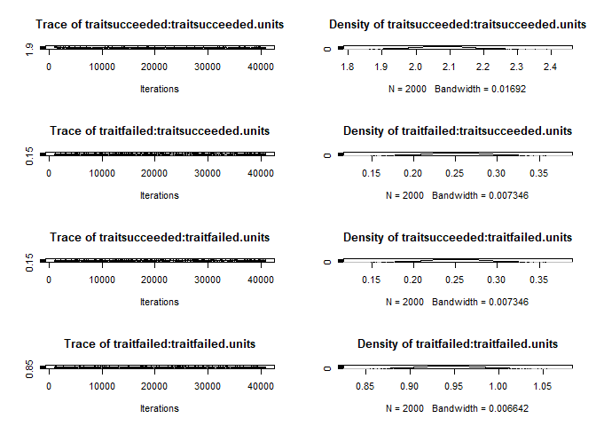
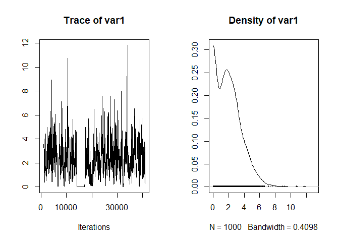

Parasitic worms often have complex life cycles, where they infect multiple hosts in succession before reproducing. Each step in the life cycle involves a risk, as some parasites will fail to infect the next host in the cycle. But is this risk consistent? Using a dataset of experimental infections from over a hundred worms, we examine what impacts how likely it is for parasites to establish infection in their next hosts.


# Descriptive stats

Number of infections (rows):


```
## [1] 2610
```

Number of species:


```
## [1] 127
```
Number of species in each phyla:

<div class="kable-table">

|parasite_phylum | n_distinct(Species)|
|:---------------|-------------------:|
|Acanthocephala  |                  10|
|Nematoda        |                  88|
|Platyhelminthes |                  29|

</div>

Number of stages:


```
## [1] 157
```

Number of studies:


```
## [1] 153
```

Total number of exposed hosts:


```
## [1] 16913
```

Summary of doses:


```
##    Min. 1st Qu.  Median    Mean 3rd Qu.    Max. 
##       1      40     175    5211    2000 1000000
```

Summary of recoveries:


```
##     Min.  1st Qu.   Median     Mean  3rd Qu.     Max. 
##      0.0      3.0     15.0   1179.8     98.9 650000.0
```

Doses and thus recoveries vary over a large range.

# Models

For statistical modeling, we round the number of established/not established worms to integer values. In this way, we can fit logistic regression models, instead of treating recovery rate as a continuous variable.


## Model structure

First, I compare how different model structures perform. I fit models with `MCMCglmm` as it can also be used for phylogenetic analyses.

Here are the different tested models: (1) recovery rate as continuous response, (2) recovery rate as proportion (recovered and not recovered round to integers), (3) bivariate with log recovered and log dose as response variables, (4) bivariate with recovered/not recovered as counts (bivariate poisson). Notably, an error term was included in the GLMM to account for overdispersion (additive overdispersion - equivalent to adding an obs-level random effect to `glmer`). The preliminary models include several presumably important predictors, including time after infection, parasite stage, parasite size, and target host body mass. The models include study as a random effect, but not phylogeny (yet). 


The most complex model (bivariate poisson) had decent mixing for the random effects, so the models did not have fitting issues.

<!-- --><!-- -->

For each model, I extract their predictions.


Then I compare predictions from different models with observed values. The bivariate LMM is the worse - it has many predicted recovery rates above 1.

<!-- -->

When reduced to only plausible values, the univariate GLMM model looks best.

<!-- -->
Residual plots. The bivariate LMM is the worst. The univariate GLMM looks the best.

<!-- -->


Another way to check model fit is to compare the distribution of predictions with that of the observations. Here are density plots for the predicted values. We can see that some models yield predictions more closely matching the data than others, but it is a little hard to tell with the substantial right-skew in the data.

<!-- -->

Here are the distributions overlapping. The univariate GLMM performs best, i.e. it comes closest to the observed data distribution.

<!-- -->

The chains for the variance components in this "best" model mixed fine.

<!-- -->

In these models, we included several presumably important predictors. We test these more formally below, but here's the model summary:


```
## 
##  Iterations = 1001:40981
##  Thinning interval  = 20
##  Sample size  = 2000 
## 
##  DIC: 5420468 
## 
##  G-structure:  ~Study
## 
##       post.mean l-95% CI u-95% CI eff.samp
## Study     2.848    2.065    3.747     1756
## 
##  R-structure:  ~units
## 
##       post.mean l-95% CI u-95% CI eff.samp
## units     2.732    2.523     2.92     1330
## 
##  Location effects: cbind(succeeded, failed) ~ log_dpi + nh_fac * to_int_def + log_ws + log_hm 
## 
##                              post.mean l-95% CI u-95% CI eff.samp  pMCMC    
## (Intercept)                    2.32588  1.43906  3.26846     1506 <5e-04 ***
## log_dpi                       -0.22922 -0.30580 -0.14255     1868 <5e-04 ***
## nh_fac2                       -0.91000 -2.18512  0.36217     2000  0.152    
## nh_fac3                       -0.58558 -2.42152  1.09739     2000  0.506    
## to_int_defDefinitive          -1.60606 -2.24844 -0.94667     2000 <5e-04 ***
## log_ws                         0.36516  0.28738  0.45412     2000 <5e-04 ***
## log_hm                        -0.07275 -0.13495 -0.01207     2000  0.020 *  
## nh_fac2:to_int_defDefinitive   2.46789  1.14018  3.77615     2000 <5e-04 ***
## nh_fac3:to_int_defDefinitive   1.11789 -0.50324  2.96149     1792  0.218    
## ---
## Signif. codes:  0 '***' 0.001 '**' 0.01 '*' 0.05 '.' 0.1 ' ' 1
```

The model suggests that (i) recovery goes down with time post infection, (ii) recovery is higher in second definitive hosts and lower in first definitive hosts, (iii) that large larvae have higher establishment rates, (iv) that establishment is unrelated to host mass, and (v) considerable residual variance is between studies.

## Level of analysis - host or condition?

The data were often collected at the level of individual hosts. For example, a study may have infected 5 hosts and then dissected them at 5 different time points. Or those 5 hosts may have been given different doses. We did not pool these hosts to be at the 'study level' because we wanted to account for variation due to e.g. when hosts were dissected. 

However, some studies had a single condition, such as 100 hosts each receiving 2 worm larva. The results of such an experiment may be reported as a mean abundance (i.e. worms per exposed host). From such results, we know the number of parasites given and the number recovered, but not their distribution among hosts. Such results are at the study level.

Logisitc regression accounts for the number of trials (worms given) and the number of successes (worms recovered), so it should not matter that dataset is a mix of results at the host level and the study level - the trials do not change. Nonetheless, let's compare models fit at either level. We convert the dataframe to the 'condition' level. Any infections within a study using e.g. different host species, doses, or dissection times are kept separate, whereas any infection under the same conditions are pooled.


Now we re-fit the logistic regression from above, but at the 'condition' level. We fit them with `lmer` since this is faster.


The fixed effect parameters are almost identical, even though the model in which rows were sometimes individual hosts have more "observations".

<!-- -->

The estimated SE associated with each term is also the same in the two models.

<!-- -->

The random effects are also very similar, but they differ in ways that we would expect. By pooling, the residual variance goes down because there are fewer points within studies. The between study variance also goes down slightly, presumably because pooling makes the study effects more variable.


```
##  Groups   Name        Std.Dev.
##  obs      (Intercept) 1.6212  
##  study_rs (Intercept) 1.5814
```

```
##  Groups   Name        Std.Dev.
##  obs      (Intercept) 1.4804  
##  study_rs (Intercept) 1.3375
```

We can also compare the R^2^ of the two models.


They are similar, but pooling reduces the variance explained.

<div class="kable-table">

|       VF|       VR|       VD|       VE| marg_r2| cond_r2| study_var_explained|
|--------:|--------:|--------:|--------:|-------:|-------:|-------------------:|
| 2.250388| 2.500877| 3.289868| 2.628442|   0.211|   0.445|               0.234|
| 1.242573| 1.788876| 3.289868| 2.191711|   0.146|   0.356|               0.210|

</div>

Since we proceed mainly at the condition level, let's re-calculate some of the descriptive statistics. Number of recovery rates (rows):


```
## [1] 1659
```

Number of species:


```
## [1] 127
```

Number of stages:


```
## [1] 157
```

Number of studies:


```
## [1] 153
```

Total number of exposed hosts:


```
## [1] 16913
```
Proportion without worm size:


```
## [1] 0.1440627
```

Proportion without host mass: 


```
## [1] 0.0006027728
```
Proportion without host or parasite size


```
## [1] 0.1446655
```


## Weights

Most experimental infections are based on single individuals, but some experiments report infection rates from groups of individuals.

<!-- -->


We would like to give experiments with multiple individuals more weight, but it is tricky to know how. Should an infection of 10 hosts have a 10-fold higher weight in the analysis than an infection with one animal? Or 2-fold, if on a log10 scale? Let's try weighting the analysis on a log-10 scale, and then we'll compare a non-phylogenetic model with and without weighting.


The fixed effects are essentially identical in the models with or without weighting, either at the host and condition level.

<!-- -->

Or at the condition level. 

<!-- -->

The estimated SE associated with each term is also the same in the two models.

<!-- -->

Maybe weights have little impact because they are unrelated to recovery rate. Experiments given higher weights are not more likely to have a high or low recovery rate.

<!-- -->

Given that (i) it is not clear how to weight by sample size and (ii) it doesn't affect the parameters, I proceed without weighting by sample size.


## Random slopes

### Time of dissection 

We did not average at the study level, because there are some important sources of variation within studies, like different dissection times. In the previous models, we fit a single time-dependent decrease in recovery. This may be a little disingenuous because different parasite species or stages may be lost from hosts at different rates. Here is the relationship over the full data (infections pooled at condition level): 

<!-- -->

As expected, recovery rates go down with days post infection, but there is a lot of variation. Also, it is not clear that the relationship is linear. For example, the dashed line is the relationship with log time, which assume that hazards are exponential (i.e. they don't accumulate linearly).

Given that hosts were dissected on different time schedules in different studies, each study could have a different relationship with time. Here is a plot showing time-dependent recovery in 49 studies. We see that the relationship is usually linear, though sometimes the log relationship fits better (dashed lines). We can also see that sometimes there is a negative relationship, sometimes none, and sometimes a positive relationship.

<!-- -->

Thus, let's compare three models: 1) studies differ but have the same time effect (random intercepts), 2) study x time (random slopes), and 3) study x log time.


The random slopes model was a clear improvement, regardless whether time was untransformed...

<div class="kable-table">

|      | npar|      AIC|      BIC|    logLik| deviance|    Chisq| Df| Pr(>Chisq)|
|:-----|----:|--------:|--------:|---------:|--------:|--------:|--:|----------:|
|m2_ri |   11| 15704.84| 15762.68| -7841.421| 15682.84|       NA| NA|         NA|
|m2_rs |   13| 15635.17| 15703.52| -7804.587| 15609.17| 73.66707|  2|          0|

</div>

...or log transformed.

<div class="kable-table">

|       | npar|      AIC|      BIC|    logLik| deviance|    Chisq| Df| Pr(>Chisq)|
|:------|----:|--------:|--------:|---------:|--------:|--------:|--:|----------:|
|m2_ril |   11| 15730.87| 15788.71| -7854.436| 15708.87|       NA| NA|         NA|
|m2_rsl |   13| 15621.70| 15690.05| -7797.850| 15595.70| 113.1705|  2|          0|

</div>

The random slopes model with log time was also a better fit than the model with untransformed time.

<div class="kable-table">

|       | npar|      AIC|      BIC|    logLik| deviance|    Chisq| Df| Pr(>Chisq)|
|:------|----:|--------:|--------:|---------:|--------:|--------:|--:|----------:|
|m2_rs  |   13| 15635.17| 15703.52| -7804.587| 15609.17|       NA| NA|         NA|
|m2_rsl |   13| 15621.70| 15690.05| -7797.850| 15595.70| 13.47334|  0|          0|

</div>

Calculating R^2^ values for random slope models is more complex than for random intercept models, because the variance explained by the random effects depends on the levels of the random effect (Study) *and* the covariate values (time). We modified code given [here](https://besjournals.onlinelibrary.wiley.com/doi/full/10.1111/2041-210X.12225) to calculate R^2^ for random slope models. We can see how the conditional R^2^ goes up as we include random slopes, though it does not increase further when we use with log time. The reason is that the overall error variance goes down when we use log time, but so does the variance between studies. This suggests that using log time better accounts for variation within studies, thereby reducing the differences between studies.

<div class="kable-table">

|step                   | df_used|       VF|       VR|       VD|       VE| marg_r2| cond_r2| study_var_explained|
|:----------------------|-------:|--------:|--------:|--------:|--------:|-------:|-------:|-------------------:|
|random int             |      NA| 1.350644| 1.852367| 3.289868| 2.135020|   0.157|   0.371|               0.214|
|random slope           |       0| 1.236100| 2.835918| 3.289868| 1.851326|   0.134|   0.442|               0.308|
|random slope, log time |       0| 1.221211| 3.106193| 3.289868| 1.756586|   0.130|   0.462|               0.332|

</div>

Here is the summary of the simplest random slopes model (i.e. just time, study, and their interaction). Interestingly, the fixed effect of dpi is only weakly negative. Both the random intercept term (studies differ in mean recovery) and the random slope term (studies differ in how recovery changes with time) are positive. The covariance tends to be negative, indicating that studies with above average recoveries tend to be associated with stronger decreases over time. Conversely, if recovery is low to begin with, then it has more of a chance to increase (positive slopes).


```
## Generalized linear mixed model fit by maximum likelihood (Laplace
##   Approximation) [glmerMod]
##  Family: binomial  ( logit )
## Formula: cbind(succeeded, failed) ~ log_dpi + (1 + log_dpi | study_rs) +  
##     (1 | obs)
##    Data: filter(datx, !is.na(log_ws), !is.na(log_hm))
## 
##      AIC      BIC   logLik deviance df.resid 
##  15701.2  15732.8  -7844.6  15689.2     1413 
## 
## Scaled residuals: 
##      Min       1Q   Median       3Q      Max 
## -1.55106 -0.06584  0.00171  0.04310  1.61259 
## 
## Random effects:
##  Groups   Name        Variance Std.Dev. Corr 
##  obs      (Intercept) 1.8636   1.3652        
##  study_rs (Intercept) 7.2129   2.6857        
##           log_dpi     0.5684   0.7539   -0.79
## Number of obs: 1419, groups:  obs, 1419; study_rs, 146
## 
## Fixed effects:
##             Estimate Std. Error z value Pr(>|z|)   
## (Intercept)  -0.9133     0.3206  -2.849  0.00438 **
## log_dpi      -0.1671     0.0918  -1.821  0.06867 . 
## ---
## Signif. codes:  0 '***' 0.001 '**' 0.01 '*' 0.05 '.' 0.1 ' ' 1
## 
## Correlation of Fixed Effects:
##         (Intr)
## log_dpi -0.873
```

This plot shows how slopes and intercepts are negatively related at the level of study. This correlation, though, disappears when the time variable is centered (not shown).

<!-- -->

Since the random slopes model appears to be superior, let's check the predictions. Here are the random slope predictions within studies. The model seems to capture the relationships well.

<!-- -->

The number of studies where recovery increases looks similar to the number that decreases. Let's check each study individually. Here are the number of studies with at least 4 dissection times


```
## [1] 84
```

We fit a simple logistic regression to each one to test whether recovery usually increases or decreases over time.


Here's the distribution of regression coefficients.

<!-- -->

There were more studies with negative coefficients than positive coefficients, but not many. Negative coefficients (decreased recover over time) were a bit more likely to be statistically significant (P < 0.001) than positive coefficients.

<div class="kable-table">

|beta_dir |  n| sigs| perc_sig|
|:--------|--:|----:|--------:|
|neg      | 46|   37|    0.804|
|pos      | 38|   25|    0.658|

</div>

How quickly recovery decreases with time is not dependent on life stage, so e.g. recovery does not decrease faster for worms in the second host compared to the first host.

<!-- -->

One worry is if model fit varies with time post exposure, such as if there was systemic undercounting in early dissections. The residual plots across studies do not suggest that recovery rates are over- or underestimated at different dpi.

<!-- -->

Let's make some plots with CIs for the change in recovery with time. We'll use `MCMCglmm` to fit the models.


Here is the overall decrease in recovery with time, as predicted by the random intercepts model.

<!-- -->

Here is the same plot but the predictions are from the random slopes model. They are similar, though the CI is wider in the random slopes model.


<!-- -->


We can also pick a few studies for a manuscript figure that illustrates the different time by recovery relationships.


<!-- -->


### Dose

Another researcher-controlled variable that varied within studies was dose. Some studies used multiple doses. Recovery rates might increase with dose (e.g. more worms overwhelm immune responses) or decrease with dose (competition among parasites, increased immune response). Here's how the pattern looks across the studies with multiple doses. Often the relationship is flat or decreasing. And it is usually linear as log-transforming dose did not provide a better fit in most cases.

<!-- -->

However, across the whole data dose varies by several orders of magnitude, so a linear relationship (solid line) does not fit the data well. Dose probably needs to be log-transformed for analyses. 

<!-- -->

Here is the same plot, but with the x-axis log transformed. The relationship between recovery and log dose (dashed line) fits better. Higher doses are associated with lower recovery. This suggests that researchers use higher doses when lower recovery rates are expected *OR* that higher doses cause lower recovery. 

<!-- -->

At least within studies, higher doses seem to cause lower recovery. The red lines on the next plot are the fits for each study and they are often negative.

<!-- -->

Given the broad range of doses, it is probably better to use log dose in the analyses. For example, when we add untransformed dose as a fixed effect to the random-intercpt model we fitted above, the effect is weak.

<div class="kable-table">

|       | npar|      AIC|      BIC|    logLik| deviance|    Chisq| Df| Pr(>Chisq)|
|:------|----:|--------:|--------:|---------:|--------:|--------:|--:|----------:|
|m2_ril |   11| 15730.87| 15788.71| -7854.436| 15708.87|       NA| NA|         NA|
|m2_rid |   12| 15729.12| 15792.22| -7852.562| 15705.12| 3.746738|  1|  0.0529107|

</div>

But it is very clear with log-transformed dose.

<div class="kable-table">

|        | npar|      AIC|      BIC|    logLik| deviance|    Chisq| Df| Pr(>Chisq)|
|:-------|----:|--------:|--------:|---------:|--------:|--------:|--:|----------:|
|m2_ril  |   11| 15730.87| 15788.71| -7854.436| 15708.87|       NA| NA|         NA|
|m2_rild |   12| 15649.11| 15712.20| -7812.556| 15625.11| 83.75941|  1|          0|

</div>

A random slopes model with untransformed dose also has numerical issues with fitting, so I continue with log dose.


Let's compare three models: 1) studies differ but have the same dose relationship (random intercepts), 2) study x dose (random slopes), and 3) with both random slopes terms (dose and dpi).


Adding a dose random slopes term to a random intercept model is an improvement...

<div class="kable-table">

|        | npar|      AIC|      BIC|    logLik| deviance|    Chisq| Df| Pr(>Chisq)|
|:-------|----:|--------:|--------:|---------:|--------:|--------:|--:|----------:|
|m2_rild |   12| 15649.11| 15712.20| -7812.556| 15625.11|       NA| NA|         NA|
|m2_rsd  |   14| 15587.66| 15661.27| -7779.831| 15559.66| 65.45001|  2|          0|

</div>

...as is adding the dose random slopes term to a model that already includes a random slopes term for time dpi.

<div class="kable-table">

|                                 | npar|      AIC|      BIC|    logLik| deviance|    Chisq| Df| Pr(>Chisq)|
|:--------------------------------|----:|--------:|--------:|---------:|--------:|--------:|--:|----------:|
|update(m2_rsl, . ~ . + log_dose) |   14| 15540.37| 15613.98| -7756.185| 15512.37|       NA| NA|         NA|
|m2_rs2                           |   17| 15479.03| 15568.41| -7722.514| 15445.03| 67.34153|  3|          0|

</div>

The main effect of dose explains about 4% of variation in recovery, whereas the random slopes explains just 1-2%. By contrast, dissection time random effect explains more of the variation within studies (~10%). This suggests that studies with different recovery rates use different doses and that dose explains relatively little variation within studies.

<div class="kable-table">

|step                             | df_used|       VF|       VR|       VD|       VE| marg_r2| cond_r2| study_var_explained|
|:--------------------------------|-------:|--------:|--------:|--------:|--------:|-------:|-------:|-------------------:|
|random int, without dose         |      NA| 1.244517| 1.789710| 3.289868| 2.191738|   0.146|   0.356|               0.210|
|random int, dose main effect     |       1| 1.617901| 1.801280| 3.289868| 2.030861|   0.185|   0.391|               0.206|
|random slope for dose            |       0| 1.221662| 2.232422| 3.289868| 1.872865|   0.142|   0.401|               0.259|
|two random slopes, dose and time |       0| 1.240992| 3.821013| 3.289868| 1.474031|   0.126|   0.515|               0.389|

</div>

Let's check the predictions. Here are the predicted recoveries given the study by dose interaction (no fixed effects). They look good, but it is also clear that these relationships vary less than the study x time relationships.


<!-- -->

Like we did for dissection times, let's fit a logistic regression to each study with at least 4 different doses. There are only 27 of these studies.


```
## [1] 27
```

We fit a simple logistic regression to each one to test whether recovery usually increases or decreases over time.


Here's the distribution of regression coefficients. There's a negative skew.

<!-- -->

There were twice as many studies with negative coefficients than positive coefficients, and they were much more likely to be considered significant (P < 0.001).

<div class="kable-table">

|beta_dir |  n| sigs| perc_sig|
|:--------|--:|----:|--------:|
|neg      | 18|   15|    0.833|
|pos      |  9|    5|    0.556|

</div>

So dose explains some variation within studies, but much less than dissection time. And dose seems to explain a fair amount of the differences between studies. However, this is also the main variation we are trying to parse. I think that doses are chosen in response to different recovery rates by researchers, not the other way around (i.e. using high doses is not why recovery rates are lower).

Since dose is incorporated into the response variable and since it probably does not cause the large variation across studies by itself, I leave it out of the main models, but consider it again at the end of the notebook.

## Phylogenetic model

Now let's add phylogeny into the model. We fit `MCMCglmm` models because it can incorporate phylogeny as random effects (phylogenetic covariance matrix). We want to assess whether phylogeny accounts for variation beyond study, since studies are usually on one species or a few closely related species. 

We'll add phylogeny three ways: 1) by itself, 2) to a model with just the study effect, and 3) to a model with study and the main fixed effects. This tests whether phylogeny explains variation alone, beyond study, and beyond life cycle characteristics, respectively. 


When we compare models with DIC, we find that a model with just a phylogenetic effect is not clearly better than one with just a study effect (random intercept).


```
## delta DIC, study-only (random intercept) vs phylogeny-only model: 1.81 (higher is better)
```

Adding phylogeny to the random slopes model is also not an obvious improvement


```
## delta DIC, study-only (random slopes) vs phylogeny+random slopes: 2.08 (higher is better)
```

And here's what happens when we add phylogeny to the model with several fixed effects (stage, worm and host size).


```
## delta DIC, without vs with phylogeny when fixed effects in model: -0.89 (higher is better)
```

In the phylogeny-only model, the phylogeny variance component is very large relatively to the residual variance, it is almost certainly inflated. Maybe some branches are associated with complete separation (100% recovery rates).

<!-- -->
When we add phylogeny to the random slopes model, it is much lower and not clearly different from zero, either without fixed effects...

<!-- -->

...or with fixed effects.

<!-- -->

The phylogenetic effect competes with the study effect - when we add phylogeny to a model with just study (random intercept) their variance components are negatively correlated (not shown). This makes sense. A given study usually focused on a single parasite species, so phylogeny and study should explain some of the same variation.

Let's compare R^2^ values for the models with and without phylogeny.


Weirdly, the R^2^ table suggests phylogeny alone has a huge effect compared to study alone (with or without random slopes). This is due to the very large variance component for the phylogenetic effect.


<div class="kable-table">

|model                   |r2m                 |r2c                 |
|:-----------------------|:-------------------|:-------------------|
|study only, random int  |0.011 [0.004-0.021] |0.322 [0.268-0.387] |
|study only, rand slopes |0.005 [0-0.022]     |0.437 [0.374-0.499] |
|phylogeny only          |0 [0-0]             |0.666 [0.514-0.789] |

</div>

This seeming importance of phylogeny disappears when we add it to a model with random slopes. It explains little variation beyond that explained by the study effect.

<div class="kable-table">

|model                   |r2m             |r2c                 |
|:-----------------------|:---------------|:-------------------|
|study only, rand slopes |0.005 [0-0.022] |0.437 [0.374-0.499] |
|rand slopes + phylogeny |0.004 [0-0.018] |0.476 [0.398-0.574] |

</div>

Phylogeny might account for some variation beyond that explained by study in a model with multiple fixed effects. However, this phylogenetic effect bordered zero.

<div class="kable-table">

|model                                     |r2m                 |r2c                 |
|:-----------------------------------------|:-------------------|:-------------------|
|random slopes + fixed effects             |0.135 [0.092-0.185] |0.491 [0.421-0.56]  |
|random slopes + fixed effects + phylogeny |0.167 [0.106-0.229] |0.593 [0.474-0.699] |

</div>

I would not actually predict a strong phylogenetic effect, because different life stages from closely related species might have very different infection probabilities. Also, recovery rates are variable and measured with considerable error, making phylogenetic effects harder to detect. 

Since "study" and "species" overlap substantially, maybe we should just look at higher taxonomic levels. Since studies usually focus on the same species, maybe we can detect taxonomic/phyla effects by looking at whether e.g. parasite families have similar recovery rates across studies. To test this, we replace parasite phylogeny with taxonomy in the model, but only the higher taxonomic levels (i.e. phylum, class, order, and family - presumably those levels won't overlap much with the study effect). 


When we fit that model, we see that the taxonomic effects are usually near zero. This suggests species from the same order, family, etc. do not have more similar recovery rates than we would expect.

<!-- -->

Here is the change in DIC when adding taxonomy to a model with fixed effects.


```
## delta DIC, random slopes&fixed effx vs +taxonomy: 2.99 (higher is better)
```

And the R^2^ values goes up when we add taxonomy, though the conditional R^2^ has a wide range because the taxonomic effects were hard to estimate.


<div class="kable-table">

|model                                    |r2m                 |r2c                |
|:----------------------------------------|:-------------------|:------------------|
|random slopes + fixed effects            |0.135 [0.092-0.185] |0.491 [0.421-0.56] |
|random slopes + fixed effects + taxonomy |0.125 [0.006-0.207] |0.66 [0.505-0.987] |

</div>

When we fit the taxonomic model with `lmer` and then perform a likelihood ratio test to see if adding taxonomy improves the model, it is not significant.

<div class="kable-table">

|          | npar|      AIC|      BIC|    logLik| deviance|    Chisq| Df| Pr(>Chisq)|
|:---------|----:|--------:|--------:|---------:|--------:|--------:|--:|----------:|
|m2_rsl    |   13| 15621.70| 15690.05| -7797.850| 15595.70|       NA| NA|         NA|
|m2_rs_tax |   17| 15628.42| 15717.80| -7797.208| 15594.42| 1.284187|  4|  0.8640527|

</div>

The variance components for study and most higher taxonomic levels are uncorrelated, with the exception of parasite family (some studies might be the only ones on a particular worm family). This suggests the negative correlation between study and phylogenetic effects in the previous models is due to the same species/genera being studied.


```
##                                  (Intercept):(Intercept).study_rs
## (Intercept):(Intercept).study_rs                             1.00
## log_dpi:(Intercept).study_rs                                -0.94
## (Intercept):log_dpi.study_rs                                -0.94
## log_dpi:log_dpi.study_rs                                     0.75
## parasite_phylum                                             -0.01
## parasite_class                                              -0.05
## parasite_order                                               0.11
## parasite_family                                             -0.13
## units                                                       -0.19
##                                  log_dpi:(Intercept).study_rs
## (Intercept):(Intercept).study_rs                        -0.94
## log_dpi:(Intercept).study_rs                             1.00
## (Intercept):log_dpi.study_rs                             1.00
## log_dpi:log_dpi.study_rs                                -0.91
## parasite_phylum                                          0.01
## parasite_class                                           0.05
## parasite_order                                          -0.10
## parasite_family                                          0.03
## units                                                    0.20
##                                  (Intercept):log_dpi.study_rs
## (Intercept):(Intercept).study_rs                        -0.94
## log_dpi:(Intercept).study_rs                             1.00
## (Intercept):log_dpi.study_rs                             1.00
## log_dpi:log_dpi.study_rs                                -0.91
## parasite_phylum                                          0.01
## parasite_class                                           0.05
## parasite_order                                          -0.10
## parasite_family                                          0.03
## units                                                    0.20
##                                  log_dpi:log_dpi.study_rs parasite_phylum
## (Intercept):(Intercept).study_rs                     0.75           -0.01
## log_dpi:(Intercept).study_rs                        -0.91            0.01
## (Intercept):log_dpi.study_rs                        -0.91            0.01
## log_dpi:log_dpi.study_rs                             1.00           -0.01
## parasite_phylum                                     -0.01            1.00
## parasite_class                                      -0.02            0.10
## parasite_order                                       0.05            0.11
## parasite_family                                      0.03            0.06
## units                                               -0.19           -0.02
##                                  parasite_class parasite_order parasite_family
## (Intercept):(Intercept).study_rs          -0.05           0.11           -0.13
## log_dpi:(Intercept).study_rs               0.05          -0.10            0.03
## (Intercept):log_dpi.study_rs               0.05          -0.10            0.03
## log_dpi:log_dpi.study_rs                  -0.02           0.05            0.03
## parasite_phylum                            0.10           0.11            0.06
## parasite_class                             1.00           0.07            0.06
## parasite_order                             0.07           1.00            0.03
## parasite_family                            0.06           0.03            1.00
## units                                      0.01          -0.03           -0.05
##                                  units
## (Intercept):(Intercept).study_rs -0.19
## log_dpi:(Intercept).study_rs      0.20
## (Intercept):log_dpi.study_rs      0.20
## log_dpi:log_dpi.study_rs         -0.19
## parasite_phylum                  -0.02
## parasite_class                    0.01
## parasite_order                   -0.03
## parasite_family                  -0.05
## units                             1.00
```

Here's a plot showing how the VC estimates for parasite order are unrelated to those for study.

<!-- -->

We can also make a plot to confirm that recovery rates do not vary with taxonomy. Let's look at parasite families. The black points are observed recovery rates, while the red points are the medians for the family. It looks like some families might have higher infection rates than others, but recall that these may be single studies.

<!-- -->

When we take the average recovery for a study, then the differences among parasite families are much less conspicuous.

<!-- -->

When we make the same plot for parasite orders, which is less confounded with "study", we see few compelling differences.

<!-- -->

What about the fixed effects? Are they the same with or without a phylogenetic random effect? They are rather tightly correlated, suggesting that a model with or without phylogeny will not impact the conclusions.

<!-- -->

So, phylogeny does not have a clear effect on recovery, at least independent from study effects. Since phylogeny (1) does not affect the fixed effects, (2) is hard to estimate, and (3) intuitively should be low in this dataset, we leave it out of the main analysis.

# Model series for hypothesis testing

We now want to build a series of models. We'll use our random slopes model as the "base" model: it includes just study and days until dissection. We then add terms to this model to test explicit hypotheses. 

Here is the base model summary:


```
## 
##  Iterations = 1001:40981
##  Thinning interval  = 20
##  Sample size  = 2000 
## 
##  DIC: 5561849 
## 
##  G-structure:  ~us(1 + log_dpi):study_rs
## 
##                                  post.mean l-95% CI u-95% CI eff.samp
## (Intercept):(Intercept).study_rs    7.2306   3.9237  10.7413     1779
## log_dpi:(Intercept).study_rs       -1.6219  -2.5896  -0.8039     1805
## (Intercept):log_dpi.study_rs       -1.6219  -2.5896  -0.8039     1805
## log_dpi:log_dpi.study_rs            0.6048   0.3602   0.8912     1844
## 
##  R-structure:  ~units
## 
##       post.mean l-95% CI u-95% CI eff.samp
## units     1.882     1.72     2.05     1674
## 
##  Location effects: cbind(succeeded, failed) ~ log_dpi 
## 
##             post.mean  l-95% CI  u-95% CI eff.samp pMCMC   
## (Intercept) -0.920133 -1.565932 -0.329497     1806 0.006 **
## log_dpi     -0.163854 -0.351054  0.005494     2000 0.074 . 
## ---
## Signif. codes:  0 '***' 0.001 '**' 0.01 '*' 0.05 '.' 0.1 ' ' 1
```

Now let's get to hypothesis testing. Throughout we use the random slopes model with log-transformed time.

### Hypothesis 1: recovery rates are higher later in the life cycle

First, we test whether parasite life stage impacts establishment, specifically whether the parasite is infecting the first, second, third host, etc. To test this, we add 'step in cycle' to model.


When we look at the parameter estimates, we see that recovery is significantly higher in second hosts than first hosts. The difference between second and third hosts is not significant.


```
## 
##  Iterations = 1001:40981
##  Thinning interval  = 20
##  Sample size  = 2000 
## 
##  DIC: 5561850 
## 
##  G-structure:  ~us(1 + log_dpi):study_rs
## 
##                                  post.mean l-95% CI u-95% CI eff.samp
## (Intercept):(Intercept).study_rs    6.1611   3.3760   9.2502     2610
## log_dpi:(Intercept).study_rs       -1.4169  -2.2330  -0.7282     2568
## (Intercept):log_dpi.study_rs       -1.4169  -2.2330  -0.7282     2568
## log_dpi:log_dpi.study_rs            0.5425   0.3269   0.7913     1796
## 
##  R-structure:  ~units
## 
##       post.mean l-95% CI u-95% CI eff.samp
## units     1.891    1.713    2.061     1806
## 
##  Location effects: cbind(succeeded, failed) ~ log_dpi + nh_fac 
## 
##              post.mean   l-95% CI   u-95% CI eff.samp  pMCMC    
## (Intercept) -1.6063960 -2.2681763 -0.9398006     1873 <5e-04 ***
## log_dpi     -0.1748585 -0.3440895 -0.0003476     2000  0.042 *  
## nh_fac2      1.2213799  0.6479249  1.8907627     2000 <5e-04 ***
## nh_fac3      1.9613235  0.8198732  3.0196319     1923 <5e-04 ***
## ---
## Signif. codes:  0 '***' 0.001 '**' 0.01 '*' 0.05 '.' 0.1 ' ' 1
```

Model DIC is not much better with parasite stage, although the term was significant.


```
## delta DIC, with and without 'next host': -1.12 (higher is better)
```

The R^2^ table elucidates this contradiction. The overall model fit is not better. Instead, the fixed effect of stage now explains about 5% of the variation, which was subtracted from the "study" variation. In essence, different studies usually focus on different life stages, which in turn differ in their infection rates.

<div class="kable-table">

|model                        |r2m                 |r2c                 |
|:----------------------------|:-------------------|:-------------------|
|base random slopes, log time |0.005 [0-0.022]     |0.437 [0.374-0.499] |
|parasite stage               |0.059 [0.025-0.107] |0.431 [0.368-0.495] |

</div>

So life cycle step is important in determining infection rates. Let's plot the predicted means for different life stages at day one post infection (the intercept). Recovery rates increase with life cycle length, but the difference between 2nd and 3rd stage larva is not clear, since CIs overlap. For all stages, predicted recoveries are higher than observed ones. This is because most hosts were dissected after several days or even weeks.


<!-- -->

When we plot the predictions at the median time of dissection (18 days), then predictions better match observed medians.


<!-- -->

Here are those predicted means:

<div class="kable-table">

|nh_fac |       fit|       lwr|       upr|
|:------|---------:|---------:|---------:|
|1      | 0.1079550| 0.0734479| 0.1571999|
|2      | 0.2910227| 0.2046343| 0.3859791|
|3      | 0.4649367| 0.2511257| 0.7090252|

</div>

The differences among life stages were similar when estimated 1 or 18 dpi (though the CIs are obviously lower at the median of 18 dpi) because dissection times did not differ much among life stages.

<!-- -->

### Hypothesis 2: recovery rates differ in intermediate vs definitive hosts

The first host in a cycle can be an intermediate host (in a complex cycle) or a definitive host (in a direct cycle). Does this matter? To test this hypothesis, we distinguish between cases where worms infect intermediate vs definitive hosts. Before entering this term into a model, let's make sure that there are enough species and studies at each combination of life stage and host type. Here are the number of species in the different combinations. There are fewer intermediate host infections later in the life cycle, as expected.


```
##       to_int_def
## nh_fac Intermediate Definitive
##      1           28         29
##      2            7         53
##      3            5         10
```

Here are the number of studies:


```
##       to_int_def
## nh_fac Intermediate Definitive
##      1           33         34
##      2            9         57
##      3            5         11
```

Both tables suggest that there are several species and studies in each combination of life stage and int/def, so it is reasonable to add it to the mixed model.


The model suggests parasites have lower recovery rates in definitive hosts than in intermediate hosts.


```
## 
##  Iterations = 1001:40981
##  Thinning interval  = 20
##  Sample size  = 2000 
## 
##  DIC: 5561847 
## 
##  G-structure:  ~us(1 + log_dpi):study_rs
## 
##                                  post.mean l-95% CI u-95% CI eff.samp
## (Intercept):(Intercept).study_rs    6.9103   3.9621  10.7309     1833
## log_dpi:(Intercept).study_rs       -1.5137  -2.4083  -0.7812     2000
## (Intercept):log_dpi.study_rs       -1.5137  -2.4083  -0.7812     2000
## log_dpi:log_dpi.study_rs            0.5676   0.3232   0.8067     2000
## 
##  R-structure:  ~units
## 
##       post.mean l-95% CI u-95% CI eff.samp
## units     1.811    1.642    1.975     1750
## 
##  Location effects: cbind(succeeded, failed) ~ log_dpi + nh_fac + to_int_def 
## 
##                      post.mean  l-95% CI  u-95% CI eff.samp  pMCMC    
## (Intercept)          -0.878569 -1.615444 -0.161579     1956  0.021 *  
## log_dpi              -0.183716 -0.374670 -0.007176     2000  0.048 *  
## nh_fac2               1.723154  1.028808  2.398638     1656 <5e-04 ***
## nh_fac3               2.223397  1.020966  3.346669     1850  0.001 ***
## to_int_defDefinitive -1.335216 -1.798369 -0.819201     1810 <5e-04 ***
## ---
## Signif. codes:  0 '***' 0.001 '**' 0.01 '*' 0.05 '.' 0.1 ' ' 1
```

Model DIC is not much better though.


```
## delta DIC, with int vs def: 2.92 (higher is better)
```

Nor is it clear that recovery rates at a given life stage depend on whether the host is an intermediate or definitive host.


```
## delta DIC, with stage x int/def interaction: 5.06 (higher is better)
```

Here's how R^2^ changes. Like for parasite stage, the total variance explained does not increase much by adding the intermediate vs definitive host distinction, but more variation is attributed to the fixed effects.

<div class="kable-table">

|model                 |r2m                 |r2c                 |
|:---------------------|:-------------------|:-------------------|
|base + parasite stage |0.059 [0.025-0.107] |0.431 [0.368-0.495] |
|+ to int vs def       |0.081 [0.045-0.127] |0.475 [0.411-0.541] |
|+ stage by int vs def |0.096 [0.054-0.144] |0.488 [0.426-0.551] |

</div>

And here's the plot. Predicted means are at the median dissection time (18 dpi). Infections of first intermediate hosts are more successful than infection of first definitive hosts. But the opposite is true for second hosts.


<!-- -->

The higher recovery in first or second intermediate hosts might be due to being dissected later, i.e. the model thinks the observed recovery rates are lower than they would be if they were dissected earlier.

<!-- -->
Here are the median dissection times.

<div class="kable-table">

|nh_fac |to_int_def   | dpi|
|:------|:------------|---:|
|1      |Intermediate |  21|
|1      |Definitive   |  14|
|2      |Intermediate |  30|
|2      |Definitive   |  22|
|3      |Intermediate |  14|
|3      |Definitive   |  15|

</div>

But it likely is due to worms having larger infective stages when the next host is the definitive host.

<!-- -->

Thus, this term needs to be disentangled from our next model predictor, worm size. But before moving onto that, let's make a manuscript figure.

<!-- -->

### Hypothesis 3: recovery rates increase with worm size

Since later life stages targeting definitive hosts have better establishment rates, is this because they are larger? Let's add the size of infective parasite stages into the model. Moreover, if worm size drives the pattern, we expect the effect of "step" and the "int vs def" distinction to decrease once size is added. And there should not be an interaction between next host and parasite size.


The worm size term is significant. Moreover, the difference among life stages decreased.


```
## 
##  Iterations = 1001:40981
##  Thinning interval  = 20
##  Sample size  = 2000 
## 
##  DIC: 5561849 
## 
##  G-structure:  ~us(1 + log_dpi):study_rs
## 
##                                  post.mean l-95% CI u-95% CI eff.samp
## (Intercept):(Intercept).study_rs     6.658   3.7723  10.1634     1738
## log_dpi:(Intercept).study_rs        -1.510  -2.3871  -0.7521     1872
## (Intercept):log_dpi.study_rs        -1.510  -2.3871  -0.7521     1872
## log_dpi:log_dpi.study_rs             0.547   0.3157   0.7805     1872
## 
##  R-structure:  ~units
## 
##       post.mean l-95% CI u-95% CI eff.samp
## units     1.801    1.628    1.966     1787
## 
##  Location effects: cbind(succeeded, failed) ~ log_dpi + nh_fac * to_int_def + log_ws 
## 
##                               post.mean   l-95% CI   u-95% CI eff.samp  pMCMC
## (Intercept)                   2.0396228  0.6285436  3.3923203     1798  0.003
## log_dpi                      -0.1665095 -0.3591819  0.0005136     2000  0.071
## nh_fac2                      -0.9554376 -2.4944402  0.4146239     1863  0.209
## nh_fac3                      -1.9225726 -4.4018682  0.1165077     1841  0.086
## to_int_defDefinitive         -1.6524767 -2.1980444 -1.1561919     2135 <5e-04
## log_ws                        0.3102428  0.1895970  0.4343562     1815 <5e-04
## nh_fac2:to_int_defDefinitive  1.6890324  0.1368450  3.1799141     2000  0.030
## nh_fac3:to_int_defDefinitive  1.6791666 -0.3818513  3.5085395     2000  0.095
##                                 
## (Intercept)                  ** 
## log_dpi                      .  
## nh_fac2                         
## nh_fac3                      .  
## to_int_defDefinitive         ***
## log_ws                       ***
## nh_fac2:to_int_defDefinitive *  
## nh_fac3:to_int_defDefinitive .  
## ---
## Signif. codes:  0 '***' 0.001 '**' 0.01 '*' 0.05 '.' 0.1 ' ' 1
```

Again, despite being significant, adding worm size is not a huge improvement, as judged by DIC.


```
## delta DIC, after adding parasite size: -3.87 (higher is better)
```

Neither is adding a worm size by stage interaction


```
## delta DIC, after adding parasite size x stage: 1.11 (higher is better)
```
Here is the summary from the more complex model with a worm size by stage interaction. Most of the interactions with worm size are not significant.


```
## 
##  Iterations = 1001:40981
##  Thinning interval  = 20
##  Sample size  = 2000 
## 
##  DIC: 5561848 
## 
##  G-structure:  ~us(1 + log_dpi):study_rs
## 
##                                  post.mean l-95% CI u-95% CI eff.samp
## (Intercept):(Intercept).study_rs    7.2804   3.9408  10.7083     2000
## log_dpi:(Intercept).study_rs       -1.6555  -2.4696  -0.7961     2000
## (Intercept):log_dpi.study_rs       -1.6555  -2.4696  -0.7961     2000
## log_dpi:log_dpi.study_rs            0.5762   0.3443   0.8230     2000
## 
##  R-structure:  ~units
## 
##       post.mean l-95% CI u-95% CI eff.samp
## units      1.79    1.631    1.952     1861
## 
##  Location effects: cbind(succeeded, failed) ~ log_dpi + nh_fac * to_int_def * log_ws 
## 
##                                     post.mean  l-95% CI  u-95% CI eff.samp
## (Intercept)                           8.28050   2.84214  13.38421     2000
## log_dpi                              -0.15965  -0.34320   0.01418     1846
## nh_fac2                              -8.28533 -15.31861  -0.81282     2000
## nh_fac3                              -8.60685 -13.87260  -2.94878     2188
## to_int_defDefinitive                 -4.07953 -11.50662   4.06103     2209
## log_ws                                0.98506   0.41532   1.52807     2000
## nh_fac2:to_int_defDefinitive          4.75145  -4.52833  14.42439     2000
## nh_fac3:to_int_defDefinitive          4.59823  -3.21306  12.57283     2274
## nh_fac2:log_ws                       -0.83778  -1.76619   0.13053     2000
## nh_fac3:log_ws                       -0.53593  -1.21552   0.20708     2000
## to_int_defDefinitive:log_ws          -0.25334  -1.10192   0.68743     2222
## nh_fac2:to_int_defDefinitive:log_ws   0.32410  -0.78694   1.57476     2000
## nh_fac3:to_int_defDefinitive:log_ws   0.35153  -0.67379   1.35660     1732
##                                      pMCMC    
## (Intercept)                          0.001 ***
## log_dpi                              0.077 .  
## nh_fac2                              0.032 *  
## nh_fac3                              0.002 ** 
## to_int_defDefinitive                 0.282    
## log_ws                              <5e-04 ***
## nh_fac2:to_int_defDefinitive         0.310    
## nh_fac3:to_int_defDefinitive         0.239    
## nh_fac2:log_ws                       0.084 .  
## nh_fac3:log_ws                       0.140    
## to_int_defDefinitive:log_ws          0.565    
## nh_fac2:to_int_defDefinitive:log_ws  0.581    
## nh_fac3:to_int_defDefinitive:log_ws  0.492    
## ---
## Signif. codes:  0 '***' 0.001 '**' 0.01 '*' 0.05 '.' 0.1 ' ' 1
```

Here's how R^2^ changes. The marginal R^2^ again increased at the expense of study-level variation, suggesting that some of the differences among studies is related to different sizes of infective stages. Adding the worm x stage interaction does not explain much variation either. Interestingly, worm size only explains 1-2% of the variation beyond that accounted for life stage, but by itself it explains 7% of the variation, nearly as much as life stage alone. Thus, worm size may explain the differences among stages.

<div class="kable-table">

|model                       |r2m                 |r2c                 |
|:---------------------------|:-------------------|:-------------------|
|base, stage, and int vs def |0.096 [0.054-0.144] |0.488 [0.426-0.551] |
|+ worm size                 |0.113 [0.076-0.159] |0.468 [0.408-0.529] |
|+ stage by worm size        |0.124 [0.082-0.17]  |0.478 [0.416-0.542] |
|base + worm size            |0.075 [0.039-0.117] |0.41 [0.353-0.473]  |

</div>
Now let's look at the worm size parameter, first without life stage in the model. Here is the posterior distribution for exp(worm size), i.e. the odds ratio. It suggests that a 1 unit increase in log worm size is associated with 1.36 times better odds of infection. Note the odds are not the same as probability - the change in odds depends on the baseline infection probability. For example, if the baseline infection probability is 10%, then a 1 unit increase in log worm size increases infection probability 13.6% (0.1 x odds ratio). But if the baseline is 50%, then the infection probability increases to 68% (0.5 x odds ratio).


```
## 
## Iterations = 1001:40981
## Thinning interval = 20 
## Number of chains = 1 
## Sample size per chain = 2000 
## 
## 1. Empirical mean and standard deviation for each variable,
##    plus standard error of the mean:
## 
##           Mean             SD       Naive SE Time-series SE 
##       1.283377       0.048763       0.001090       0.001042 
## 
## 2. Quantiles for each variable:
## 
##  2.5%   25%   50%   75% 97.5% 
## 1.191 1.251 1.283 1.315 1.383
```
Since worm size is log transformed, we need to interpret this coefficient with regards to proportional change. A change in 1 log unit corresponds to a exp(1) or 2.72-fold increase in worm size, so the odds ratio suggests the odds go up 36% with a 2.72-fold increase in worm size. We can express this with more intuitive percents. Here is the predicted percent increase in the odds of infection with a 10% increase in worm size.


```
## 
## Iterations = 1001:40981
## Thinning interval = 20 
## Number of chains = 1 
## Sample size per chain = 2000 
## 
## 1. Empirical mean and standard deviation for each variable,
##    plus standard error of the mean:
## 
##           Mean             SD       Naive SE Time-series SE 
##      2.400e-02      3.708e-03      8.291e-05      7.921e-05 
## 
## 2. Quantiles for each variable:
## 
##    2.5%     25%     50%     75%   97.5% 
## 0.01676 0.02155 0.02402 0.02643 0.03138
```
And for a 100% increase (2-fold increase):


```
## 
## Iterations = 1001:40981
## Thinning interval = 20 
## Number of chains = 1 
## Sample size per chain = 2000 
## 
## 1. Empirical mean and standard deviation for each variable,
##    plus standard error of the mean:
## 
##           Mean             SD       Naive SE Time-series SE 
##      0.1886086      0.0313008      0.0006999      0.0006687 
## 
## 2. Quantiles for each variable:
## 
##   2.5%    25%    50%    75%  97.5% 
## 0.1285 0.1677 0.1884 0.2089 0.2519
```
we can double check our calculation by refitting the model, but using log base 2 instead of ln. In this case the exp coefficient should correspond to the change in the odds with a doubling of worm size.


```
## log_ws2 
## 0.18945
```

The odds ratio for worm size is a bit higher in the model including life stage.


```
## 
## Iterations = 1001:40981
## Thinning interval = 20 
## Number of chains = 1 
## Sample size per chain = 2000 
## 
## 1. Empirical mean and standard deviation for each variable,
##    plus standard error of the mean:
## 
##           Mean             SD       Naive SE Time-series SE 
##       1.366498       0.086806       0.001941       0.002042 
## 
## 2. Quantiles for each variable:
## 
##  2.5%   25%   50%   75% 97.5% 
## 1.211 1.303 1.363 1.424 1.548
```

We want to plot predictions for different combinations of worm size and life stage. Let's make a new dataframe with the combinations of fixed effects at which we would like to predict recovery rate. Then we re-fit the model and extract the predictions and CI for plotting.


We see that much of the variation across life stages can be explained by worm size. This suggests worm size is an important factor driving the increase in establishment with life cycle steps.


<!-- -->

Plot is maybe better in separate panels, though the int vs def distinction is less clear...

<!-- -->

We can also make the same plot, but without the int vs def host distinction.


<!-- -->

It certainly looks like this pattern is consistent across the wide span of larval sizes. But some of the trend could be driven by detection bias. For example, small worms are harder to find and count. Thus, let's check if recovery still increases with worm size when we restrict the data to the largest third of worm stages.


After restricting the data to large worm stages that are unlikely to be overlooked, we still see a positive relationship between worm size and recovery in a model with just random slopes.


```
## 
##  Iterations = 1001:40981
##  Thinning interval  = 20
##  Sample size  = 2000 
## 
##  DIC: 53429.48 
## 
##  G-structure:  ~us(1 + log_dpi):study_rs
## 
##                                  post.mean l-95% CI u-95% CI eff.samp
## (Intercept):(Intercept).study_rs    4.4961   0.7492   9.5192     1326
## log_dpi:(Intercept).study_rs       -1.0639  -2.3671  -0.1127     1413
## (Intercept):log_dpi.study_rs       -1.0639  -2.3671  -0.1127     1413
## log_dpi:log_dpi.study_rs            0.4958   0.1898   0.8953     1326
## 
##  R-structure:  ~units
## 
##       post.mean l-95% CI u-95% CI eff.samp
## units     1.124   0.8514    1.364     1638
## 
##  Location effects: cbind(succeeded, failed) ~ log_dpi + log_ws 
## 
##             post.mean l-95% CI u-95% CI eff.samp pMCMC   
## (Intercept)    0.6430  -0.2663   1.6570     2644 0.169   
## log_dpi       -0.1682  -0.4463   0.1242     1882 0.236   
## log_ws         0.1800   0.0396   0.3075     1954 0.006 **
## ---
## Signif. codes:  0 '***' 0.001 '**' 0.01 '*' 0.05 '.' 0.1 ' ' 1
```


### Hypothesis 4: recovery rates depend on host mass

And what about hosts? Since hosts get larger as life cycles progress, this could drive the increase in recovery rates with "step". And might host mass actually explain recovery better than parasite size? Or do they interact, with comparably sized worms having a better chance at infecting a large or small host?


When we added host mass to a model without parasite size, but with stage in the cycle, recovery rates decreased with host mass. This is not what we would expect if changes in host mass drove the pattern across life cycles (i.e. recovery rates were higher in latter stages where hosts were bigger), but rather suggests that host mass might explain variation within stages.


```
## 
##  Iterations = 1001:40981
##  Thinning interval  = 20
##  Sample size  = 2000 
## 
##  DIC: 5561846 
## 
##  G-structure:  ~us(1 + log_dpi):study_rs
## 
##                                  post.mean l-95% CI u-95% CI eff.samp
## (Intercept):(Intercept).study_rs    7.6159   4.3567  11.1865     1773
## log_dpi:(Intercept).study_rs       -1.6311  -2.5619  -0.8476     1744
## (Intercept):log_dpi.study_rs       -1.6311  -2.5619  -0.8476     1744
## log_dpi:log_dpi.study_rs            0.5929   0.3483   0.8378     1729
## 
##  R-structure:  ~units
## 
##       post.mean l-95% CI u-95% CI eff.samp
## units     1.764    1.609    1.922     1563
## 
##  Location effects: cbind(succeeded, failed) ~ log_dpi + nh_fac * to_int_def + log_hm 
## 
##                              post.mean l-95% CI u-95% CI eff.samp pMCMC    
## (Intercept)                   -0.71572 -1.50096  0.06440     2000 0.076 .  
## log_dpi                       -0.15218 -0.35342  0.02213     2000 0.106    
## nh_fac2                       -0.17942 -1.88270  1.24845     2000 0.798    
## nh_fac3                        2.07456  0.24668  3.90905     2000 0.028 *  
## to_int_defDefinitive          -1.11610 -1.73310 -0.49940     2000 0.001 ***
## log_hm                        -0.09928 -0.16436 -0.03384     1853 0.003 ** 
## nh_fac2:to_int_defDefinitive   2.30059  0.70587  3.99841     2000 0.006 ** 
## nh_fac3:to_int_defDefinitive   0.63733 -1.51985  2.53271     2000 0.534    
## ---
## Signif. codes:  0 '***' 0.001 '**' 0.01 '*' 0.05 '.' 0.1 ' ' 1
```

Host mass alone explained about the same amount of variation as parasite size did, after accounting for stage. But when we consider host mass in the absence of stage data, it explains much less variance. This suggests recovery may vary with host mass within stages.

<div class="kable-table">

|model                         |r2m                 |r2c                 |
|:-----------------------------|:-------------------|:-------------------|
|base, stage, and int vs def   |0.096 [0.054-0.144] |0.488 [0.426-0.551] |
|+ host mass without worm size |0.118 [0.072-0.176] |0.513 [0.446-0.579] |
|+ worm size without host mass |0.113 [0.076-0.159] |0.468 [0.408-0.529] |
|base + host mass              |0.04 [0.016-0.073]  |0.493 [0.422-0.566] |

</div>

Here's how adding host mass impacts DIC.


```
## delta DIC, after adding host mass to stage model: -1.41 (higher is better)
```

Let's look at the host mass parameter, first without life stage in the model and then with it. Here is the posterior distribution for the odds ratio without stage.


```
## 
## Iterations = 1001:40981
## Thinning interval = 20 
## Number of chains = 1 
## Sample size per chain = 2000 
## 
## 1. Empirical mean and standard deviation for each variable,
##    plus standard error of the mean:
## 
##           Mean             SD       Naive SE Time-series SE 
##      0.8762796      0.0260293      0.0005820      0.0005285 
## 
## 2. Quantiles for each variable:
## 
##   2.5%    25%    50%    75%  97.5% 
## 0.8263 0.8584 0.8759 0.8941 0.9263
```

It suggests the odds decrease 12% for a 1 unit change in host mass. Here is the predicted percent decrease in the odds of infection with a 10% increase in host mass...


```
## 
## Iterations = 1001:40981
## Thinning interval = 20 
## Number of chains = 1 
## Sample size per chain = 2000 
## 
## 1. Empirical mean and standard deviation for each variable,
##    plus standard error of the mean:
## 
##           Mean             SD       Naive SE Time-series SE 
##      1.255e-02      2.797e-03      6.254e-05      5.678e-05 
## 
## 2. Quantiles for each variable:
## 
##    2.5%     25%     50%     75%   97.5% 
## 0.00727 0.01061 0.01255 0.01445 0.01802
```
...and for a doubling of host mass.


```
## 
## Iterations = 1001:40981
## Thinning interval = 20 
## Number of chains = 1 
## Sample size per chain = 2000 
## 
## 1. Empirical mean and standard deviation for each variable,
##    plus standard error of the mean:
## 
##           Mean             SD       Naive SE Time-series SE 
##      0.0875644      0.0187885      0.0004201      0.0003815 
## 
## 2. Quantiles for each variable:
## 
##    2.5%     25%     50%     75%   97.5% 
## 0.05168 0.07463 0.08775 0.10044 0.12386
```
Surprisingly, the odds ratio for host mass get closer to 1 (smaller effect) when we control for life stage.


```
## 
## Iterations = 1001:40981
## Thinning interval = 20 
## Number of chains = 1 
## Sample size per chain = 2000 
## 
## 1. Empirical mean and standard deviation for each variable,
##    plus standard error of the mean:
## 
##           Mean             SD       Naive SE Time-series SE 
##      0.9059987      0.0303184      0.0006779      0.0007050 
## 
## 2. Quantiles for each variable:
## 
##   2.5%    25%    50%    75%  97.5% 
## 0.8456 0.8850 0.9067 0.9255 0.9642
```

But is the effect of host mass independent of parasite size? And is it consistent across stages? Let's add host mass to models already including parasite size and check its interaction with stage.


Adding a host mass main effect to a model with a worm size x stage interaction is not much of an improvement.


```
## delta DIC, after adding host mass to model with worm size: 3.37 (higher is better)
```

But there might be an interaction between host mass and life stage.


```
## delta DIC, after adding host mass x stage interaction: 2.41 (higher is better)
```

The R^2^ table suggests that allowing host mass to interact with stage explains a few percentage points of the variation, and this does not clearly come at the expense of worm size since overall fit increased.

<div class="kable-table">

|model                           |r2m                 |r2c                 |
|:-------------------------------|:-------------------|:-------------------|
|base, stage x worm size         |0.124 [0.082-0.17]  |0.478 [0.416-0.542] |
|+ host mass                     |0.161 [0.114-0.214] |0.514 [0.45-0.576]  |
|+ host mass x stage interaction |0.176 [0.127-0.231] |0.526 [0.461-0.591] |

</div>

The step x host mass interaction terms were generally not significant but they did vary in sign.


```
## 
##  Iterations = 1001:40981
##  Thinning interval  = 20
##  Sample size  = 2000 
## 
##  DIC: 5561842 
## 
##  G-structure:  ~us(1 + log_dpi):study_rs
## 
##                                  post.mean l-95% CI u-95% CI eff.samp
## (Intercept):(Intercept).study_rs     8.138   4.5912  12.0898     1546
## log_dpi:(Intercept).study_rs        -1.822  -2.8068  -0.9473     1762
## (Intercept):log_dpi.study_rs        -1.822  -2.8068  -0.9473     1762
## log_dpi:log_dpi.study_rs             0.613   0.3695   0.9031     1789
## 
##  R-structure:  ~units
## 
##       post.mean l-95% CI u-95% CI eff.samp
## units     1.743     1.58    1.903     1589
## 
##  Location effects: cbind(succeeded, failed) ~ log_dpi + nh_fac * to_int_def * log_ws + nh_fac * to_int_def * log_hm 
## 
##                                     post.mean  l-95% CI  u-95% CI eff.samp
## (Intercept)                          12.33542   6.44321  17.89443     2111
## log_dpi                              -0.13047  -0.31738   0.05978     2000
## nh_fac2                             -12.22217 -20.34383  -4.95818     2000
## nh_fac3                             -13.43185 -20.56099  -6.94974     1738
## to_int_defDefinitive                 -5.46858 -14.63595   2.98110     2000
## log_ws                                1.41247   0.80086   2.00886     2141
## log_hm                               -0.15395  -0.23700  -0.07120     2000
## nh_fac2:to_int_defDefinitive          7.71477  -3.27424  18.29226     2000
## nh_fac3:to_int_defDefinitive          5.76042  -4.10373  15.86922     2000
## nh_fac2:log_ws                       -1.20841  -2.22728  -0.21992     2000
## nh_fac3:log_ws                       -0.91495  -1.61336  -0.11498     2000
## to_int_defDefinitive:log_ws          -0.47693  -1.47447   0.45861     2000
## nh_fac2:log_hm                        0.34829  -0.20582   0.88341     2000
## nh_fac3:log_hm                        0.25066  -0.30204   0.83695     2000
## to_int_defDefinitive:log_hm           0.01496  -0.18371   0.19875     2000
## nh_fac2:to_int_defDefinitive:log_ws   0.51287  -0.77722   1.82224     2000
## nh_fac3:to_int_defDefinitive:log_ws   0.54712  -0.51304   1.69720     2000
## nh_fac2:to_int_defDefinitive:log_hm  -0.45323  -1.04262   0.15602     1873
## nh_fac3:to_int_defDefinitive:log_hm   0.02141  -0.68865   0.69330     2000
##                                      pMCMC    
## (Intercept)                         <5e-04 ***
## log_dpi                              0.183    
## nh_fac2                              0.001 ***
## nh_fac3                              0.001 ***
## to_int_defDefinitive                 0.259    
## log_ws                              <5e-04 ***
## log_hm                              <5e-04 ***
## nh_fac2:to_int_defDefinitive         0.160    
## nh_fac3:to_int_defDefinitive         0.284    
## nh_fac2:log_ws                       0.016 *  
## nh_fac3:log_ws                       0.017 *  
## to_int_defDefinitive:log_ws          0.355    
## nh_fac2:log_hm                       0.214    
## nh_fac3:log_hm                       0.394    
## to_int_defDefinitive:log_hm          0.891    
## nh_fac2:to_int_defDefinitive:log_ws  0.441    
## nh_fac3:to_int_defDefinitive:log_ws  0.353    
## nh_fac2:to_int_defDefinitive:log_hm  0.140    
## nh_fac3:to_int_defDefinitive:log_hm  0.948    
## ---
## Signif. codes:  0 '***' 0.001 '**' 0.01 '*' 0.05 '.' 0.1 ' ' 1
```

Let's plot these host mass effects.


These are the model predictions without accounting for worm size (i.e. just host mass in the model). There are not clear, consistent trends.

<!-- -->

Let's look at the same plot, but while controlling for worm size - the predicted values in the next plot are for the average worm size in each stage. It does not differ much from the previous plot.


<!-- -->

Better in two panels?

<!-- -->

We can make the same plot, but just distinguishing host in cycle, not int vs def.


<!-- -->
Finally, we can check whether worm size and host size interact. In other words, is being big relatively more important when the next host is big (or small)?


Let's first check without stage x covariate interactions. That is, we'll add the worm size by host mass interaction to a model with just stage. The interaction term is not significant.


```
## 
##  Iterations = 1001:40981
##  Thinning interval  = 20
##  Sample size  = 2000 
## 
##  DIC: 5561846 
## 
##  G-structure:  ~us(1 + log_dpi):study_rs
## 
##                                  post.mean l-95% CI u-95% CI eff.samp
## (Intercept):(Intercept).study_rs    7.1014   3.9473  10.4960     1844
## log_dpi:(Intercept).study_rs       -1.5902  -2.3720  -0.7242     1743
## (Intercept):log_dpi.study_rs       -1.5902  -2.3720  -0.7242     1743
## log_dpi:log_dpi.study_rs            0.5654   0.3252   0.7995     1823
## 
##  R-structure:  ~units
## 
##       post.mean l-95% CI u-95% CI eff.samp
## units     1.771    1.624    1.937     1728
## 
##  Location effects: cbind(succeeded, failed) ~ log_dpi + nh_fac * to_int_def + log_ws * log_hm 
## 
##                              post.mean  l-95% CI  u-95% CI eff.samp pMCMC    
## (Intercept)                   2.724392  0.795486  4.758585     2000 0.012 *  
## log_dpi                      -0.144435 -0.331537  0.029238     2000 0.113    
## nh_fac2                      -1.223786 -2.892923  0.233453     2000 0.122    
## nh_fac3                      -1.827562 -4.046777  0.495242     1910 0.127    
## to_int_defDefinitive         -1.123257 -1.745901 -0.513980     2182 0.001 ***
## log_ws                        0.374949  0.171480  0.574529     2000 0.001 ***
## log_hm                       -0.157389 -0.349170  0.030580     2131 0.116    
## nh_fac2:to_int_defDefinitive  1.876408  0.391037  3.533385     2000 0.016 *  
## nh_fac3:to_int_defDefinitive  1.423246 -0.477081  3.413630     1876 0.158    
## log_ws:log_hm                -0.005788 -0.027452  0.015674     2000 0.600    
## ---
## Signif. codes:  0 '***' 0.001 '**' 0.01 '*' 0.05 '.' 0.1 ' ' 1
```

And the R^2^ value does not increase much with this interaction.

<div class="kable-table">

|model                               |r2m                 |r2c                 |
|:-----------------------------------|:-------------------|:-------------------|
|base, stage, and int vs def         |0.096 [0.054-0.144] |0.488 [0.426-0.551] |
|+ host mass (alone, no worm size)   |0.118 [0.072-0.176] |0.513 [0.446-0.579] |
|+ worm size (alone, no host mass)   |0.113 [0.076-0.159] |0.468 [0.408-0.529] |
|+ worm size x host mass interaction |0.137 [0.093-0.189] |0.493 [0.431-0.557] |

</div>

Likewise, the host mass by worm size interaction was not significant when added to a model with stage interactions. This is not surprising, given that we already allow worm and host size effects to vary across the steps of the life cycle.


```
## 
##  Iterations = 1001:40981
##  Thinning interval  = 20
##  Sample size  = 2000 
## 
##  DIC: 5561845 
## 
##  G-structure:  ~us(1 + log_dpi):study_rs
## 
##                                  post.mean l-95% CI u-95% CI eff.samp
## (Intercept):(Intercept).study_rs    8.0412    4.416  11.8911     1698
## log_dpi:(Intercept).study_rs       -1.7960   -2.713  -0.9338     1736
## (Intercept):log_dpi.study_rs       -1.7960   -2.713  -0.9338     1736
## log_dpi:log_dpi.study_rs            0.6061    0.359   0.8827     1819
## 
##  R-structure:  ~units
## 
##       post.mean l-95% CI u-95% CI eff.samp
## units     1.746    1.587    1.924     1829
## 
##  Location effects: cbind(succeeded, failed) ~ log_dpi + nh_fac * to_int_def * log_ws + nh_fac * to_int_def * log_hm + log_ws * log_hm 
## 
##                                      post.mean   l-95% CI   u-95% CI eff.samp
## (Intercept)                          12.292658   6.417983  17.818303     2000
## log_dpi                              -0.128915  -0.295373   0.061363     2000
## nh_fac2                             -12.302256 -19.954025  -4.504396     2000
## nh_fac3                             -13.381612 -20.082444  -6.680114     2000
## to_int_defDefinitive                 -5.831018 -14.852497   3.495204     1859
## log_ws                                1.411323   0.819652   2.027988     2000
## log_hm                               -0.115653  -0.528097   0.311276     2000
## nh_fac2:to_int_defDefinitive          7.964388  -2.249222  18.467392     2000
## nh_fac3:to_int_defDefinitive          5.997445  -4.070166  16.015730     1813
## nh_fac2:log_ws                       -1.223033  -2.227138  -0.236899     2000
## nh_fac3:log_ws                       -0.932406  -1.722918  -0.180497     2000
## to_int_defDefinitive:log_ws          -0.528031  -1.502435   0.526568     1868
## nh_fac2:log_hm                        0.337450  -0.214141   0.872566     1876
## nh_fac3:log_hm                        0.205705  -0.606989   0.930635     2134
## to_int_defDefinitive:log_hm           0.008481  -0.189340   0.207020     2000
## log_ws:log_hm                         0.004349  -0.042960   0.048734     2000
## nh_fac2:to_int_defDefinitive:log_ws   0.542819  -0.650731   1.831943     2000
## nh_fac3:to_int_defDefinitive:log_ws   0.582439  -0.512899   1.707115     2000
## nh_fac2:to_int_defDefinitive:log_hm  -0.448793  -1.038378   0.145180     1802
## nh_fac3:to_int_defDefinitive:log_hm   0.041907  -0.605815   0.769278     2000
##                                      pMCMC    
## (Intercept)                         <5e-04 ***
## log_dpi                              0.162    
## nh_fac2                              0.003 ** 
## nh_fac3                             <5e-04 ***
## to_int_defDefinitive                 0.232    
## log_ws                              <5e-04 ***
## log_hm                               0.612    
## nh_fac2:to_int_defDefinitive         0.129    
## nh_fac3:to_int_defDefinitive         0.261    
## nh_fac2:log_ws                       0.017 *  
## nh_fac3:log_ws                       0.017 *  
## to_int_defDefinitive:log_ws          0.328    
## nh_fac2:log_hm                       0.225    
## nh_fac3:log_hm                       0.590    
## to_int_defDefinitive:log_hm          0.932    
## log_ws:log_hm                        0.846    
## nh_fac2:to_int_defDefinitive:log_ws  0.391    
## nh_fac3:to_int_defDefinitive:log_ws  0.296    
## nh_fac2:to_int_defDefinitive:log_hm  0.144    
## nh_fac3:to_int_defDefinitive:log_hm  0.911    
## ---
## Signif. codes:  0 '***' 0.001 '**' 0.01 '*' 0.05 '.' 0.1 ' ' 1
```

And it explained essentially no additional variation in recovery rates.

<div class="kable-table">

|model                                      |r2m                 |r2c                 |
|:------------------------------------------|:-------------------|:-------------------|
|base, worm size x stage, host mass x stage |0.176 [0.127-0.231] |0.526 [0.461-0.591] |
|+ worm size x host mass interaction        |0.174 [0.125-0.232] |0.525 [0.456-0.592] |

</div>

The model is worse, judged by DIC.


```
## delta DIC, after adding host mass x worm size interaction to model with worm size and host mass: -2.58 (higher is better)
```

In sum, establishment decreases with host mass, though this varies with life stage.

## Hypothesis 5: recover rate over time depends on step in the cycle

Are worms lost faster from the second host than the first host? To test this, let's examine the interaction between time to dissection and step. I'll add this interaction to a model without host mass and worm size and then to a model with those two variables.


Here is how a time x stage interaction impacts DIC. 


```
## delta DIC, added dpi x step interaction to model with just their main effects: -0.4 (higher is better)
```

But the effect is small, as judged by R^2^

<div class="kable-table">

|model                          |r2m                 |r2c                 |
|:------------------------------|:-------------------|:-------------------|
|base, stage                    |0.096 [0.054-0.144] |0.488 [0.426-0.551] |
|+ time dpi x stage interaction |0.107 [0.065-0.157] |0.501 [0.441-0.569] |

</div>

Here is the change in model DIC when this time x stage interaction is added to a model with host and parasite size effects.


```
## delta DIC, added dpi x step interaction to model with just their main effects: -2.15 (higher is better)
```

<div class="kable-table">

|model                                           |r2m                 |r2c                 |
|:-----------------------------------------------|:-------------------|:-------------------|
|with worm and host size, and their interactions |0.176 [0.127-0.231] |0.526 [0.461-0.591] |
|+ time dpi x stage interaction                  |0.179 [0.131-0.235] |0.53 [0.464-0.595]  |

</div>

And the terms of this time by stage interaction are not significant.


```
## 
##  Iterations = 1001:40981
##  Thinning interval  = 20
##  Sample size  = 2000 
## 
##  DIC: 5561844 
## 
##  G-structure:  ~us(1 + log_dpi):study_rs
## 
##                                  post.mean l-95% CI u-95% CI eff.samp
## (Intercept):(Intercept).study_rs    7.7065   4.5969  11.8075     1677
## log_dpi:(Intercept).study_rs       -1.7997  -2.7104  -0.9141     1680
## (Intercept):log_dpi.study_rs       -1.7997  -2.7104  -0.9141     1680
## log_dpi:log_dpi.study_rs            0.6453   0.3695   0.9240     1733
## 
##  R-structure:  ~units
## 
##       post.mean l-95% CI u-95% CI eff.samp
## units     1.731    1.578    1.906     2000
## 
##  Location effects: cbind(succeeded, failed) ~ log_dpi * nh_fac * to_int_def + nh_fac * to_int_def * log_ws + nh_fac * to_int_def * log_hm 
## 
##                                      post.mean  l-95% CI  u-95% CI eff.samp
## (Intercept)                           11.25908   5.19834  17.04477     2000
## log_dpi                                0.16970  -0.15779   0.50502     2099
## nh_fac2                              -10.18903 -22.16518   2.90525     2000
## nh_fac3                              -11.65376 -19.93807  -1.44839     2000
## to_int_defDefinitive                  -3.74132 -12.54943   5.31855     2000
## log_ws                                 1.39048   0.76622   2.00786     2000
## log_hm                                -0.15692  -0.23393  -0.07459     1982
## log_dpi:nh_fac2                       -0.48371  -2.49715   1.33654     2000
## log_dpi:nh_fac3                       -0.43655  -1.75107   1.06738     1872
## log_dpi:to_int_defDefinitive          -0.55749  -0.96126  -0.16453     2000
## nh_fac2:to_int_defDefinitive           5.20957  -9.99826  19.03977     2000
## nh_fac3:to_int_defDefinitive           2.02122  -9.06602  13.73502     2000
## nh_fac2:log_ws                        -1.13756  -2.23835   0.05423     2000
## nh_fac3:log_ws                        -0.93256  -1.71205  -0.13724     2000
## to_int_defDefinitive:log_ws           -0.44835  -1.49930   0.44224     2000
## nh_fac2:log_hm                         0.34864  -0.16108   0.93078     2000
## nh_fac3:log_hm                         0.24487  -0.35139   0.85192     2146
## to_int_defDefinitive:log_hm            0.03466  -0.17319   0.21839     2000
## log_dpi:nh_fac2:to_int_defDefinitive   0.67181  -1.14037   2.77919     2000
## log_dpi:nh_fac3:to_int_defDefinitive   1.11148  -0.46370   2.63059     1848
## nh_fac2:to_int_defDefinitive:log_ws    0.43510  -1.03088   1.71073     2000
## nh_fac3:to_int_defDefinitive:log_ws    0.66061  -0.46418   1.84147     2000
## nh_fac2:to_int_defDefinitive:log_hm   -0.46631  -1.06081   0.14578     2000
## nh_fac3:to_int_defDefinitive:log_hm    0.02010  -0.66539   0.71694     2410
##                                       pMCMC    
## (Intercept)                          <5e-04 ***
## log_dpi                               0.330    
## nh_fac2                               0.129    
## nh_fac3                               0.012 *  
## to_int_defDefinitive                  0.412    
## log_ws                               <5e-04 ***
## log_hm                               <5e-04 ***
## log_dpi:nh_fac2                       0.629    
## log_dpi:nh_fac3                       0.523    
## log_dpi:to_int_defDefinitive          0.002 ** 
## nh_fac2:to_int_defDefinitive          0.478    
## nh_fac3:to_int_defDefinitive          0.738    
## nh_fac2:log_ws                        0.058 .  
## nh_fac3:log_ws                        0.018 *  
## to_int_defDefinitive:log_ws           0.365    
## nh_fac2:log_hm                        0.222    
## nh_fac3:log_hm                        0.421    
## to_int_defDefinitive:log_hm           0.736    
## log_dpi:nh_fac2:to_int_defDefinitive  0.503    
## log_dpi:nh_fac3:to_int_defDefinitive  0.149    
## nh_fac2:to_int_defDefinitive:log_ws   0.532    
## nh_fac3:to_int_defDefinitive:log_ws   0.279    
## nh_fac2:to_int_defDefinitive:log_hm   0.144    
## nh_fac3:to_int_defDefinitive:log_hm   0.970    
## ---
## Signif. codes:  0 '***' 0.001 '**' 0.01 '*' 0.05 '.' 0.1 ' ' 1
```

Let's plot the relationship between time and recovery predicted by the model. 


There are not consistent changes in recovery over time across stages. The predicted relationships are very uncertain (large CIs), which makes sense, since different studies yielded different recovery x time relationships (i.e. the random slopes).

<!-- -->
### Double check phylogeny again

Finally, let's check phylogeny again, now that we have a model full of predictors.


Adding phylogeny to the model is not an improvement by DIC...


```
## delta DIC, saturated model with and without phylogeny: NaN (higher is better)
```

...or by R^2^.

<div class="kable-table">

|model                                           |r2m                 |r2c                 |
|:-----------------------------------------------|:-------------------|:-------------------|
|with worm and host size, and their interactions |0.179 [0.131-0.235] |0.53 [0.464-0.595]  |
|+ time dpi x stage interaction                  |0.053 [0.026-0.106] |0.624 [0.552-0.695] |

</div>

The lower bound is also near zero when we look at the trace.

<!-- -->

Thus, phylogeny does not seem important.

# Conclusions

We examined the determinants of establishment rate in worms. It can vary a lot from one study to the next as well as within studies due to e.g. dose or time differences (Fig. 1). Establishment rate tends to increase with life cycle progression, especially when the next host is the definitive host (Fig. 2). This effect is partly driven by worm size, with larger worms having higher establishment rates (Fig. 3). Establishment decreases in big hosts, but the effect is variable across the life cycle (Fig. 4).


We can quantitatively summarize the results by making an R^2^ table. The table suggests that recovery rates from the same study are quite similar, especially if we account for time-dependence within studies (i.e the random-slopes model accounted for about 10% additional variation). However, the variance explained solely by study (conditional - marginal R^2^) tends to go down as we add predictors, indicating that differences from one study to the next can be partly explained by things like life stage and worm size. Among the predictors, life stage, worm size, and host mass all had clear effects.

<div class="kable-table">

|model                                            |r2m                 |r2c                 |
|:------------------------------------------------|:-------------------|:-------------------|
|base (time post infection & study random effect) |0.011 [0.004-0.021] |0.322 [0.268-0.387] |
|+ time dpi x study (random slopes)               |0.005 [0-0.022]     |0.437 [0.374-0.499] |
|+ next host in cycle                             |0.059 [0.025-0.107] |0.431 [0.368-0.495] |
|+ intermediate or definitive host                |0.081 [0.045-0.127] |0.475 [0.411-0.541] |
|+ next host x int vs def                         |0.096 [0.054-0.144] |0.488 [0.426-0.551] |
|+ worm size                                      |0.113 [0.076-0.159] |0.468 [0.408-0.529] |
|+ worm size x stage                              |0.124 [0.082-0.17]  |0.478 [0.416-0.542] |
|+ host mass                                      |0.161 [0.114-0.214] |0.514 [0.45-0.576]  |
|+ host mass x stage                              |0.176 [0.127-0.231] |0.526 [0.461-0.591] |
|+ time dpi x stage                               |0.179 [0.131-0.235] |0.53 [0.464-0.595]  |

</div>

To double check my R^2^ calculations, I refit all the models in the table above with `glmer` and then calculated R^2^. This is simpler because, unlike with `MCMCglmm` I am not putting CIs on the variance components. With `glmer` models it is also simple to perform likelihood ratio tests and have p-values for model comparisons.


The R^2^ values from `glmer` models look very comparable for marginal R^2^, but conditional R^2^ tends to be a bit lower (6% lower in the most complex model). The main reason seems to be that the random effects VC tends to be slightly high in `MCMCglmm`. I've observed this in previous studies too and I cannot say why exactly `MCMCglmm` yields slightly higher VCs. I played with priors, but unless the priors are very strong, this has very little impact on the posterior parameter estimates. But overall, the similarity is reassuring.


<div class="kable-table">

|step                                             | df_used| LRT_pval| marg_r2| cond_r2| study_var_explained|
|:------------------------------------------------|-------:|--------:|-------:|-------:|-------------------:|
|base (time post infection & study random effect) |      NA|       NA|   0.010|   0.319|               0.309|
|+ time dpi x study (random slopes)               |       0|  0.00000|   0.005|   0.417|               0.412|
|+ next host in cycle                             |       2|  0.00002|   0.058|   0.409|               0.351|
|+ intermediate or definitive host                |       1|  0.00000|   0.077|   0.453|               0.376|
|+ next host x int vs def                         |       2|  0.01640|   0.092|   0.463|               0.371|
|+ worm size                                      |       1|  0.00000|   0.108|   0.439|               0.331|
|+ worm size x stage                              |       5|  0.06363|   0.116|   0.443|               0.327|
|+ host mass                                      |       1|  0.00001|   0.152|   0.475|               0.323|
|+ host mass x stage                              |       5|  0.34513|   0.161|   0.480|               0.319|
|+ time dpi x stage                               |       5|  0.12299|   0.162|   0.476|               0.314|

</div>

The likelihood ratio tests are also included in the table, and they suggest that the model improves by adding random slopes, adding life stage (both next host and the int vs def distinction), adding worm size, and adding host mass, but not the size x stage interactions.

Let's also check these terms individually. How much variation do they explain on their own? Marginal R^2^ represents the variance explained by each term alone. They tend to be consistently positive, implying each term alone can explain some variance in recovery. The combinations of worm size and stage and host size and stage explain the most variation, so the effects of size and stage are not entirely redundant.


<div class="kable-table">

|model                             |r2m                 |r2c                 |
|:---------------------------------|:-------------------|:-------------------|
|+ next host in cycle              |0.059 [0.025-0.107] |0.431 [0.368-0.495] |
|+ intermediate or definitive host |0.035 [0.013-0.064] |0.49 [0.425-0.557]  |
|+ next host x int vs def          |0.096 [0.054-0.144] |0.488 [0.426-0.551] |
|+ worm size                       |0.075 [0.039-0.117] |0.41 [0.353-0.473]  |
|+ worm size x stage               |0.124 [0.082-0.17]  |0.478 [0.416-0.542] |
|+ host mass                       |0.04 [0.016-0.073]  |0.493 [0.422-0.566] |
|+ host mass x stage               |0.134 [0.083-0.194] |0.526 [0.458-0.59]  |

</div>

In addition to looking at how "explanatory" terms are alone, we can also gauge how important they are in the full, final model. Here are the significant parameters in the final model: stage, host mass, and worm size by stage.

<div class="kable-table">

|param          |         lwr|         fit|        upr|sig |
|:--------------|-----------:|-----------:|----------:|:---|
|(Intercept)    |   6.6290048|  12.3482569| 18.0789296|sig |
|nh_fac2        | -19.8686971| -12.2681253| -4.4197769|sig |
|nh_fac3        | -20.4133621| -13.4495108| -6.6752281|sig |
|log_ws         |   0.8163424|   1.4108431|  2.0251347|sig |
|log_hm         |  -0.2378747|  -0.1541633| -0.0712379|sig |
|nh_fac2:log_ws |  -2.2090132|  -1.2101384| -0.1921088|sig |
|nh_fac3:log_ws |  -1.6668213|  -0.9202124| -0.1557827|sig |

</div>


As we now know what kinds of experiments yield high recovery rates (late stage in life cycle, large larvae, small host for given stage), let's look at whether doses follow these trends. That is, do researchers use higher doses when they expect lower recoveries?

# Dose as response variable

Here is the distribution of doses - it varies a lot - but it is reasonably normal on a log scale.

<!-- -->

Thus, let's fit the same series of models as for recovery rate, but with dose as response variable. We can probably also drop the time of dissection from the model too - it is not obvious why one should use higher doses when dissection dates are earlier/later. Let's check whether dose and dissection time covary. There is a slight tendency to use higher doses when dissecting later.

<!-- -->

And here is a likelihood ratio test - adding dissection time weakly predicts dose.

<div class="kable-table">

|      | npar|      AIC|      BIC|    logLik| deviance|    Chisq| Df| Pr(>Chisq)|
|:-----|----:|--------:|--------:|---------:|--------:|--------:|--:|----------:|
|lmd0  |    8| 3912.362| 3954.424| -1948.181| 3896.362|       NA| NA|         NA|
|lmd00 |    9| 3905.590| 3952.909| -1943.795| 3887.590| 8.772456|  1|  0.0030581|

</div>
within studies, are higher doses used with later dissection points? Here are most of the studies with multiple doses and dissection times. Usually the dose does not vary much with the time of dissection, suggesting the same random slopes structure is not needed for 'dose' models.

<!-- -->

So let's model log dose using standard linear mixed models (not random slopes). As for recovery rates, we add life stage, worm size, and host mass.


Here's the R^2^ table. Studies vary a lot in the dose used - by itself the study random effect explains over 90% of the variation in dose. This suggests that a random effects model might be overkill; given that there is little variation within studies, we could probably just model the unique combinations of dose and study. On the other hand, the marginal R^2^ goes up to over 50% in the most complex model, indicating that differences among studies can be explained by differences in life stage, worm size, and host mass.

<div class="kable-table">

|step                              | df_used| LRT_pval| marg_r2| cond_r2| study_var_explained|
|:---------------------------------|-------:|--------:|-------:|-------:|-------------------:|
|just study random effect          |      NA|       NA|   0.000|   0.915|               0.915|
|+ next host in cycle              |       2|  0.00000|   0.285|   0.914|               0.629|
|+ intermediate or definitive host |       1|  0.00000|   0.324|   0.906|               0.582|
|+ next host x int vs def          |       2|  0.10477|   0.319|   0.904|               0.585|
|+ worm size                       |       1|  0.53157|   0.316|   0.902|               0.586|
|+ worm size x stage               |       5|  0.00015|   0.401|   0.902|               0.501|
|+ host mass                       |       1|  0.00004|   0.471|   0.891|               0.420|
|+ host mass x stage               |       5|  0.37177|   0.480|   0.893|               0.413|

</div>

Let's plot some of these effects. To get CIs, we'll fit the model again with `MCMCglmm`.


Here is the model summary. Notably, the distinction between intermediate and definitive hosts is not important.


```
## 
##  Iterations = 1001:50951
##  Thinning interval  = 50
##  Sample size  = 1000 
## 
##  DIC: 3550.892 
## 
##  G-structure:  ~study_rs
## 
##          post.mean l-95% CI u-95% CI eff.samp
## study_rs     2.544    1.884    3.363    861.8
## 
##  R-structure:  ~units
## 
##       post.mean l-95% CI u-95% CI eff.samp
## units    0.6452   0.5939    0.694     1233
## 
##  Location effects: log_dose ~ nh_fac * to_int_def * log_ws + nh_fac * to_int_def * log_hm 
## 
##                                     post.mean  l-95% CI  u-95% CI eff.samp
## (Intercept)                          12.70556   8.01060  17.36446   1000.0
## nh_fac2                             -14.41276 -20.82631  -8.70635    645.4
## nh_fac3                             -10.50360 -15.75169  -5.18134   1000.0
## to_int_defDefinitive                 -1.63596  -8.65653   5.41885   1000.0
## log_ws                                0.77564   0.28983   1.30110   1000.0
## log_hm                                0.09235   0.03100   0.14941   1000.0
## nh_fac2:to_int_defDefinitive          5.35482  -2.29513  13.26406    841.7
## nh_fac3:to_int_defDefinitive          0.92533  -6.94190   8.01842   1000.0
## nh_fac2:log_ws                       -1.28962  -2.07057  -0.57229    684.6
## nh_fac3:log_ws                       -0.97528  -1.57413  -0.40211    904.0
## to_int_defDefinitive:log_ws          -0.33101  -1.03406   0.53305   1000.0
## nh_fac2:log_hm                       -0.04911  -0.38284   0.28988    900.3
## nh_fac3:log_hm                       -0.01759  -0.45797   0.38788    764.0
## to_int_defDefinitive:log_hm          -0.07991  -0.22240   0.04928   1000.0
## nh_fac2:to_int_defDefinitive:log_ws   0.72258  -0.18997   1.65822    805.3
## nh_fac3:to_int_defDefinitive:log_ws   0.13104  -0.67407   0.97626   1064.0
## nh_fac2:to_int_defDefinitive:log_hm   0.23006  -0.13973   0.59133    907.3
## nh_fac3:to_int_defDefinitive:log_hm   0.11306  -0.39501   0.61305    691.5
##                                      pMCMC    
## (Intercept)                         <0.001 ***
## nh_fac2                             <0.001 ***
## nh_fac3                             <0.001 ***
## to_int_defDefinitive                 0.638    
## log_ws                               0.002 ** 
## log_hm                               0.006 ** 
## nh_fac2:to_int_defDefinitive         0.164    
## nh_fac3:to_int_defDefinitive         0.788    
## nh_fac2:log_ws                       0.002 ** 
## nh_fac3:log_ws                       0.006 ** 
## to_int_defDefinitive:log_ws          0.360    
## nh_fac2:log_hm                       0.790    
## nh_fac3:log_hm                       0.948    
## to_int_defDefinitive:log_hm          0.272    
## nh_fac2:to_int_defDefinitive:log_ws  0.140    
## nh_fac3:to_int_defDefinitive:log_ws  0.746    
## nh_fac2:to_int_defDefinitive:log_hm  0.216    
## nh_fac3:to_int_defDefinitive:log_hm  0.670    
## ---
## Signif. codes:  0 '***' 0.001 '**' 0.01 '*' 0.05 '.' 0.1 ' ' 1
```


First, here is the change in dose used with life cycle stage. The size of the points correspond to the number of exposures at that dose for the study. Lower doses are used with later life stages. The difference between intermediate and definitive hosts is caused by differences in host mass.

<!-- -->

Mean dose decreases with life cycle stage. The CIs seem a little overconfident, though. Let's pool all exposures from the same study at the same dose and refit the model.


The study effect (red) obviously goes down after pooling, as there is less replication within studies.

<!-- -->

The means and CIs from this model are not much different, suggesting pooling within studies does not have a big impact.


<!-- -->

What about the two covariates parasite size and host size? Does dose vary with them?

Dose decreases with worm size, mainly across life stages, but also within them.

<!-- -->

Dose increases with host mass within and across stages. The different doses used for intermediate and definitive hosts also looks like it can be explained by host mass.

<!-- -->

Since the model suggested that differences between intermediate and definitive hosts were not important, let's re-fit the dose model without this term.


Including the int vs def distinction (red) only marginally lowers the model deviance.

<!-- -->

And the DIC is better without this term in the model.


```
## delta DIC, without vs with int/def distinction: 16.08 (higher is better)
```

Here are the model predictions, after removing the intermediate vs definitive host distinction.

<!-- -->


<!-- -->

Finally, let's refit the model, but with just the predicted recovery rates from the mixed models. The predicted recovery rates combine info on life stage, worm size, and host mass.


<!-- -->


Thus, experimenters usually use higher doses in situations where lower infection rates are expected.


