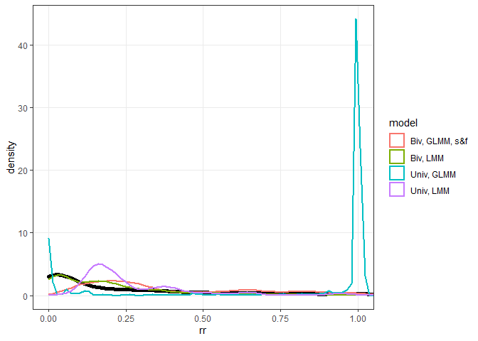
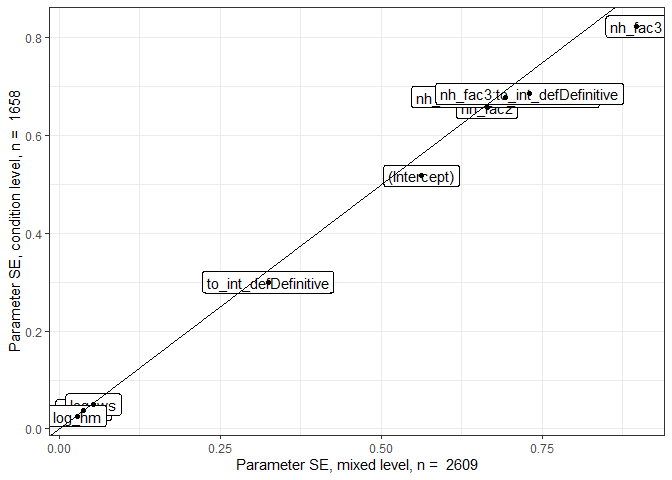
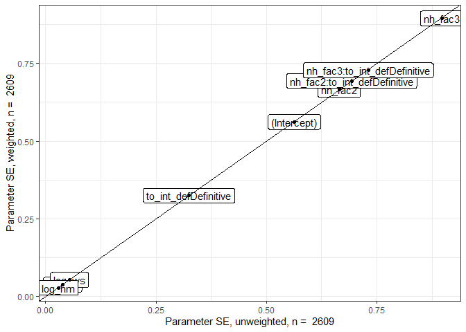
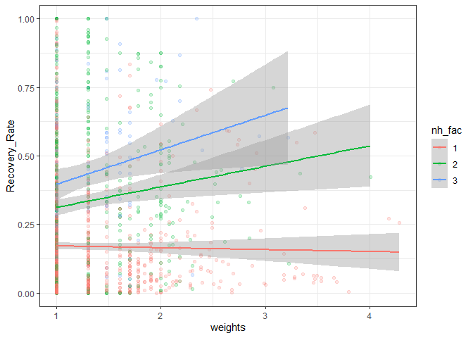
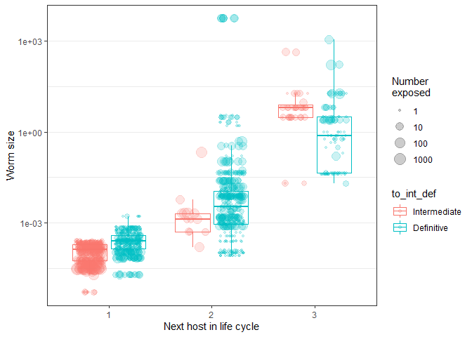

Establishment probability in worms
================

  - [Descriptive stats](#descriptive-stats)
  - [Models](#models)
      - [Model structure](#model-structure)
      - [Level of analysis - host or
        condition?](#level-of-analysis---host-or-condition)
      - [Weights](#weights)
      - [Random slopes](#random-slopes)
          - [Time of dissection](#time-of-dissection)
          - [Dose](#dose)
      - [Phylogenetic model](#phylogenetic-model)
  - [Model series for hypothesis
    testing](#model-series-for-hypothesis-testing)
      - [Hypothesis 1: recovery rates are higher later in the life
        cycle](#hypothesis-1-recovery-rates-are-higher-later-in-the-life-cycle)
      - [Hypothesis 2: recovery rates differ in intermediate vs
        definitive
        hosts](#hypothesis-2-recovery-rates-differ-in-intermediate-vs-definitive-hosts)
      - [Hypothesis 3: recovery rates increase with worm
        size](#hypothesis-3-recovery-rates-increase-with-worm-size)
      - [Hypothesis 4: recovery rates depend on host
        mass](#hypothesis-4-recovery-rates-depend-on-host-mass)
      - [Hypothesis 5: recover rate over time depends on step in the
        cycle](#hypothesis-5-recover-rate-over-time-depends-on-step-in-the-cycle)
  - [Conclusions](#conclusions)
  - [Dose as response variable](#dose-as-response-variable)

Parasitic worms often have complex life cycles, where they infect
multiple hosts in succession before reproducing. Each step in the life
cycle involves a risk, as some parasites will fail to infect the next
host in the cycle. But is this risk consistent? Using a dataset of
experimental infections from over a hundred worms, we examine what
impacts how likely it is for parasites to establish infection in their
next hosts.

# Descriptive stats

Number of infections (rows):

    ## [1] 2610

Number of species:

    ## [1] 127

Number of species in each phyla:

| parasite\_phylum | n\_distinct(Species) |
| :--------------- | -------------------: |
| Acanthocephala   |                   10 |
| Nematoda         |                   88 |
| Platyhelminthes  |                   29 |

Number of stages:

    ## [1] 157

Number of studies:

    ## [1] 153

Total number of exposed hosts:

    ## [1] 16913

Summary of doses:

    ##    Min. 1st Qu.  Median    Mean 3rd Qu.    Max. 
    ##       1      40     175    5211    2000 1000000

Summary of recoveries:

    ##     Min.  1st Qu.   Median     Mean  3rd Qu.     Max. 
    ##      0.0      3.0     15.0   1179.8     98.9 650000.0

Doses and thus recoveries vary over a large range.

# Models

For statistical modeling, we round the number of established/not
established worms to integer values. In this way, we can fit logistic
regression models, instead of treating recovery rate as a continuous
variable.

## Model structure

First, I compare how different model structures perform. I fit models
with `MCMCglmm` as it can also be used for phylogenetic analyses.

Here are the different tested models: (1) recovery rate as continuous
response, (2) recovery rate as proportion (recovered and not recovered
round to integers), (3) bivariate with log recovered and log dose as
response variables, (4) bivariate with recovered/not recovered as counts
(bivariate poisson). Notably, an error term was included in the GLMM to
account for overdispersion (additive overdispersion - equivalent to
adding an obs-level random effect to `glmer`). The preliminary models
include several presumably important predictors, including time after
infection, parasite stage, parasite size, and target host body mass. The
models include study as a random effect, but not phylogeny (yet).

The most complex model (bivariate poisson) had decent mixing for the
random effects, so the models did not have fitting issues.

<!-- --><!-- -->

For each model, I extract their predictions.

Then I compare predictions from different models with observed values.
The bivariate LMM is the worse - it has many predicted recovery rates
above 1.

<!-- -->

When reduced to only plausible values, the univariate GLMM model looks
best.

<!-- -->
Residual plots. The bivariate LMM is the worst. The univariate GLMM
looks the best.

<!-- -->

Another way to check model fit is to compare the distribution of
predictions with that of the observations. Here are density plots for
the predicted values. We can see that some models yield predictions more
closely matching the data than others, but it is a little hard to tell
with the substantial right-skew in the data.

<!-- -->

Here are the distributions overlapping. The univariate GLMM performs
best, i.e. it comes closest to the observed data distribution.

<!-- -->

The chains for the variance components in this “best” model mixed fine.

<!-- -->

In these models, we included several presumably important predictors. We
test these more formally below, but here’s the model summary:

    ## 
    ##  Iterations = 1001:40981
    ##  Thinning interval  = 20
    ##  Sample size  = 2000 
    ## 
    ##  DIC: NaN 
    ## 
    ##  G-structure:  ~Study
    ## 
    ##       post.mean l-95% CI u-95% CI eff.samp
    ## Study     10698     6996    14630     1059
    ## 
    ##  R-structure:  ~units
    ## 
    ##       post.mean l-95% CI u-95% CI eff.samp
    ## units     56020    52693    59200    323.6
    ## 
    ##  Location effects: cbind(succeeded, failed) ~ log_dpi + nh_fac * to_int_def + log_ws + log_hm 
    ## 
    ##                              post.mean l-95% CI u-95% CI eff.samp pMCMC
    ## (Intercept)                     48.007  -38.961  133.476   1067.1 0.269
    ## log_dpi                         -5.835  -16.723    3.962   2000.0 0.244
    ## nh_fac2                        -68.323 -179.156   40.362   1160.6 0.233
    ## nh_fac3                         16.080 -138.557  167.040   1671.7 0.817
    ## to_int_defDefinitive            44.844  -24.134  104.488   1203.2 0.182
    ## log_ws                           2.581   -5.554   10.330   1569.2 0.502
    ## log_hm                           2.174   -2.697    7.514   1628.8 0.415
    ## nh_fac2:to_int_defDefinitive    -1.554 -120.465  110.357    823.1 0.967
    ## nh_fac3:to_int_defDefinitive  -107.916 -246.015   37.826   1526.1 0.136

The model suggests that (i) recovery goes down with time post infection,
(ii) recovery is higher in second definitive hosts and lower in first
definitive hosts, (iii) that large larvae have higher establishment
rates, (iv) that establishment is unrelated to host mass, and (v)
considerable residual variance is between studies.

## Level of analysis - host or condition?

The data were often collected at the level of individual hosts. For
example, a study may have infected 5 hosts and then dissected them at 5
different time points. Or those 5 hosts may have been given different
doses. We did not pool these hosts to be at the ‘study level’ because we
wanted to account for variation due to e.g. when hosts were dissected.

However, some studies had a single condition, such as 100 hosts each
receiving 2 worm larva. The results of such an experiment may be
reported as a mean abundance (i.e. worms per exposed host). From such
results, we know the number of parasites given and the number recovered,
but not their distribution among hosts. Such results are at the study
level.

Logisitc regression accounts for the number of trials (worms given) and
the number of successes (worms recovered), so it should not matter that
dataset is a mix of results at the host level and the study level - the
trials do not change. Nonetheless, let’s compare models fit at either
level. We convert the dataframe to the ‘condition’ level. Any infections
within a study using e.g. different host species, doses, or dissection
times are kept separate, whereas any infection under the same conditions
are pooled.

Now we re-fit the logistic regression from above, but at the ‘condition’
level. We fit them with `lmer` since this is faster.

The fixed effect parameters are almost identical, even though the model
in which rows were sometimes individual hosts have more “observations”.

<!-- -->

The estimated SE associated with each term is also the same in the two
models.

<!-- -->

The random effects are also very similar, but they differ in ways that
we would expect. By pooling, the residual variance goes down because
there are fewer points within studies. The between study variance also
goes down slightly, presumably because pooling makes the study effects
more variable.

    ##  Groups   Name        Std.Dev.
    ##  obs      (Intercept) 1.5595  
    ##  study_rs (Intercept) 1.5081

    ##  Groups   Name        Std.Dev.
    ##  obs      (Intercept) 1.4232  
    ##  study_rs (Intercept) 1.3065

We can also compare the R2 of the two models.

They are similar, but pooling reduces the variance explained.

|       VF |       VR |       VD |       VE | marg\_r2 | cond\_r2 | study\_var\_explained |
| -------: | -------: | -------: | -------: | -------: | -------: | --------------------: |
| 1.886605 | 2.274488 | 3.289868 | 2.431945 |    0.191 |    0.421 |                 0.230 |
| 1.063910 | 1.706983 | 3.289868 | 2.025598 |    0.132 |    0.343 |                 0.211 |

Since we proceed mainly at the condition level, let’s re-calculate some
of the descriptive statistics. Number of recovery rates (rows):

    ## [1] 1659

Number of species:

    ## [1] 127

Number of stages:

    ## [1] 157

Number of studies:

    ## [1] 153

Total number of exposed hosts:

    ## [1] 16913

Proportion without worm size:

    ## [1] 0

Proportion without host mass:

    ## [1] 0.0006027728

Proportion without host or parasite size

    ## [1] 0.0006027728

## Weights

Most experimental infections are based on single individuals, but some
experiments report infection rates from groups of individuals.

<!-- -->

We would like to give experiments with multiple individuals more weight,
but it is tricky to know how. Should an infection of 10 hosts have a
10-fold higher weight in the analysis than an infection with one animal?
Or 2-fold, if on a log10 scale? Let’s try weighting the analysis on a
log-10 scale, and then we’ll compare a non-phylogenetic model with and
without weighting.

The fixed effects are essentially identical in the models with or
without weighting, either at the host and condition level.

<!-- -->

Or at the condition level.

<!-- -->

The estimated SE associated with each term is also the same in the two
models.

<!-- -->

Maybe weights have little impact because they are unrelated to recovery
rate. Experiments given higher weights are not more likely to have a
high or low recovery rate.

<!-- -->

Given that (i) it is not clear how to weight by sample size and (ii) it
doesn’t affect the parameters, I proceed without weighting by sample
size.

## Random slopes

### Time of dissection

We did not average at the study level, because there are some important
sources of variation within studies, like different dissection times. In
the previous models, we fit a single time-dependent decrease in
recovery. This may be a little disingenuous because different parasite
species or stages may be lost from hosts at different rates. Here is the
relationship over the full data (infections pooled at condition level):

<!-- -->

As expected, recovery rates go down with days post infection, but there
is a lot of variation. Also, it is not clear that the relationship is
linear. For example, the dashed line is the relationship with log time,
which assume that hazards are exponential (i.e. they don’t accumulate
linearly).

Given that hosts were dissected on different time schedules in different
studies, each study could have a different relationship with time. Here
is a plot showing time-dependent recovery in 49 studies. We see that the
relationship is usually linear, though sometimes the log relationship
fits better (dashed lines). We can also see that sometimes there is a
negative relationship, sometimes none, and sometimes a positive
relationship.

<!-- -->

Thus, let’s compare three models: 1) studies differ but have the same
time effect (random intercepts), 2) study x time (random slopes), and 3)
study x log time.

The random slopes model was a clear improvement, regardless whether time
was untransformed…

|        | npar |      AIC |      BIC |     logLik | deviance |   Chisq | Df | Pr(\>Chisq) |
| :----- | ---: | -------: | -------: | ---------: | -------: | ------: | -: | ----------: |
| m2\_ri |   11 | 18734.52 | 18794.07 | \-9356.260 | 18712.52 |      NA | NA |          NA |
| m2\_rs |   13 | 18659.81 | 18730.19 | \-9316.907 | 18633.81 | 78.7064 |  2 |           0 |

…or log transformed.

|         | npar |      AIC |      BIC |     logLik | deviance |    Chisq | Df | Pr(\>Chisq) |
| :------ | ---: | -------: | -------: | ---------: | -------: | -------: | -: | ----------: |
| m2\_ril |   11 | 18757.54 | 18817.08 | \-9367.768 | 18735.54 |       NA | NA |          NA |
| m2\_rsl |   13 | 18645.84 | 18716.21 | \-9309.921 | 18619.84 | 115.6959 |  2 |           0 |

The random slopes model with log time was also a better fit than the
model with untransformed time.

|         | npar |      AIC |      BIC |     logLik | deviance |    Chisq | Df | Pr(\>Chisq) |
| :------ | ---: | -------: | -------: | ---------: | -------: | -------: | -: | ----------: |
| m2\_rs  |   13 | 18659.81 | 18730.19 | \-9316.907 | 18633.81 |       NA | NA |          NA |
| m2\_rsl |   13 | 18645.84 | 18716.21 | \-9309.921 | 18619.84 | 13.97353 |  0 |           0 |

Calculating R2 values for random slope models is more complex
than for random intercept models, because the variance explained by the
random effects depends on the levels of the random effect (Study) *and*
the covariate values (time). We modified code given
[here](https://besjournals.onlinelibrary.wiley.com/doi/full/10.1111/2041-210X.12225)
to calculate R2 for random slope models. We can see how the
conditional R2 goes up as we include random slopes, though it
does not increase further when we use with log time. The reason is that
the overall error variance goes down when we use log time, but so does
the variance between studies. This suggests that using log time better
accounts for variation within studies, thereby reducing the differences
between studies.

| step                   | df\_used |       VF |       VR |       VD |       VE | marg\_r2 | cond\_r2 | study\_var\_explained |
| :--------------------- | -------: | -------: | -------: | -------: | -------: | -------: | -------: | --------------------: |
| random int             |       NA | 1.134203 | 1.747451 | 3.289868 | 1.986083 |    0.139 |    0.353 |                 0.214 |
| random slope           |        0 | 1.050602 | 2.534511 | 3.289868 | 1.745322 |    0.122 |    0.416 |                 0.294 |
| random slope, log time |        0 | 0.981403 | 2.733993 | 3.289868 | 1.664046 |    0.113 |    0.429 |                 0.316 |

Here is the summary of the simplest random slopes model (i.e. just time,
study, and their interaction). Interestingly, the fixed effect of dpi is
only weakly negative. Both the random intercept term (studies differ in
mean recovery) and the random slope term (studies differ in how recovery
changes with time) are positive. The covariance tends to be negative,
indicating that studies with above average recoveries tend to be
associated with stronger decreases over time. Conversely, if recovery is
low to begin with, then it has more of a chance to increase (positive
slopes).

    ## Generalized linear mixed model fit by maximum likelihood (Laplace
    ##   Approximation) [glmerMod]
    ##  Family: binomial  ( logit )
    ## Formula: cbind(succeeded, failed) ~ log_dpi + (1 + log_dpi | study_rs) +  
    ##     (1 | obs)
    ##    Data: filter(datx, !is.na(log_ws), !is.na(log_hm))
    ## 
    ##      AIC      BIC   logLik deviance df.resid 
    ##  18724.1  18756.6  -9356.1  18712.1     1652 
    ## 
    ## Scaled residuals: 
    ##      Min       1Q   Median       3Q      Max 
    ## -1.59925 -0.06255  0.00152  0.04473  1.66650 
    ## 
    ## Random effects:
    ##  Groups   Name        Variance Std.Dev. Corr 
    ##  obs      (Intercept) 1.737    1.3179        
    ##  study_rs (Intercept) 5.812    2.4107        
    ##           log_dpi     0.465    0.6819   -0.75
    ## Number of obs: 1658, groups:  obs, 1658; study_rs, 169
    ## 
    ## Fixed effects:
    ##             Estimate Std. Error z value Pr(>|z|)    
    ## (Intercept) -0.97569    0.26910  -3.626 0.000288 ***
    ## log_dpi     -0.15522    0.07845  -1.979 0.047867 *  
    ## ---
    ## Signif. codes:  0 '***' 0.001 '**' 0.01 '*' 0.05 '.' 0.1 ' ' 1
    ## 
    ## Correlation of Fixed Effects:
    ##         (Intr)
    ## log_dpi -0.855

This plot shows how slopes and intercepts are negatively related at the
level of study. This correlation, though, disappears when the time
variable is centered (not shown).

<!-- -->

Since the random slopes model appears to be superior, let’s check the
predictions. Here are the random slope predictions within studies. The
model seems to capture the relationships well.

<!-- -->

The number of studies where recovery increases looks similar to the
number that decreases. Let’s check each study individually. Here are the
number of studies with at least 4 dissection times

    ## [1] 102

We fit a simple logistic regression to each one to test whether recovery
usually increases or decreases over time.

Here’s the distribution of regression coefficients.

<!-- -->

There were more studies with negative coefficients than positive
coefficients, but not many. Negative coefficients (decreased recover
over time) were a bit more likely to be statistically significant (P \<
0.001) than positive coefficients.

| beta\_dir |  n | sigs | perc\_sig |
| :-------- | -: | ---: | --------: |
| neg       | 54 |   41 |     0.759 |
| pos       | 48 |   34 |     0.708 |

How quickly recovery decreases with time is not dependent on life stage,
so e.g. recovery does not decrease faster for worms in the second host
compared to the first host.

<!-- -->

One worry is if model fit varies with time post exposure, such as if
there was systemic undercounting in early dissections. The residual
plots across studies do not suggest that recovery rates are over- or
underestimated at different dpi.

<!-- -->

Let’s make some plots with CIs for the change in recovery with time.
We’ll use `MCMCglmm` to fit the models.

Here is the overall decrease in recovery with time, as predicted by the
random intercepts model.

<!-- -->

Here is the same plot but the predictions are from the random slopes
model. They are similar, though the CI is wider in the random slopes
model.

<!-- -->

We can also pick a few studies for a manuscript figure that illustrates
the different time by recovery relationships.

<!-- -->

### Dose

Another researcher-controlled variable that varied within studies was
dose. Some studies used multiple doses. Recovery rates might increase
with dose (e.g. more worms overwhelm immune responses) or decrease with
dose (competition among parasites, increased immune response). Here’s
how the pattern looks across the studies with multiple doses. Often the
relationship is flat or decreasing. And it is usually linear as
log-transforming dose did not provide a better fit in most cases.

<!-- -->

However, across the whole data dose varies by several orders of
magnitude, so a linear relationship (solid line) does not fit the data
well. Dose probably needs to be log-transformed for analyses.

<!-- -->

Here is the same plot, but with the x-axis log transformed. The
relationship between recovery and log dose (dashed line) fits better.
Higher doses are associated with lower recovery. This suggests that
researchers use higher doses when lower recovery rates are expected *OR*
that higher doses cause lower recovery.

<!-- -->

At least within studies, higher doses seem to cause lower recovery. The
red lines on the next plot are the fits for each study and they are
often negative.

<!-- -->

Given the broad range of doses, it is probably better to use log dose in
the analyses. For example, when we add untransformed dose as a fixed
effect to the random-intercpt model we fitted above, the effect is weak.

|         | npar |      AIC |      BIC |     logLik | deviance |     Chisq | Df | Pr(\>Chisq) |
| :------ | ---: | -------: | -------: | ---------: | -------: | --------: | -: | ----------: |
| m2\_ril |   11 | 18757.54 | 18817.08 | \-9367.768 | 18735.54 |        NA | NA |          NA |
| m2\_rid |   12 | 18759.31 | 18824.27 | \-9367.654 | 18735.31 | 0.2291597 |  1 |   0.6321476 |

But it is very clear with log-transformed dose.

|          | npar |      AIC |      BIC |     logLik | deviance |    Chisq | Df | Pr(\>Chisq) |
| :------- | ---: | -------: | -------: | ---------: | -------: | -------: | -: | ----------: |
| m2\_ril  |   11 | 18757.54 | 18817.08 | \-9367.768 | 18735.54 |       NA | NA |          NA |
| m2\_rild |   12 | 18680.98 | 18745.94 | \-9328.491 | 18656.98 | 78.55497 |  1 |           0 |

A random slopes model with untransformed dose also has numerical issues
with fitting, so I continue with log dose.

Let’s compare three models: 1) studies differ but have the same dose
relationship (random intercepts), 2) study x dose (random slopes), and
3) with both random slopes terms (dose and dpi).

Adding a dose random slopes term to a random intercept model is an
improvement…

|          | npar |      AIC |      BIC |     logLik | deviance |    Chisq | Df | Pr(\>Chisq) |
| :------- | ---: | -------: | -------: | ---------: | -------: | -------: | -: | ----------: |
| m2\_rild |   12 | 18680.98 | 18745.94 | \-9328.491 | 18656.98 |       NA | NA |          NA |
| m2\_rsd  |   14 | 18602.36 | 18678.15 | \-9287.182 | 18574.36 | 82.61812 |  2 |           0 |

…as is adding the dose random slopes term to a model that already
includes a random slopes term for time dpi.

|                                     | npar |      AIC |      BIC |     logLik | deviance |   Chisq | Df | Pr(\>Chisq) |
| :---------------------------------- | ---: | -------: | -------: | ---------: | -------: | ------: | -: | ----------: |
| update(m2\_rsl, . \~ . + log\_dose) |   14 | 18571.62 | 18647.40 | \-9271.808 | 18543.62 |      NA | NA |          NA |
| m2\_rs2                             |   17 | 18493.15 | 18585.18 | \-9229.575 | 18459.15 | 84.4654 |  3 |           0 |

The main effect of dose explains about 4% of variation in recovery,
whereas the random slopes explains just 1-2%. By contrast, dissection
time random effect explains more of the variation within studies
(\~10%). This suggests that studies with different recovery rates use
different doses and that dose explains relatively little variation
within studies.

| step                             | df\_used |       VF |       VR |       VD |       VE | marg\_r2 | cond\_r2 | study\_var\_explained |
| :------------------------------- | -------: | -------: | -------: | -------: | -------: | -------: | -------: | --------------------: |
| random int, without dose         |       NA | 1.063965 | 1.706982 | 3.289868 | 2.025617 |    0.132 |    0.343 |                 0.211 |
| random int, dose main effect     |        1 | 1.372201 | 1.771975 | 3.289868 | 1.899724 |    0.165 |    0.377 |                 0.212 |
| random slope for dose            |        0 | 1.098294 | 2.185739 | 3.289868 | 1.751019 |    0.132 |    0.394 |                 0.262 |
| two random slopes, dose and time |        0 | 1.039375 | 3.461034 | 3.289868 | 1.420282 |    0.113 |    0.489 |                 0.376 |

Let’s check the predictions. Here are the predicted recoveries given the
study by dose interaction (no fixed effects). They look good, but it is
also clear that these relationships vary less than the study x time
relationships.

<!-- -->

Like we did for dissection times, let’s fit a logistic regression to
each study with at least 4 different doses. There are only 27 of these
studies.

    ## [1] 33

We fit a simple logistic regression to each one to test whether recovery
usually increases or decreases over time.

Here’s the distribution of regression coefficients. There’s a negative
skew.

<!-- -->

There were twice as many studies with negative coefficients than
positive coefficients, and they were much more likely to be considered
significant (P \< 0.001).

| beta\_dir |  n | sigs | perc\_sig |
| :-------- | -: | ---: | --------: |
| neg       | 23 |   18 |     0.783 |
| pos       | 10 |    5 |     0.500 |

So dose explains some variation within studies, but much less than
dissection time. And dose seems to explain a fair amount of the
differences between studies. However, this is also the main variation we
are trying to parse. I think that doses are chosen in response to
different recovery rates by researchers, not the other way around
(i.e. using high doses is not why recovery rates are lower).

Since dose is incorporated into the response variable and since it
probably does not cause the large variation across studies by itself, I
leave it out of the main models, but consider it again at the end of the
notebook.

## Phylogenetic model

Now let’s add phylogeny into the model. We fit `MCMCglmm` models because
it can incorporate phylogeny as random effects (phylogenetic covariance
matrix). We want to assess whether phylogeny accounts for variation
beyond study, since studies are usually on one species or a few closely
related species.

We’ll add phylogeny three ways: 1) by itself, 2) to a model with just
the study effect, and 3) to a model with study and the main fixed
effects. This tests whether phylogeny explains variation alone, beyond
study, and beyond life cycle characteristics, respectively.

When we compare models with DIC, we find that a model with just a
phylogenetic effect is not clearly better than one with just a study
effect (random intercept).

    ## delta DIC, study-only (random intercept) vs phylogeny-only model: -1.89 (higher is better)

Adding phylogeny to the random slopes model is also not an obvious
improvement

    ## delta DIC, study-only (random slopes) vs phylogeny+random slopes: -3.17 (higher is better)

And here’s what happens when we add phylogeny to the model with several
fixed effects (stage, worm and host size).

    ## delta DIC, without vs with phylogeny when fixed effects in model: -4.27 (higher is better)

In the phylogeny-only model, the phylogeny variance component is very
large relatively to the residual variance, it is almost certainly
inflated. Maybe some branches are associated with complete separation
(100% recovery rates).

<!-- -->
When we add phylogeny to the random slopes model, it is much lower and
not clearly different from zero, either without fixed effects…

<!-- -->

…or with fixed effects.

<!-- -->

The phylogenetic effect competes with the study effect - when we add
phylogeny to a model with just study (random intercept) their variance
components are negatively correlated (not shown). This makes sense. A
given study usually focused on a single parasite species, so phylogeny
and study should explain some of the same variation.

Let’s compare R2 values for the models with and without
phylogeny.

Weirdly, the R2 table suggests phylogeny alone has a huge
effect compared to study alone (with or without random slopes). This is
due to the very large variance component for the phylogenetic effect.

| model                   | r2m                   | r2c                   |
| :---------------------- | :-------------------- | :-------------------- |
| study only, random int  | 0.011 \[0.005-0.021\] | 0.319 \[0.267-0.379\] |
| study only, rand slopes | 0.005 \[0-0.02\]      | 0.417 \[0.363-0.475\] |
| phylogeny only          | 0 \[0-0\]             | 0.769 \[0.647-0.871\] |

This seeming importance of phylogeny disappears when we add it to a
model with random slopes. It explains little variation beyond that
explained by the study effect.

| model                   | r2m               | r2c                   |
| :---------------------- | :---------------- | :-------------------- |
| study only, rand slopes | 0.005 \[0-0.02\]  | 0.417 \[0.363-0.475\] |
| rand slopes + phylogeny | 0.004 \[0-0.015\] | 0.458 \[0.387-0.556\] |

Phylogeny might account for some variation beyond that explained by
study in a model with multiple fixed effects. However, this phylogenetic
effect bordered zero.

| model                                     | r2m                  | r2c                  |
| :---------------------------------------- | :------------------- | :------------------- |
| random slopes + fixed effects             | 0.118 \[0.08-0.161\] | 0.456 \[0.4-0.512\]  |
| random slopes + fixed effects + phylogeny | 0.16 \[0.102-0.22\]  | 0.594 \[0.486-0.71\] |

I would not actually predict a strong phylogenetic effect, because
different life stages from closely related species might have very
different infection probabilities. Also, recovery rates are variable and
measured with considerable error, making phylogenetic effects harder to
detect.

Since “study” and “species” overlap substantially, maybe we should just
look at higher taxonomic levels. Since studies usually focus on the same
species, maybe we can detect taxonomic/phyla effects by looking at
whether e.g. parasite families have similar recovery rates across
studies. To test this, we replace parasite phylogeny with taxonomy in
the model, but only the higher taxonomic levels (i.e. phylum, class,
order, and family - presumably those levels won’t overlap much with the
study effect).

When we fit that model, we see that the taxonomic effects are usually
near zero. This suggests species from the same order, family, etc. do
not have more similar recovery rates than we would expect.

<!-- -->

Here is the change in DIC when adding taxonomy to a model with fixed
effects.

    ## delta DIC, random slopes&fixed effx vs +taxonomy: -4.73 (higher is better)

And the R2 values goes up when we add taxonomy, though the
conditional R2 has a wide range because the taxonomic effects
were hard to estimate.

| model                                    | r2m                   | r2c                   |
| :--------------------------------------- | :-------------------- | :-------------------- |
| random slopes + fixed effects            | 0.118 \[0.08-0.161\]  | 0.456 \[0.4-0.512\]   |
| random slopes + fixed effects + taxonomy | 0.116 \[0.002-0.186\] | 0.606 \[0.466-0.994\] |

When we fit the taxonomic model with `lmer` and then perform a
likelihood ratio test to see if adding taxonomy improves the model, it
is not significant.

|             | npar |      AIC |      BIC |     logLik | deviance |     Chisq | Df | Pr(\>Chisq) |
| :---------- | ---: | -------: | -------: | ---------: | -------: | --------: | -: | ----------: |
| m2\_rsl     |   13 | 18645.84 | 18716.21 | \-9309.921 | 18619.84 |        NA | NA |          NA |
| m2\_rs\_tax |   17 | 18653.22 | 18745.25 | \-9309.610 | 18619.22 | 0.6209468 |  4 |   0.9607078 |

The variance components for study and most higher taxonomic levels are
uncorrelated, with the exception of parasite family (some studies might
be the only ones on a particular worm family). This suggests the
negative correlation between study and phylogenetic effects in the
previous models is due to the same species/genera being studied.

    ##                                  (Intercept):(Intercept).study_rs
    ## (Intercept):(Intercept).study_rs                             1.00
    ## log_dpi:(Intercept).study_rs                                -0.92
    ## (Intercept):log_dpi.study_rs                                -0.92
    ## log_dpi:log_dpi.study_rs                                     0.71
    ## parasite_phylum                                              0.03
    ## parasite_class                                              -0.02
    ## parasite_order                                               0.01
    ## parasite_family                                             -0.20
    ## units                                                       -0.14
    ##                                  log_dpi:(Intercept).study_rs
    ## (Intercept):(Intercept).study_rs                        -0.92
    ## log_dpi:(Intercept).study_rs                             1.00
    ## (Intercept):log_dpi.study_rs                             1.00
    ## log_dpi:log_dpi.study_rs                                -0.90
    ## parasite_phylum                                         -0.06
    ## parasite_class                                           0.00
    ## parasite_order                                          -0.01
    ## parasite_family                                          0.05
    ## units                                                    0.16
    ##                                  (Intercept):log_dpi.study_rs
    ## (Intercept):(Intercept).study_rs                        -0.92
    ## log_dpi:(Intercept).study_rs                             1.00
    ## (Intercept):log_dpi.study_rs                             1.00
    ## log_dpi:log_dpi.study_rs                                -0.90
    ## parasite_phylum                                         -0.06
    ## parasite_class                                           0.00
    ## parasite_order                                          -0.01
    ## parasite_family                                          0.05
    ## units                                                    0.16
    ##                                  log_dpi:log_dpi.study_rs parasite_phylum
    ## (Intercept):(Intercept).study_rs                     0.71            0.03
    ## log_dpi:(Intercept).study_rs                        -0.90           -0.06
    ## (Intercept):log_dpi.study_rs                        -0.90           -0.06
    ## log_dpi:log_dpi.study_rs                             1.00            0.07
    ## parasite_phylum                                      0.07            1.00
    ## parasite_class                                       0.02           -0.01
    ## parasite_order                                      -0.01            0.00
    ## parasite_family                                      0.04            0.01
    ## units                                               -0.16            0.00
    ##                                  parasite_class parasite_order parasite_family
    ## (Intercept):(Intercept).study_rs          -0.02           0.01           -0.20
    ## log_dpi:(Intercept).study_rs               0.00          -0.01            0.05
    ## (Intercept):log_dpi.study_rs               0.00          -0.01            0.05
    ## log_dpi:log_dpi.study_rs                   0.02          -0.01            0.04
    ## parasite_phylum                           -0.01           0.00            0.01
    ## parasite_class                             1.00           0.03            0.09
    ## parasite_order                             0.03           1.00            0.17
    ## parasite_family                            0.09           0.17            1.00
    ## units                                     -0.08          -0.11           -0.08
    ##                                  units
    ## (Intercept):(Intercept).study_rs -0.14
    ## log_dpi:(Intercept).study_rs      0.16
    ## (Intercept):log_dpi.study_rs      0.16
    ## log_dpi:log_dpi.study_rs         -0.16
    ## parasite_phylum                   0.00
    ## parasite_class                   -0.08
    ## parasite_order                   -0.11
    ## parasite_family                  -0.08
    ## units                             1.00

Here’s a plot showing how the VC estimates for parasite order are
unrelated to those for study.

<!-- -->

We can also make a plot to confirm that recovery rates do not vary with
taxonomy. Let’s look at parasite families. The black points are observed
recovery rates, while the red points are the medians for the family. It
looks like some families might have higher infection rates than others,
but recall that these may be single studies.

<!-- -->

When we take the average recovery for a study, then the differences
among parasite families are much less conspicuous.

<!-- -->

When we make the same plot for parasite orders, which is less confounded
with “study”, we see few compelling differences.

<!-- -->

What about the fixed effects? Are they the same with or without a
phylogenetic random effect? They are rather tightly correlated,
suggesting that a model with or without phylogeny will not impact the
conclusions.

<!-- -->

So, phylogeny does not have a clear effect on recovery, at least
independent from study effects. Since phylogeny (1) does not affect the
fixed effects, (2) is hard to estimate, and (3) intuitively should be
low in this dataset, we leave it out of the main analysis.

# Model series for hypothesis testing

We now want to build a series of models. We’ll use our random slopes
model as the “base” model: it includes just study and days until
dissection. We then add terms to this model to test explicit hypotheses.

Here is the base model summary:

    ## 
    ##  Iterations = 1001:40981
    ##  Thinning interval  = 20
    ##  Sample size  = 2000 
    ## 
    ##  DIC: 12183221 
    ## 
    ##  G-structure:  ~us(1 + log_dpi):study_rs
    ## 
    ##                                  post.mean l-95% CI u-95% CI eff.samp
    ## (Intercept):(Intercept).study_rs    5.8783   3.6118   8.5470     1517
    ## log_dpi:(Intercept).study_rs       -1.2702  -1.9547  -0.6405     1575
    ## (Intercept):log_dpi.study_rs       -1.2702  -1.9547  -0.6405     1575
    ## log_dpi:log_dpi.study_rs            0.5003   0.2914   0.6986     2000
    ## 
    ##  R-structure:  ~units
    ## 
    ##       post.mean l-95% CI u-95% CI eff.samp
    ## units      1.75    1.609    1.896     2000
    ## 
    ##  Location effects: cbind(succeeded, failed) ~ log_dpi 
    ## 
    ##             post.mean  l-95% CI  u-95% CI eff.samp pMCMC   
    ## (Intercept) -0.983263 -1.493765 -0.429399     2000 0.003 **
    ## log_dpi     -0.150906 -0.304588  0.009262     2000 0.058 . 
    ## ---
    ## Signif. codes:  0 '***' 0.001 '**' 0.01 '*' 0.05 '.' 0.1 ' ' 1

Now let’s get to hypothesis testing. Throughout we use the random slopes
model with log-transformed time.

### Hypothesis 1: recovery rates are higher later in the life cycle

First, we test whether parasite life stage impacts establishment,
specifically whether the parasite is infecting the first, second, third
host, etc. To test this, we add ‘step in cycle’ to model.

When we look at the parameter estimates, we see that recovery is
significantly higher in second hosts than first hosts. The difference
between second and third hosts is not significant.

    ## 
    ##  Iterations = 1001:40981
    ##  Thinning interval  = 20
    ##  Sample size  = 2000 
    ## 
    ##  DIC: 12183227 
    ## 
    ##  G-structure:  ~us(1 + log_dpi):study_rs
    ## 
    ##                                  post.mean l-95% CI u-95% CI eff.samp
    ## (Intercept):(Intercept).study_rs    4.8024   2.7434   6.9728     1814
    ## log_dpi:(Intercept).study_rs       -1.0646  -1.6348  -0.5092     1814
    ## (Intercept):log_dpi.study_rs       -1.0646  -1.6348  -0.5092     1814
    ## log_dpi:log_dpi.study_rs            0.4403   0.2755   0.6309     1856
    ## 
    ##  R-structure:  ~units
    ## 
    ##       post.mean l-95% CI u-95% CI eff.samp
    ## units      1.76    1.618    1.909     2000
    ## 
    ##  Location effects: cbind(succeeded, failed) ~ log_dpi + nh_fac 
    ## 
    ##             post.mean l-95% CI u-95% CI eff.samp  pMCMC    
    ## (Intercept)  -1.61755 -2.14743 -1.07933     2000 <5e-04 ***
    ## log_dpi      -0.16254 -0.31265 -0.02108     2000  0.038 *  
    ## nh_fac2       1.16106  0.56986  1.70276     2000 <5e-04 ***
    ## nh_fac3       1.85175  0.95180  2.78929     2000 <5e-04 ***
    ## ---
    ## Signif. codes:  0 '***' 0.001 '**' 0.01 '*' 0.05 '.' 0.1 ' ' 1

Model DIC is not much better with parasite stage, although the term was
significant.

    ## delta DIC, with and without 'next host': -5.89 (higher is better)

The R2 table elucidates this contradiction. The overall model
fit is not better. Instead, the fixed effect of stage now explains about
5% of the variation, which was subtracted from the “study” variation. In
essence, different studies usually focus on different life stages, which
in turn differ in their infection rates.

| model                        | r2m                   | r2c                   |
| :--------------------------- | :-------------------- | :-------------------- |
| base random slopes, log time | 0.005 \[0-0.02\]      | 0.417 \[0.363-0.475\] |
| parasite stage               | 0.059 \[0.026-0.103\] | 0.412 \[0.359-0.468\] |

So life cycle step is important in determining infection rates. Let’s
plot the predicted means for different life stages at day one post
infection (the intercept). Recovery rates increase with life cycle
length, but the difference between 2nd and 3rd stage larva is not clear,
since CIs overlap. For all stages, predicted recoveries are higher than
observed ones. This is because most hosts were dissected after several
days or even weeks.

<!-- -->

When we plot the predictions at the median time of dissection (18 days),
then predictions better match observed medians.

<!-- -->

Here are those predicted means:

| nh\_fac |       fit |       lwr |       upr |
| :------ | --------: | --------: | --------: |
| 1       | 0.1103326 | 0.0776165 | 0.1516971 |
| 2       | 0.2836790 | 0.2060106 | 0.3714641 |
| 3       | 0.4413705 | 0.2671148 | 0.6504169 |

The differences among life stages were similar when estimated 1 or 18
dpi (though the CIs are obviously lower at the median of 18 dpi) because
dissection times did not differ much among life stages.

<!-- -->

### Hypothesis 2: recovery rates differ in intermediate vs definitive hosts

The first host in a cycle can be an intermediate host (in a complex
cycle) or a definitive host (in a direct cycle). Does this matter? To
test this hypothesis, we distinguish between cases where worms infect
intermediate vs definitive hosts. Before entering this term into a
model, let’s make sure that there are enough species and studies at each
combination of life stage and host type. Here are the number of species
in the different combinations. There are fewer intermediate host
infections later in the life cycle, as expected.

    ##       to_int_def
    ## nh_fac Intermediate Definitive
    ##      1           31         40
    ##      2            7         57
    ##      3            6         16

Here are the number of studies:

    ##       to_int_def
    ## nh_fac Intermediate Definitive
    ##      1           35         47
    ##      2            9         61
    ##      3            6         15

Both tables suggest that there are several species and studies in each
combination of life stage and int/def, so it is reasonable to add it to
the mixed model.

The model suggests parasites have lower recovery rates in definitive
hosts than in intermediate hosts.

    ## 
    ##  Iterations = 1001:40981
    ##  Thinning interval  = 20
    ##  Sample size  = 2000 
    ## 
    ##  DIC: 12183224 
    ## 
    ##  G-structure:  ~us(1 + log_dpi):study_rs
    ## 
    ##                                  post.mean l-95% CI u-95% CI eff.samp
    ## (Intercept):(Intercept).study_rs    5.3180   3.0309   7.6379     1859
    ## log_dpi:(Intercept).study_rs       -1.1308  -1.7694  -0.5609     1842
    ## (Intercept):log_dpi.study_rs       -1.1308  -1.7694  -0.5609     1842
    ## log_dpi:log_dpi.study_rs            0.4629   0.2802   0.6559     1869
    ## 
    ##  R-structure:  ~units
    ## 
    ##       post.mean l-95% CI u-95% CI eff.samp
    ## units     1.699    1.554    1.857     1870
    ## 
    ##  Location effects: cbind(succeeded, failed) ~ log_dpi + nh_fac + to_int_def 
    ## 
    ##                      post.mean l-95% CI u-95% CI eff.samp  pMCMC    
    ## (Intercept)           -0.90394 -1.54901 -0.25735     2000  0.004 ** 
    ## log_dpi               -0.16829 -0.32537 -0.01265     2000  0.038 *  
    ## nh_fac2                1.52881  0.95861  2.12017     2000 <5e-04 ***
    ## nh_fac3                2.05711  1.11100  2.98987     2000 <5e-04 ***
    ## to_int_defDefinitive  -1.16931 -1.61721 -0.68292     2000 <5e-04 ***
    ## ---
    ## Signif. codes:  0 '***' 0.001 '**' 0.01 '*' 0.05 '.' 0.1 ' ' 1

Model DIC is not much better though.

    ## delta DIC, with int vs def: 3.37 (higher is better)

Nor is it clear that recovery rates at a given life stage depend on
whether the host is an intermediate or definitive host.

    ## delta DIC, with stage x int/def interaction: 4.7 (higher is better)

Here’s how R2 changes. Like for parasite stage, the total
variance explained does not increase much by adding the intermediate vs
definitive host distinction, but more variation is attributed to the
fixed effects.

| model                  | r2m                   | r2c                   |
| :--------------------- | :-------------------- | :-------------------- |
| base + parasite stage  | 0.059 \[0.026-0.103\] | 0.412 \[0.359-0.468\] |
| \+ to int vs def       | 0.078 \[0.043-0.12\]  | 0.45 \[0.394-0.511\]  |
| \+ stage by int vs def | 0.09 \[0.054-0.136\]  | 0.465 \[0.405-0.525\] |

And here’s the plot. Predicted means are at the median dissection time
(18 dpi). Infections of first intermediate hosts are more successful
than infection of first definitive hosts. But the opposite is true for
second hosts.

<!-- -->

The higher recovery in first or second intermediate hosts might be due
to being dissected later, i.e. the model thinks the observed recovery
rates are lower than they would be if they were dissected earlier.

<!-- -->
Here are the median dissection times.

| nh\_fac | to\_int\_def | dpi |
| :------ | :----------- | --: |
| 1       | Intermediate |  21 |
| 1       | Definitive   |  14 |
| 2       | Intermediate |  30 |
| 2       | Definitive   |  22 |
| 3       | Intermediate |  14 |
| 3       | Definitive   |  15 |

But it likely is due to worms having larger infective stages when the
next host is the definitive host.

<!-- -->

Thus, this term needs to be disentangled from our next model predictor,
worm size. But before moving onto that, let’s make a manuscript figure.

<!-- -->

### Hypothesis 3: recovery rates increase with worm size

Since later life stages targeting definitive hosts have better
establishment rates, is this because they are larger? Let’s add the size
of infective parasite stages into the model. Moreover, if worm size
drives the pattern, we expect the effect of “step” and the “int vs def”
distinction to decrease once size is added. And there should not be an
interaction between next host and parasite size.

The worm size term is significant. Moreover, the difference among life
stages decreased.

    ## 
    ##  Iterations = 1001:40981
    ##  Thinning interval  = 20
    ##  Sample size  = 2000 
    ## 
    ##  DIC: 12183226 
    ## 
    ##  G-structure:  ~us(1 + log_dpi):study_rs
    ## 
    ##                                  post.mean l-95% CI u-95% CI eff.samp
    ## (Intercept):(Intercept).study_rs    5.0777   2.9234   7.5677     1787
    ## log_dpi:(Intercept).study_rs       -1.1269  -1.7758  -0.5860     1850
    ## (Intercept):log_dpi.study_rs       -1.1269  -1.7758  -0.5860     1850
    ## log_dpi:log_dpi.study_rs            0.4428   0.2741   0.6327     2000
    ## 
    ##  R-structure:  ~units
    ## 
    ##       post.mean l-95% CI u-95% CI eff.samp
    ## units     1.689    1.559    1.835     1693
    ## 
    ##  Location effects: cbind(succeeded, failed) ~ log_dpi + nh_fac * to_int_def + log_ws 
    ## 
    ##                              post.mean  l-95% CI  u-95% CI eff.samp  pMCMC    
    ## (Intercept)                   1.942523  0.773771  3.212140     1712  0.004 ** 
    ## log_dpi                      -0.161177 -0.314174 -0.006291     2006  0.035 *  
    ## nh_fac2                      -0.972169 -2.344405  0.509957     2000  0.189    
    ## nh_fac3                      -1.889303 -3.788801 -0.184517     1791  0.035 *  
    ## to_int_defDefinitive         -1.534276 -2.025026 -1.043506     2000 <5e-04 ***
    ## log_ws                        0.299648  0.189403  0.412221     2000 <5e-04 ***
    ## nh_fac2:to_int_defDefinitive  1.581982  0.065623  2.955339     2000  0.033 *  
    ## nh_fac3:to_int_defDefinitive  1.470409 -0.079291  2.818702     2000  0.056 .  
    ## ---
    ## Signif. codes:  0 '***' 0.001 '**' 0.01 '*' 0.05 '.' 0.1 ' ' 1

Again, despite being significant, adding worm size is not a huge
improvement, as judged by DIC.

    ## delta DIC, after adding parasite size: -2.92 (higher is better)

Neither is adding a worm size by stage interaction

    ## delta DIC, after adding parasite size x stage: 2.05 (higher is better)

Here is the summary from the more complex model with a worm size by
stage interaction. Most of the interactions with worm size are not
significant.

    ## 
    ##  Iterations = 1001:40981
    ##  Thinning interval  = 20
    ##  Sample size  = 2000 
    ## 
    ##  DIC: 12183223 
    ## 
    ##  G-structure:  ~us(1 + log_dpi):study_rs
    ## 
    ##                                  post.mean l-95% CI u-95% CI eff.samp
    ## (Intercept):(Intercept).study_rs    5.4878   3.3102   8.0502     1767
    ## log_dpi:(Intercept).study_rs       -1.2175  -1.8417  -0.6601     1794
    ## (Intercept):log_dpi.study_rs       -1.2175  -1.8417  -0.6601     1794
    ## log_dpi:log_dpi.study_rs            0.4567   0.2961   0.6581     2000
    ## 
    ##  R-structure:  ~units
    ## 
    ##       post.mean l-95% CI u-95% CI eff.samp
    ## units     1.679    1.543    1.828     1809
    ## 
    ##  Location effects: cbind(succeeded, failed) ~ log_dpi + nh_fac * to_int_def * log_ws 
    ## 
    ##                                      post.mean   l-95% CI   u-95% CI eff.samp
    ## (Intercept)                           8.401819   3.652013  13.260692     2194
    ## log_dpi                              -0.154662  -0.297973   0.002846     2000
    ## nh_fac2                              -8.460679 -15.680147  -1.843292     2000
    ## nh_fac3                              -8.525558 -13.464066  -3.289935     2000
    ## to_int_defDefinitive                 -5.175190 -12.126521   1.440411     1924
    ## log_ws                                1.001565   0.465968   1.497283     2174
    ## nh_fac2:to_int_defDefinitive          5.891976  -2.442597  14.066924     2000
    ## nh_fac3:to_int_defDefinitive          5.273295  -1.754591  12.109602     2000
    ## nh_fac2:log_ws                       -0.855688  -1.841403  -0.017590     2000
    ## nh_fac3:log_ws                       -0.622305  -1.274658   0.026311     2168
    ## to_int_defDefinitive:log_ws          -0.386404  -1.177405   0.377467     1907
    ## nh_fac2:to_int_defDefinitive:log_ws   0.470177  -0.626411   1.522295     2000
    ## nh_fac3:to_int_defDefinitive:log_ws   0.325780  -0.476881   1.270168     1800
    ##                                      pMCMC    
    ## (Intercept)                          0.001 ***
    ## log_dpi                              0.042 *  
    ## nh_fac2                              0.027 *  
    ## nh_fac3                              0.001 ***
    ## to_int_defDefinitive                 0.143    
    ## log_ws                              <5e-04 ***
    ## nh_fac2:to_int_defDefinitive         0.180    
    ## nh_fac3:to_int_defDefinitive         0.146    
    ## nh_fac2:log_ws                       0.066 .  
    ## nh_fac3:log_ws                       0.062 .  
    ## to_int_defDefinitive:log_ws          0.338    
    ## nh_fac2:to_int_defDefinitive:log_ws  0.393    
    ## nh_fac3:to_int_defDefinitive:log_ws  0.497    
    ## ---
    ## Signif. codes:  0 '***' 0.001 '**' 0.01 '*' 0.05 '.' 0.1 ' ' 1

Here’s how R2 changes. The marginal R2 again
increased at the expense of study-level variation, suggesting that some
of the differences among studies is related to different sizes of
infective stages. Adding the worm x stage interaction does not explain
much variation either. Interestingly, worm size only explains 1-2% of
the variation beyond that accounted for life stage, but by itself it
explains 7% of the variation, nearly as much as life stage alone. Thus,
worm size may explain the differences among stages.

| model                       | r2m                   | r2c                   |
| :-------------------------- | :-------------------- | :-------------------- |
| base, stage, and int vs def | 0.09 \[0.054-0.136\]  | 0.465 \[0.405-0.525\] |
| \+ worm size                | 0.108 \[0.074-0.148\] | 0.441 \[0.384-0.499\] |
| \+ stage by worm size       | 0.117 \[0.079-0.159\] | 0.449 \[0.395-0.506\] |
| base + worm size            | 0.077 \[0.042-0.117\] | 0.395 \[0.345-0.452\] |

Now let’s look at the worm size parameter, first without life stage in
the model. Here is the posterior distribution for exp(worm size),
i.e. the odds ratio. It suggests that a 1 unit increase in log worm
size is associated with 1.35 times better odds of infection. Note the
odds are not the same as probability - the change in odds depends on the
baseline infection probability. For example, if the baseline infection
probability is 10%, then a 1 unit increase in log worm size increases
infection probability 13.5% (0.1 x odds ratio). But if the baseline is
50%, then the infection probability increases to 67.5% (0.5 x odds
ratio).

    ## 
    ## Iterations = 1001:40981
    ## Thinning interval = 20 
    ## Number of chains = 1 
    ## Sample size per chain = 2000 
    ## 
    ## 1. Empirical mean and standard deviation for each variable,
    ##    plus standard error of the mean:
    ## 
    ##           Mean             SD       Naive SE Time-series SE 
    ##      1.2654864      0.0428625      0.0009584      0.0010308 
    ## 
    ## 2. Quantiles for each variable:
    ## 
    ##  2.5%   25%   50%   75% 97.5% 
    ## 1.185 1.237 1.264 1.294 1.351

Since worm size is log transformed, we need to interpret this
coefficient with regards to proportional change. A change in 1 log unit
corresponds to a exp(1) or 2.72-fold increase in worm size, so the odds
ratio suggests the odds go up 35% with a 2.72-fold increase in worm
size. We can express this with more intuitive percents. Here is the
predicted percent increase in the odds of infection with a 10% increase
in worm size.

    ## 
    ## Iterations = 1001:40981
    ## Thinning interval = 20 
    ## Number of chains = 1 
    ## Sample size per chain = 2000 
    ## 
    ## 1. Empirical mean and standard deviation for each variable,
    ##    plus standard error of the mean:
    ## 
    ##           Mean             SD       Naive SE Time-series SE 
    ##      2.264e-02      3.301e-03      7.380e-05      7.925e-05 
    ## 
    ## 2. Quantiles for each variable:
    ## 
    ##    2.5%     25%     50%     75%   97.5% 
    ## 0.01631 0.02046 0.02260 0.02484 0.02906

And for a 100% increase (2-fold increase):

    ## 
    ## Iterations = 1001:40981
    ## Thinning interval = 20 
    ## Number of chains = 1 
    ## Sample size per chain = 2000 
    ## 
    ## 1. Empirical mean and standard deviation for each variable,
    ##    plus standard error of the mean:
    ## 
    ##           Mean             SD       Naive SE Time-series SE 
    ##      0.1771358      0.0276325      0.0006179      0.0006642 
    ## 
    ## 2. Quantiles for each variable:
    ## 
    ##   2.5%    25%    50%    75%  97.5% 
    ## 0.1248 0.1587 0.1764 0.1954 0.2316

we can double check our calculation by refitting the model, but using
log base 2 instead of ln. In this case the exp coefficient should
correspond to the change in the odds with a doubling of worm size.

    ##   log_ws2 
    ## 0.1775685

The odds ratio for worm size is a bit higher in the model including life
stage.

    ## 
    ## Iterations = 1001:40981
    ## Thinning interval = 20 
    ## Number of chains = 1 
    ## Sample size per chain = 2000 
    ## 
    ## 1. Empirical mean and standard deviation for each variable,
    ##    plus standard error of the mean:
    ## 
    ##           Mean             SD       Naive SE Time-series SE 
    ##       1.351520       0.076149       0.001703       0.001703 
    ## 
    ## 2. Quantiles for each variable:
    ## 
    ##  2.5%   25%   50%   75% 97.5% 
    ## 1.208 1.299 1.348 1.401 1.509

We want to plot predictions for different combinations of worm size and
life stage. Let’s make a new dataframe with the combinations of fixed
effects at which we would like to predict recovery rate. Then we re-fit
the model and extract the predictions and CI for plotting.

We see that much of the variation across life stages can be explained by
worm size. This suggests worm size is an important factor driving the
increase in establishment with life cycle steps.

<!-- -->

Plot is maybe better in separate panels, though the int vs def
distinction is less clear…

<!-- -->

We can also make the same plot, but without the int vs def host
distinction.

<!-- -->

It certainly looks like this pattern is consistent across the wide span
of larval sizes. But some of the trend could be driven by detection
bias. For example, small worms are harder to find and count. Thus, let’s
check if recovery still increases with worm size when we restrict the
data to the largest third of worm stages.

After restricting the data to large worm stages that are unlikely to be
overlooked, we still see a positive relationship between worm size and
recovery in a model with just random slopes.

    ## 
    ##  Iterations = 1001:40981
    ##  Thinning interval  = 20
    ##  Sample size  = 2000 
    ## 
    ##  DIC: 58308.79 
    ## 
    ##  G-structure:  ~us(1 + log_dpi):study_rs
    ## 
    ##                                  post.mean l-95% CI u-95% CI eff.samp
    ## (Intercept):(Intercept).study_rs    3.2446   0.7917  6.85232     1701
    ## log_dpi:(Intercept).study_rs       -0.7530  -1.6420 -0.03142     1723
    ## (Intercept):log_dpi.study_rs       -0.7530  -1.6420 -0.03142     1723
    ## log_dpi:log_dpi.study_rs            0.3887   0.1474  0.66749     1681
    ## 
    ##  R-structure:  ~units
    ## 
    ##       post.mean l-95% CI u-95% CI eff.samp
    ## units     1.144   0.8997    1.375     1741
    ## 
    ##  Location effects: cbind(succeeded, failed) ~ log_dpi + log_ws 
    ## 
    ##             post.mean l-95% CI u-95% CI eff.samp pMCMC  
    ## (Intercept)   0.51393 -0.21629  1.27682     2000 0.167  
    ## log_dpi      -0.17020 -0.40132  0.06645     2000 0.160  
    ## log_ws        0.14638  0.03847  0.28482     2000 0.019 *
    ## ---
    ## Signif. codes:  0 '***' 0.001 '**' 0.01 '*' 0.05 '.' 0.1 ' ' 1

### Hypothesis 4: recovery rates depend on host mass

And what about hosts? Since hosts get larger as life cycles progress,
this could drive the increase in recovery rates with “step”. And might
host mass actually explain recovery better than parasite size? Or do
they interact, with comparably sized worms having a better chance at
infecting a large or small host?

When we added host mass to a model without parasite size, but with stage
in the cycle, recovery rates decreased with host mass. This is not what
we would expect if changes in host mass drove the pattern across life
cycles (i.e. recovery rates were higher in latter stages where hosts
were bigger), but rather suggests that host mass might explain variation
within stages.

    ## 
    ##  Iterations = 1001:40981
    ##  Thinning interval  = 20
    ##  Sample size  = 2000 
    ## 
    ##  DIC: 12183225 
    ## 
    ##  G-structure:  ~us(1 + log_dpi):study_rs
    ## 
    ##                                  post.mean l-95% CI u-95% CI eff.samp
    ## (Intercept):(Intercept).study_rs    5.7647   3.5205   8.4347     2008
    ## log_dpi:(Intercept).study_rs       -1.1977  -1.8504  -0.6229     1866
    ## (Intercept):log_dpi.study_rs       -1.1977  -1.8504  -0.6229     1866
    ## log_dpi:log_dpi.study_rs            0.4801   0.2955   0.6828     1734
    ## 
    ##  R-structure:  ~units
    ## 
    ##       post.mean l-95% CI u-95% CI eff.samp
    ## units      1.67     1.53    1.819     2000
    ## 
    ##  Location effects: cbind(succeeded, failed) ~ log_dpi + nh_fac * to_int_def + log_hm 
    ## 
    ##                              post.mean  l-95% CI  u-95% CI eff.samp  pMCMC    
    ## (Intercept)                  -0.705024 -1.421018 -0.088811     2000  0.044 *  
    ## log_dpi                      -0.148584 -0.291376  0.016175     2000  0.056 .  
    ## nh_fac2                      -0.229119 -1.868420  1.202631     2000  0.758    
    ## nh_fac3                       1.519301  0.044897  2.968547     2000  0.042 *  
    ## to_int_defDefinitive         -1.180785 -1.786070 -0.566105     2000 <5e-04 ***
    ## log_hm                       -0.053968 -0.110566  0.003873     2000  0.058 .  
    ## nh_fac2:to_int_defDefinitive  2.047193  0.593489  3.780689     2000  0.020 *  
    ## nh_fac3:to_int_defDefinitive  0.893597 -0.554618  2.558681     1876  0.250    
    ## ---
    ## Signif. codes:  0 '***' 0.001 '**' 0.01 '*' 0.05 '.' 0.1 ' ' 1

Host mass alone explained about the same amount of variation as parasite
size did, after accounting for stage. But when we consider host mass in
the absence of stage data, it explains much less variance. This suggests
recovery may vary with host mass within stages.

| model                          | r2m                   | r2c                   |
| :----------------------------- | :-------------------- | :-------------------- |
| base, stage, and int vs def    | 0.09 \[0.054-0.136\]  | 0.465 \[0.405-0.525\] |
| \+ host mass without worm size | 0.099 \[0.058-0.148\] | 0.479 \[0.416-0.545\] |
| \+ worm size without host mass | 0.108 \[0.074-0.148\] | 0.441 \[0.384-0.499\] |
| base + host mass               | 0.028 \[0.008-0.056\] | 0.458 \[0.396-0.519\] |

Here’s how adding host mass impacts DIC.

    ## delta DIC, after adding host mass to stage model: -2.22 (higher is better)

Let’s look at the host mass parameter, first without life stage in the
model and then with it. Here is the posterior distribution for the odds
ratio without stage.

    ## 
    ## Iterations = 1001:40981
    ## Thinning interval = 20 
    ## Number of chains = 1 
    ## Sample size per chain = 2000 
    ## 
    ## 1. Empirical mean and standard deviation for each variable,
    ##    plus standard error of the mean:
    ## 
    ##           Mean             SD       Naive SE Time-series SE 
    ##      0.9071874      0.0236708      0.0005293      0.0005293 
    ## 
    ## 2. Quantiles for each variable:
    ## 
    ##   2.5%    25%    50%    75%  97.5% 
    ## 0.8623 0.8913 0.9061 0.9235 0.9529

It suggests the odds decrease 9% for a 1 unit change in host mass. Here
is the predicted percent decrease in the odds of infection with a 10%
increase in host mass…

    ## 
    ## Iterations = 1001:40981
    ## Thinning interval = 20 
    ## Number of chains = 1 
    ## Sample size per chain = 2000 
    ## 
    ## 1. Empirical mean and standard deviation for each variable,
    ##    plus standard error of the mean:
    ## 
    ##           Mean             SD       Naive SE Time-series SE 
    ##      9.270e-03      2.463e-03      5.508e-05      5.541e-05 
    ## 
    ## 2. Quantiles for each variable:
    ## 
    ##     2.5%      25%      50%      75%    97.5% 
    ## 0.004589 0.007559 0.009355 0.010909 0.014016

…and for a doubling of host mass.

    ## 
    ## Iterations = 1001:40981
    ## Thinning interval = 20 
    ## Number of chains = 1 
    ## Sample size per chain = 2000 
    ## 
    ## 1. Empirical mean and standard deviation for each variable,
    ##    plus standard error of the mean:
    ## 
    ##           Mean             SD       Naive SE Time-series SE 
    ##      0.0653556      0.0169022      0.0003779      0.0003803 
    ## 
    ## 2. Quantiles for each variable:
    ## 
    ##    2.5%     25%     50%     75%   97.5% 
    ## 0.03289 0.05368 0.06607 0.07668 0.09756

Surprisingly, the odds ratio for host mass get closer to 1 (smaller
effect) when we control for life stage.

    ## 
    ## Iterations = 1001:40981
    ## Thinning interval = 20 
    ## Number of chains = 1 
    ## Sample size per chain = 2000 
    ## 
    ## 1. Empirical mean and standard deviation for each variable,
    ##    plus standard error of the mean:
    ## 
    ##           Mean             SD       Naive SE Time-series SE 
    ##      0.9478738      0.0279409      0.0006248      0.0006248 
    ## 
    ## 2. Quantiles for each variable:
    ## 
    ##   2.5%    25%    50%    75%  97.5% 
    ## 0.8935 0.9293 0.9477 0.9665 1.0022

But is the effect of host mass independent of parasite size? And is it
consistent across stages? Let’s add host mass to models already
including parasite size and check its interaction with stage.

Adding a host mass main effect to a model with a worm size x stage
interaction is not much of an improvement.

    ## delta DIC, after adding host mass to model with worm size: 1.87 (higher is better)

But there might be an interaction between host mass and life stage.

    ## delta DIC, after adding host mass x stage interaction: -2.89 (higher is better)

The R2 table suggests that allowing host mass to interact
with stage explains a few percentage points of the variation, and this
does not clearly come at the expense of worm size since overall fit
increased.

| model                            | r2m                   | r2c                   |
| :------------------------------- | :-------------------- | :-------------------- |
| base, stage x worm size          | 0.117 \[0.079-0.159\] | 0.449 \[0.395-0.506\] |
| \+ host mass                     | 0.138 \[0.095-0.185\] | 0.471 \[0.417-0.533\] |
| \+ host mass x stage interaction | 0.159 \[0.114-0.207\] | 0.485 \[0.428-0.547\] |

The step x host mass interaction terms were generally not significant
but they did vary in sign.

    ## 
    ##  Iterations = 1001:40981
    ##  Thinning interval  = 20
    ##  Sample size  = 2000 
    ## 
    ##  DIC: 12183224 
    ## 
    ##  G-structure:  ~us(1 + log_dpi):study_rs
    ## 
    ##                                  post.mean l-95% CI u-95% CI eff.samp
    ## (Intercept):(Intercept).study_rs    5.9277   3.5085   8.4591     1728
    ## log_dpi:(Intercept).study_rs       -1.3095  -1.9795  -0.7007     1795
    ## (Intercept):log_dpi.study_rs       -1.3095  -1.9795  -0.7007     1795
    ## log_dpi:log_dpi.study_rs            0.4803   0.3018   0.6815     1824
    ## 
    ##  R-structure:  ~units
    ## 
    ##       post.mean l-95% CI u-95% CI eff.samp
    ## units     1.648    1.513      1.8     2000
    ## 
    ##  Location effects: cbind(succeeded, failed) ~ log_dpi + nh_fac * to_int_def * log_ws + nh_fac * to_int_def * log_hm 
    ## 
    ##                                     post.mean  l-95% CI  u-95% CI eff.samp
    ## (Intercept)                          12.18762   7.15278  17.63439     2000
    ## log_dpi                              -0.13242  -0.29612   0.01344     1790
    ## nh_fac2                             -12.07916 -19.78137  -5.09466     1559
    ## nh_fac3                             -13.77393 -19.22695  -7.32105     1848
    ## to_int_defDefinitive                 -7.56833 -14.98070   0.59811     2139
    ## log_ws                                1.40816   0.81653   1.93595     2000
    ## log_hm                               -0.13389  -0.21105  -0.06240     2000
    ## nh_fac2:to_int_defDefinitive          9.69862   0.46183  19.42788     2000
    ## nh_fac3:to_int_defDefinitive          7.36546  -1.06584  16.39006     2000
    ## nh_fac2:log_ws                       -1.20678  -2.11415  -0.21818     1965
    ## nh_fac3:log_ws                       -0.91716  -1.55516  -0.21805     2000
    ## to_int_defDefinitive:log_ws          -0.67706  -1.55446   0.12556     2000
    ## nh_fac2:log_hm                        0.31795  -0.20718   0.86551     2000
    ## nh_fac3:log_hm                        0.35548  -0.05475   0.77732     1748
    ## to_int_defDefinitive:log_hm           0.06510  -0.11282   0.23736     2151
    ## nh_fac2:to_int_defDefinitive:log_ws   0.72249  -0.43190   1.87583     2000
    ## nh_fac3:to_int_defDefinitive:log_ws   0.52372  -0.38388   1.48804     2000
    ## nh_fac2:to_int_defDefinitive:log_hm  -0.47687  -1.02172   0.12777     2000
    ## nh_fac3:to_int_defDefinitive:log_hm  -0.06443  -0.58059   0.44096     1824
    ##                                      pMCMC    
    ## (Intercept)                         <5e-04 ***
    ## log_dpi                              0.095 .  
    ## nh_fac2                              0.003 ** 
    ## nh_fac3                             <5e-04 ***
    ## to_int_defDefinitive                 0.060 .  
    ## log_ws                              <5e-04 ***
    ## log_hm                               0.002 ** 
    ## nh_fac2:to_int_defDefinitive         0.044 *  
    ## nh_fac3:to_int_defDefinitive         0.089 .  
    ## nh_fac2:log_ws                       0.019 *  
    ## nh_fac3:log_ws                       0.007 ** 
    ## to_int_defDefinitive:log_ws          0.114    
    ## nh_fac2:log_hm                       0.241    
    ## nh_fac3:log_hm                       0.106    
    ## to_int_defDefinitive:log_hm          0.472    
    ## nh_fac2:to_int_defDefinitive:log_ws  0.218    
    ## nh_fac3:to_int_defDefinitive:log_ws  0.295    
    ## nh_fac2:to_int_defDefinitive:log_hm  0.094 .  
    ## nh_fac3:to_int_defDefinitive:log_hm  0.819    
    ## ---
    ## Signif. codes:  0 '***' 0.001 '**' 0.01 '*' 0.05 '.' 0.1 ' ' 1

Let’s plot these host mass effects.

These are the model predictions without accounting for worm size
(i.e. just host mass in the model). There are not clear, consistent
trends.

<!-- -->

Let’s look at the same plot, but while controlling for worm size - the
predicted values in the next plot are for the average worm size in each
stage. It does not differ much from the previous plot.

<!-- -->

Better in two panels?

<!-- -->

We can make the same plot, but just distinguishing host in cycle, not
int vs def.

<!-- -->
Finally, we can check whether worm size and host size interact. In other
words, is being big relatively more important when the next host is big
(or small)?

Let’s first check without stage x covariate interactions. That is, we’ll
add the worm size by host mass interaction to a model with just stage.
The interaction term is not significant.

    ## 
    ##  Iterations = 1001:40981
    ##  Thinning interval  = 20
    ##  Sample size  = 2000 
    ## 
    ##  DIC: 12183225 
    ## 
    ##  G-structure:  ~us(1 + log_dpi):study_rs
    ## 
    ##                                  post.mean l-95% CI u-95% CI eff.samp
    ## (Intercept):(Intercept).study_rs    5.3094   2.9450   7.8302     1789
    ## log_dpi:(Intercept).study_rs       -1.1596  -1.8399  -0.5641     1822
    ## (Intercept):log_dpi.study_rs       -1.1596  -1.8399  -0.5641     1822
    ## log_dpi:log_dpi.study_rs            0.4517   0.2786   0.6576     1825
    ## 
    ##  R-structure:  ~units
    ## 
    ##       post.mean l-95% CI u-95% CI eff.samp
    ## units     1.675    1.533    1.819     1832
    ## 
    ##  Location effects: cbind(succeeded, failed) ~ log_dpi + nh_fac * to_int_def + log_ws * log_hm 
    ## 
    ##                              post.mean  l-95% CI  u-95% CI eff.samp  pMCMC    
    ## (Intercept)                   1.956030  0.284070  3.775989     2000  0.034 *  
    ## log_dpi                      -0.144921 -0.298897  0.008423     2000  0.067 .  
    ## nh_fac2                      -0.981357 -2.467809  0.468023     2000  0.204    
    ## nh_fac3                      -1.722697 -3.662953  0.212486     2000  0.092 .  
    ## to_int_defDefinitive         -1.138502 -1.694632 -0.466491     2000 <5e-04 ***
    ## log_ws                        0.299532  0.128316  0.469992     2000 <5e-04 ***
    ## log_hm                       -0.048695 -0.204987  0.099834     1973  0.544    
    ## nh_fac2:to_int_defDefinitive  1.528975 -0.017087  3.048419     2159  0.048 *  
    ## nh_fac3:to_int_defDefinitive  1.207092 -0.292186  2.836894     1804  0.134    
    ## log_ws:log_hm                 0.001990 -0.015802  0.019697     2000  0.833    
    ## ---
    ## Signif. codes:  0 '***' 0.001 '**' 0.01 '*' 0.05 '.' 0.1 ' ' 1

And the R2 value does not increase much with this
interaction.

| model                                | r2m                   | r2c                   |
| :----------------------------------- | :-------------------- | :-------------------- |
| base, stage, and int vs def          | 0.09 \[0.054-0.136\]  | 0.465 \[0.405-0.525\] |
| \+ host mass (alone, no worm size)   | 0.099 \[0.058-0.148\] | 0.479 \[0.416-0.545\] |
| \+ worm size (alone, no host mass)   | 0.108 \[0.074-0.148\] | 0.441 \[0.384-0.499\] |
| \+ worm size x host mass interaction | 0.119 \[0.08-0.165\]  | 0.458 \[0.395-0.52\]  |

Likewise, the host mass by worm size interaction was not significant
when added to a model with stage interactions. This is not surprising,
given that we already allow worm and host size effects to vary across
the steps of the life cycle.

    ## 
    ##  Iterations = 1001:40981
    ##  Thinning interval  = 20
    ##  Sample size  = 2000 
    ## 
    ##  DIC: 12183222 
    ## 
    ##  G-structure:  ~us(1 + log_dpi):study_rs
    ## 
    ##                                  post.mean l-95% CI u-95% CI eff.samp
    ## (Intercept):(Intercept).study_rs    6.0150   3.5551   8.7416     1960
    ## log_dpi:(Intercept).study_rs       -1.3240  -1.9647  -0.7175     1672
    ## (Intercept):log_dpi.study_rs       -1.3240  -1.9647  -0.7175     1672
    ## log_dpi:log_dpi.study_rs            0.4838   0.3078   0.6927     1664
    ## 
    ##  R-structure:  ~units
    ## 
    ##       post.mean l-95% CI u-95% CI eff.samp
    ## units     1.646    1.508    1.781     1499
    ## 
    ##  Location effects: cbind(succeeded, failed) ~ log_dpi + nh_fac * to_int_def * log_ws + nh_fac * to_int_def * log_hm + log_ws * log_hm 
    ## 
    ##                                      post.mean   l-95% CI   u-95% CI eff.samp
    ## (Intercept)                          12.161544   7.378834  17.730587     2000
    ## log_dpi                              -0.133881  -0.282559   0.025205     2000
    ## nh_fac2                             -11.997232 -19.294027  -4.820344     2000
    ## nh_fac3                             -13.769306 -19.773595  -7.785331     2000
    ## to_int_defDefinitive                 -7.470456 -15.564110   1.185103     2000
    ## log_ws                                1.405816   0.885434   2.002943     2000
    ## log_hm                               -0.122565  -0.514168   0.270366     2041
    ## nh_fac2:to_int_defDefinitive          9.479507   0.060130  18.992109     2347
    ## nh_fac3:to_int_defDefinitive          7.314349  -1.907108  15.630357     2000
    ## nh_fac2:log_ws                       -1.196691  -2.133758  -0.279629     2000
    ## nh_fac3:log_ws                       -0.924690  -1.619491  -0.176755     2000
    ## to_int_defDefinitive:log_ws          -0.667225  -1.534005   0.260948     2000
    ## nh_fac2:log_hm                        0.310086  -0.218154   0.855216     2000
    ## nh_fac3:log_hm                        0.348517  -0.286806   1.001696     1835
    ## to_int_defDefinitive:log_hm           0.062769  -0.108739   0.226567     2000
    ## log_ws:log_hm                         0.001206  -0.039713   0.044235     1950
    ## nh_fac2:to_int_defDefinitive:log_ws   0.694936  -0.430771   1.894980     2383
    ## nh_fac3:to_int_defDefinitive:log_ws   0.513236  -0.523531   1.443518     2000
    ## nh_fac2:to_int_defDefinitive:log_hm  -0.468467  -1.071762   0.095415     2000
    ## nh_fac3:to_int_defDefinitive:log_hm  -0.068759  -0.560230   0.432598     1682
    ##                                      pMCMC    
    ## (Intercept)                         <5e-04 ***
    ## log_dpi                              0.097 .  
    ## nh_fac2                              0.002 ** 
    ## nh_fac3                             <5e-04 ***
    ## to_int_defDefinitive                 0.084 .  
    ## log_ws                              <5e-04 ***
    ## log_hm                               0.545    
    ## nh_fac2:to_int_defDefinitive         0.047 *  
    ## nh_fac3:to_int_defDefinitive         0.108    
    ## nh_fac2:log_ws                       0.013 *  
    ## nh_fac3:log_ws                       0.011 *  
    ## to_int_defDefinitive:log_ws          0.156    
    ## nh_fac2:log_hm                       0.252    
    ## nh_fac3:log_hm                       0.276    
    ## to_int_defDefinitive:log_hm          0.464    
    ## log_ws:log_hm                        0.940    
    ## nh_fac2:to_int_defDefinitive:log_ws  0.232    
    ## nh_fac3:to_int_defDefinitive:log_ws  0.304    
    ## nh_fac2:to_int_defDefinitive:log_hm  0.116    
    ## nh_fac3:to_int_defDefinitive:log_hm  0.790    
    ## ---
    ## Signif. codes:  0 '***' 0.001 '**' 0.01 '*' 0.05 '.' 0.1 ' ' 1

And it explained essentially no additional variation in recovery rates.

| model                                      | r2m                   | r2c                   |
| :----------------------------------------- | :-------------------- | :-------------------- |
| base, worm size x stage, host mass x stage | 0.159 \[0.114-0.207\] | 0.485 \[0.428-0.547\] |
| \+ worm size x host mass interaction       | 0.16 \[0.116-0.21\]   | 0.489 \[0.431-0.548\] |

The model is worse, judged by DIC.

    ## delta DIC, after adding host mass x worm size interaction to model with worm size and host mass: 2.22 (higher is better)

In sum, establishment decreases with host mass, though this varies with
life stage.

## Hypothesis 5: recover rate over time depends on step in the cycle

Are worms lost faster from the second host than the first host? To test
this, let’s examine the interaction between time to dissection and step.
I’ll add this interaction to a model without host mass and worm size and
then to a model with those two variables.

Here is how a time x stage interaction impacts DIC.

    ## delta DIC, added dpi x step interaction to model with just their main effects: -1.04 (higher is better)

But the effect is small, as judged by R2

| model                           | r2m                   | r2c                   |
| :------------------------------ | :-------------------- | :-------------------- |
| base, stage                     | 0.09 \[0.054-0.136\]  | 0.465 \[0.405-0.525\] |
| \+ time dpi x stage interaction | 0.101 \[0.063-0.146\] | 0.476 \[0.419-0.536\] |

Here is the change in model DIC when this time x stage interaction is
added to a model with host and parasite size effects.

    ## delta DIC, added dpi x step interaction to model with just their main effects: 3.68 (higher is better)

| model                                           | r2m                   | r2c                   |
| :---------------------------------------------- | :-------------------- | :-------------------- |
| with worm and host size, and their interactions | 0.159 \[0.114-0.207\] | 0.485 \[0.428-0.547\] |
| \+ time dpi x stage interaction                 | 0.164 \[0.12-0.212\]  | 0.496 \[0.438-0.555\] |

And the terms of this time by stage interaction are not significant.

    ## 
    ##  Iterations = 1001:40981
    ##  Thinning interval  = 20
    ##  Sample size  = 2000 
    ## 
    ##  DIC: 12183221 
    ## 
    ##  G-structure:  ~us(1 + log_dpi):study_rs
    ## 
    ##                                  post.mean l-95% CI u-95% CI eff.samp
    ## (Intercept):(Intercept).study_rs    5.8787   3.3260   8.7451     1773
    ## log_dpi:(Intercept).study_rs       -1.3547  -2.0847  -0.7103     1765
    ## (Intercept):log_dpi.study_rs       -1.3547  -2.0847  -0.7103     1765
    ## log_dpi:log_dpi.study_rs            0.5214   0.3206   0.7506     1880
    ## 
    ##  R-structure:  ~units
    ## 
    ##       post.mean l-95% CI u-95% CI eff.samp
    ## units     1.636    1.501    1.783     1755
    ## 
    ##  Location effects: cbind(succeeded, failed) ~ log_dpi * nh_fac * to_int_def + nh_fac * to_int_def * log_ws + nh_fac * to_int_def * log_hm 
    ## 
    ##                                      post.mean  l-95% CI  u-95% CI eff.samp
    ## (Intercept)                           11.19906   5.95363  17.15872     1973
    ## log_dpi                                0.18850  -0.10378   0.49109     2000
    ## nh_fac2                              -10.26647 -23.14912   1.01166     2000
    ## nh_fac3                               -9.29275 -16.32931  -1.08864     2000
    ## to_int_defDefinitive                  -6.23566 -13.30074   2.06277     2581
    ## log_ws                                 1.39875   0.71850   1.93157     2050
    ## log_hm                                -0.13839  -0.20935  -0.05713     2000
    ## log_dpi:nh_fac2                       -0.49048  -2.32361   1.10057     2000
    ## log_dpi:nh_fac3                       -1.07377  -2.14014  -0.04028     1813
    ## log_dpi:to_int_defDefinitive          -0.48451  -0.85675  -0.14154     2109
    ## nh_fac2:to_int_defDefinitive           7.72266  -5.85737  20.77231     2000
    ## nh_fac3:to_int_defDefinitive           1.55015  -8.37310  11.02960     2000
    ## nh_fac2:log_ws                        -1.15848  -2.24179  -0.02848     2000
    ## nh_fac3:log_ws                        -1.07824  -1.80147  -0.36544     2000
    ## to_int_defDefinitive:log_ws           -0.66615  -1.48640   0.19100     2690
    ## nh_fac2:log_hm                         0.33566  -0.18650   0.86017     2000
    ## nh_fac3:log_hm                         0.21593  -0.24122   0.68526     1871
    ## to_int_defDefinitive:log_hm            0.08300  -0.10090   0.24399     2087
    ## log_dpi:nh_fac2:to_int_defDefinitive   0.58624  -1.20095   2.22372     2000
    ## log_dpi:nh_fac3:to_int_defDefinitive   1.50771   0.43599   2.68596     1321
    ## nh_fac2:to_int_defDefinitive:log_ws    0.66854  -0.65322   1.87167     2000
    ## nh_fac3:to_int_defDefinitive:log_ws    0.76221  -0.24115   1.67483     2327
    ## nh_fac2:to_int_defDefinitive:log_hm   -0.50553  -1.06366   0.05867     2000
    ## nh_fac3:to_int_defDefinitive:log_hm    0.10364  -0.43142   0.68063     2000
    ##                                       pMCMC    
    ## (Intercept)                          <5e-04 ***
    ## log_dpi                               0.234    
    ## nh_fac2                               0.094 .  
    ## nh_fac3                               0.016 *  
    ## to_int_defDefinitive                  0.114    
    ## log_ws                               <5e-04 ***
    ## log_hm                                0.001 ***
    ## log_dpi:nh_fac2                       0.587    
    ## log_dpi:nh_fac3                       0.048 *  
    ## log_dpi:to_int_defDefinitive          0.006 ** 
    ## nh_fac2:to_int_defDefinitive          0.251    
    ## nh_fac3:to_int_defDefinitive          0.758    
    ## nh_fac2:log_ws                        0.045 *  
    ## nh_fac3:log_ws                        0.003 ** 
    ## to_int_defDefinitive:log_ws           0.120    
    ## nh_fac2:log_hm                        0.211    
    ## nh_fac3:log_hm                        0.354    
    ## to_int_defDefinitive:log_hm           0.344    
    ## log_dpi:nh_fac2:to_int_defDefinitive  0.523    
    ## log_dpi:nh_fac3:to_int_defDefinitive  0.006 ** 
    ## nh_fac2:to_int_defDefinitive:log_ws   0.291    
    ## nh_fac3:to_int_defDefinitive:log_ws   0.114    
    ## nh_fac2:to_int_defDefinitive:log_hm   0.084 .  
    ## nh_fac3:to_int_defDefinitive:log_hm   0.713    
    ## ---
    ## Signif. codes:  0 '***' 0.001 '**' 0.01 '*' 0.05 '.' 0.1 ' ' 1

Let’s plot the relationship between time and recovery predicted by the
model.

There are not consistent changes in recovery over time across stages.
The predicted relationships are very uncertain (large CIs), which makes
sense, since different studies yielded different recovery x time
relationships (i.e. the random slopes).

<!-- -->
\#\#\# Double check phylogeny again

Finally, let’s check phylogeny again, now that we have a model full of
predictors.

Adding phylogeny to the model is not an improvement by DIC…

    ## delta DIC, saturated model with and without phylogeny: NaN (higher is better)

…or by R2.

| model                                           | r2m                  | r2c                   |
| :---------------------------------------------- | :------------------- | :-------------------- |
| with worm and host size, and their interactions | 0.164 \[0.12-0.212\] | 0.496 \[0.438-0.555\] |
| \+ time dpi x stage interaction                 | 0.05 \[0.027-0.078\] | 0.162 \[0.11-0.221\]  |

The lower bound is also near zero when we look at the trace.

<!-- -->

Thus, phylogeny does not seem important.

# Conclusions

We examined the determinants of establishment rate in worms. It can vary
a lot from one study to the next as well as within studies due to
e.g. dose or time differences (Fig. 1). Establishment rate tends to
increase with life cycle progression, especially when the next host is
the definitive host (Fig. 2). This effect is partly driven by worm size,
with larger worms having higher establishment rates (Fig. 3).
Establishment decreases in big hosts, but the effect is variable across
the life cycle (Fig. 4).

We can quantitatively summarize the results by making an R2
table. The table suggests that recovery rates from the same study are
quite similar, especially if we account for time-dependence within
studies (i.e the random-slopes model accounted for about 10% additional
variation). However, the variance explained solely by study (conditional
- marginal R2) tends to go down as we add predictors,
indicating that differences from one study to the next can be partly
explained by things like life stage and worm size. Among the predictors,
life stage, worm size, and host mass all had clear effects.

| model                                            | r2m                   | r2c                   |
| :----------------------------------------------- | :-------------------- | :-------------------- |
| base (time post infection & study random effect) | 0.011 \[0.005-0.021\] | 0.319 \[0.267-0.379\] |
| \+ time dpi x study (random slopes)              | 0.005 \[0-0.02\]      | 0.417 \[0.363-0.475\] |
| \+ next host in cycle                            | 0.059 \[0.026-0.103\] | 0.412 \[0.359-0.468\] |
| \+ intermediate or definitive host               | 0.078 \[0.043-0.12\]  | 0.45 \[0.394-0.511\]  |
| \+ next host x int vs def                        | 0.09 \[0.054-0.136\]  | 0.465 \[0.405-0.525\] |
| \+ worm size                                     | 0.108 \[0.074-0.148\] | 0.441 \[0.384-0.499\] |
| \+ worm size x stage                             | 0.117 \[0.079-0.159\] | 0.449 \[0.395-0.506\] |
| \+ host mass                                     | 0.138 \[0.095-0.185\] | 0.471 \[0.417-0.533\] |
| \+ host mass x stage                             | 0.159 \[0.114-0.207\] | 0.485 \[0.428-0.547\] |
| \+ time dpi x stage                              | 0.164 \[0.12-0.212\]  | 0.496 \[0.438-0.555\] |

To double check my R2 calculations, I refit all the models in
the table above with `glmer` and then calculated R2. This is
simpler because, unlike with `MCMCglmm` I am not putting CIs on the
variance components. With `glmer` models it is also simple to perform
likelihood ratio tests and have p-values for model comparisons.

The R2 values from `glmer` models look very comparable for
marginal R2, but conditional R2 tends to be a bit
lower (6% lower in the most complex model). The main reason seems to be
that the random effects VC tends to be slightly high in `MCMCglmm`. I’ve
observed this in previous studies too and I cannot say why exactly
`MCMCglmm` yields slightly higher VCs. I played with priors, but unless
the priors are very strong, this has very little impact on the posterior
parameter estimates. But overall, the similarity is reassuring.

| step                                             | df\_used | LRT\_pval | marg\_r2 | cond\_r2 | study\_var\_explained |
| :----------------------------------------------- | -------: | --------: | -------: | -------: | --------------------: |
| base (time post infection & study random effect) |       NA |        NA |    0.011 |    0.316 |                 0.305 |
| \+ time dpi x study (random slopes)              |        0 |   0.00000 |    0.005 |    0.399 |                 0.394 |
| \+ next host in cycle                            |        2 |   0.00000 |    0.059 |    0.393 |                 0.334 |
| \+ intermediate or definitive host               |        1 |   0.00000 |    0.074 |    0.430 |                 0.356 |
| \+ next host x int vs def                        |        2 |   0.01966 |    0.087 |    0.442 |                 0.355 |
| \+ worm size                                     |        1 |   0.00000 |    0.104 |    0.417 |                 0.313 |
| \+ worm size x stage                             |        5 |   0.04955 |    0.111 |    0.418 |                 0.307 |
| \+ host mass                                     |        1 |   0.00037 |    0.132 |    0.441 |                 0.309 |
| \+ host mass x stage                             |        5 |   0.04134 |    0.148 |    0.449 |                 0.301 |
| \+ time dpi x stage                              |        5 |   0.05832 |    0.150 |    0.450 |                 0.300 |

The likelihood ratio tests are also included in the table, and they
suggest that the model improves by adding random slopes, adding life
stage (both next host and the int vs def distinction), adding worm size,
and adding host mass, but not the size x stage interactions.

Let’s also check these terms individually. How much variation do they
explain on their own? Marginal R2 represents the variance
explained by each term alone. They tend to be consistently positive,
implying each term alone can explain some variance in recovery. The
combinations of worm size and stage and host size and stage explain the
most variation, so the effects of size and stage are not entirely
redundant.

| model                              | r2m                   | r2c                   |
| :--------------------------------- | :-------------------- | :-------------------- |
| \+ next host in cycle              | 0.059 \[0.026-0.103\] | 0.412 \[0.359-0.468\] |
| \+ intermediate or definitive host | 0.027 \[0.011-0.053\] | 0.461 \[0.4-0.525\]   |
| \+ next host x int vs def          | 0.09 \[0.054-0.136\]  | 0.465 \[0.405-0.525\] |
| \+ worm size                       | 0.077 \[0.042-0.117\] | 0.395 \[0.345-0.452\] |
| \+ worm size x stage               | 0.117 \[0.079-0.159\] | 0.449 \[0.395-0.506\] |
| \+ host mass                       | 0.028 \[0.008-0.056\] | 0.458 \[0.396-0.519\] |
| \+ host mass x stage               | 0.119 \[0.075-0.169\] | 0.491 \[0.427-0.555\] |

In addition to looking at how “explanatory” terms are alone, we can also
gauge how important they are in the full, final model. Here are the
significant parameters in the final model: stage, host mass, and worm
size by stage.

| param                           |          lwr |          fit |         upr | sig |
| :------------------------------ | -----------: | -----------: | ----------: | :-- |
| (Intercept)                     |    7.0275582 |   12.1500794 |  17.5384456 | sig |
| nh\_fac2                        | \-19.3743970 | \-12.0019142 | \-4.5484253 | sig |
| nh\_fac3                        | \-20.1924271 | \-13.7070550 | \-7.7504554 | sig |
| log\_ws                         |    0.8545461 |    1.4025019 |   1.9913342 | sig |
| log\_hm                         |  \-0.2099240 |  \-0.1334587 | \-0.0610169 | sig |
| nh\_fac2:to\_int\_defDefinitive |    0.1642797 |    9.6951531 |  19.3056985 | sig |
| nh\_fac2:log\_ws                |  \-2.1388294 |  \-1.1920848 | \-0.2398452 | sig |
| nh\_fac3:log\_ws                |  \-1.5821932 |  \-0.9152644 | \-0.2427552 | sig |

As we now know what kinds of experiments yield high recovery rates (late
stage in life cycle, large larvae, small host for given stage), let’s
look at whether doses follow these trends. That is, do researchers use
higher doses when they expect lower recoveries?

# Dose as response variable

Here is the distribution of doses - it varies a lot - but it is
reasonably normal on a log scale.

<!-- -->

Thus, let’s fit the same series of models as for recovery rate, but with
dose as response variable. We can probably also drop the time of
dissection from the model too - it is not obvious why one should use
higher doses when dissection dates are earlier/later. Let’s check
whether dose and dissection time covary. There is a slight tendency to
use higher doses when dissecting later.

<!-- -->

And here is a likelihood ratio test - adding dissection time weakly
predicts dose.

|       | npar |      AIC |      BIC |     logLik | deviance |    Chisq | Df | Pr(\>Chisq) |
| :---- | ---: | -------: | -------: | ---------: | -------: | -------: | -: | ----------: |
| lmd0  |    8 | 4505.901 | 4549.208 | \-2244.951 | 4489.901 |       NA | NA |          NA |
| lmd00 |    9 | 4490.279 | 4538.999 | \-2236.140 | 4472.279 | 17.62195 |  1 |    2.69e-05 |

within studies, are higher doses used with later dissection points? Here
are most of the studies with multiple doses and dissection times.
Usually the dose does not vary much with the time of dissection,
suggesting the same random slopes structure is not needed for ‘dose’
models.

<!-- -->

So let’s model log dose using standard linear mixed models (not random
slopes). As for recovery rates, we add life stage, worm size, and host
mass.

Here’s the R2 table. Studies vary a lot in the dose used - by
itself the study random effect explains over 90% of the variation in
dose. This suggests that a random effects model might be overkill; given
that there is little variation within studies, we could probably just
model the unique combinations of dose and study. On the other hand, the
marginal R2 goes up to over 50% in the most complex model,
indicating that differences among studies can be explained by
differences in life stage, worm size, and host mass.

| step                               | df\_used | LRT\_pval | marg\_r2 | cond\_r2 | study\_var\_explained |
| :--------------------------------- | -------: | --------: | -------: | -------: | --------------------: |
| just study random effect           |       NA |        NA |    0.000 |    0.927 |                 0.927 |
| \+ next host in cycle              |        2 |   0.00000 |    0.307 |    0.926 |                 0.619 |
| \+ intermediate or definitive host |        1 |   0.00000 |    0.346 |    0.919 |                 0.573 |
| \+ next host x int vs def          |        2 |   0.01401 |    0.346 |    0.917 |                 0.571 |
| \+ worm size                       |        1 |   0.10810 |    0.341 |    0.915 |                 0.574 |
| \+ worm size x stage               |        5 |   0.00000 |    0.441 |    0.916 |                 0.475 |
| \+ host mass                       |        1 |   0.00001 |    0.506 |    0.908 |                 0.402 |
| \+ host mass x stage               |        5 |   0.21005 |    0.522 |    0.910 |                 0.388 |

Let’s plot some of these effects. To get CIs, we’ll fit the model again
with `MCMCglmm`.

Here is the model summary. Notably, the distinction between intermediate
and definitive hosts is not important.

    ## 
    ##  Iterations = 1001:50951
    ##  Thinning interval  = 50
    ##  Sample size  = 1000 
    ## 
    ##  DIC: 4048.961 
    ## 
    ##  G-structure:  ~study_rs
    ## 
    ##          post.mean l-95% CI u-95% CI eff.samp
    ## study_rs     2.648    1.944    3.371    682.5
    ## 
    ##  R-structure:  ~units
    ## 
    ##       post.mean l-95% CI u-95% CI eff.samp
    ## units    0.6086   0.5672   0.6574    971.9
    ## 
    ##  Location effects: log_dose ~ nh_fac * to_int_def * log_ws + nh_fac * to_int_def * log_hm 
    ## 
    ##                                     post.mean  l-95% CI  u-95% CI eff.samp
    ## (Intercept)                          12.95040   8.93655  17.58885   1000.0
    ## nh_fac2                             -14.53555 -20.24872  -8.72540    799.0
    ## nh_fac3                              -9.96821 -14.79419  -5.48096   1000.0
    ## to_int_defDefinitive                 -0.79410  -7.30279   5.44456   1000.0
    ## log_ws                                0.79464   0.30282   1.24321   1000.0
    ## log_hm                                0.09431   0.03821   0.15314   1089.6
    ## nh_fac2:to_int_defDefinitive          4.29859  -2.97630  12.06967    862.5
    ## nh_fac3:to_int_defDefinitive         -0.52587  -8.09327   5.37960   1000.0
    ## nh_fac2:log_ws                       -1.29282  -2.02218  -0.53166    766.2
    ## nh_fac3:log_ws                       -1.06770  -1.59951  -0.51307   1000.0
    ## to_int_defDefinitive:log_ws          -0.20920  -0.87076   0.53334   1000.0
    ## nh_fac2:log_hm                       -0.04061  -0.36846   0.25470   1000.0
    ## nh_fac3:log_hm                       -0.15808  -0.40586   0.08556   1000.0
    ## to_int_defDefinitive:log_hm          -0.05095  -0.18206   0.06746   1000.0
    ## nh_fac2:to_int_defDefinitive:log_ws   0.57676  -0.28325   1.55047    813.1
    ## nh_fac3:to_int_defDefinitive:log_ws   0.00967  -0.72729   0.76193   1000.0
    ## nh_fac2:to_int_defDefinitive:log_hm   0.20336  -0.14064   0.56649   1295.6
    ## nh_fac3:to_int_defDefinitive:log_hm   0.25003  -0.07641   0.53098   1000.0
    ##                                      pMCMC    
    ## (Intercept)                         <0.001 ***
    ## nh_fac2                             <0.001 ***
    ## nh_fac3                             <0.001 ***
    ## to_int_defDefinitive                 0.802    
    ## log_ws                               0.002 ** 
    ## log_hm                              <0.001 ***
    ## nh_fac2:to_int_defDefinitive         0.286    
    ## nh_fac3:to_int_defDefinitive         0.880    
    ## nh_fac2:log_ws                      <0.001 ***
    ## nh_fac3:log_ws                      <0.001 ***
    ## to_int_defDefinitive:log_ws          0.556    
    ## nh_fac2:log_hm                       0.830    
    ## nh_fac3:log_hm                       0.240    
    ## to_int_defDefinitive:log_hm          0.418    
    ## nh_fac2:to_int_defDefinitive:log_ws  0.224    
    ## nh_fac3:to_int_defDefinitive:log_ws  0.958    
    ## nh_fac2:to_int_defDefinitive:log_hm  0.276    
    ## nh_fac3:to_int_defDefinitive:log_hm  0.126    
    ## ---
    ## Signif. codes:  0 '***' 0.001 '**' 0.01 '*' 0.05 '.' 0.1 ' ' 1

First, here is the change in dose used with life cycle stage. The size
of the points correspond to the number of exposures at that dose for the
study. Lower doses are used with later life stages. The difference
between intermediate and definitive hosts is caused by differences in
host mass.

<!-- -->

Mean dose decreases with life cycle stage. The CIs seem a little
overconfident, though. Let’s pool all exposures from the same study at
the same dose and refit the model.

The study effect (red) obviously goes down after pooling, as there is
less replication within studies.

<!-- -->

The means and CIs from this model are not much different, suggesting
pooling within studies does not have a big impact.

<!-- -->

What about the two covariates parasite size and host size? Does dose
vary with them?

Dose decreases with worm size, mainly across life stages, but also
within them.

<!-- -->

Dose increases with host mass within and across stages. The different
doses used for intermediate and definitive hosts also looks like it can
be explained by host mass.

<!-- -->

Since the model suggested that differences between intermediate and
definitive hosts were not important, let’s re-fit the dose model without
this term.

Including the int vs def distinction (red) only marginally lowers the
model deviance.

<!-- -->

And the DIC is better without this term in the model.

    ## delta DIC, without vs with int/def distinction: 15.17 (higher is better)

Here are the model predictions, after removing the intermediate vs
definitive host distinction.

<!-- -->

<!-- -->

Finally, let’s refit the model, but with just the predicted recovery
rates from the mixed models. The predicted recovery rates combine info
on life stage, worm size, and host mass.

<!-- -->

Thus, experimenters usually use higher doses in situations where lower
infection rates are expected.
