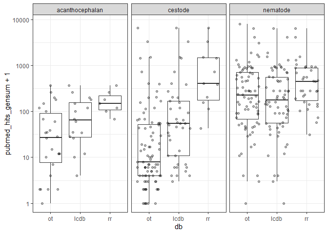
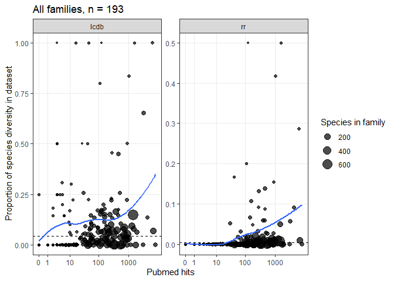
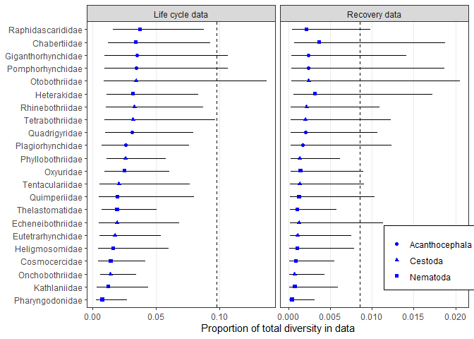

Biases
================

  - [Wrangle](#wrangle)
  - [Descriptives](#descriptives)
  - [Worm families overrepresented in life cycle database and recovery
    data relative to their overall
    diversity](#worm-families-overrepresented-in-life-cycle-database-and-recovery-data-relative-to-their-overall-diversity)
      - [Taxonomy](#taxonomy)
      - [Study effort](#study-effort)
      - [Habitat](#habitat)
      - [Host type](#host-type)
      - [Conclusions - biases in life cycle database relative to known
        helminth
        diversity](#conclusions---biases-in-life-cycle-database-relative-to-known-helminth-diversity)
          - [Plots for supplement](#plots-for-supplement)

In this notebook, we explore various kinds of biases in our comparative
data. We explore these biases at the parasite family level. That is, we
look for families that are more or less represented in the life cycle
database and the recovery rate data relative to their general diversity.

# Wrangle

In another [notebook](get_study_effort_family.Rmd), we generated a
family-level table that included study effort.

Then we add habitat from the life cycle database: freshwater, marine, or
terrestrial. In some families, the hosts recorded occupy different
habitats (e.g. family *x* includes worms in aquatic *and* terrestrial
hosts). In those cases where less than 75% of the hosts were from the
same habitat category, we considered the habitat as “mixed”.

Next, we added the typical final host type for a family: bird, mammal,
herp, fish, or invert. We only defined *final* host type, not
intermediate host type, because not all families have intermediate hosts
and some families have life cycles with multiple intermediate hosts.

# Descriptives

Here are some descriptive statistics. How many parasite families are
represented in the open tree taxonomy (ott), life cycle database (lcdb),
and recovery rate data (rr)?

| db   | num\_families |
| :--- | ------------: |
| ot   |           194 |
| lcdb |           123 |
| rr   |            53 |

Here are the number of orders:

| db   | num\_orders |
| :--- | ----------: |
| ot   |          42 |
| lcdb |          31 |
| rr   |          17 |

Number of classes:

| db   | num\_class |
| :--- | ---------: |
| ot   |          7 |
| lcdb |          6 |
| rr   |          6 |

We only have habitat and host type information for families represented
in the life cycle database. How many families are in each habitat in
each dataset? There are few marine families in the recovery rate data.

| habitat     | num\_fams\_lcdb | num\_fams\_rr |
| :---------- | --------------: | ------------: |
| freshwater  |              35 |            11 |
| marine      |              21 |             2 |
| mixed       |              13 |            10 |
| terrestrial |              54 |            30 |

In the recovery data, there are also relatively few families in herps
(reptiles or amphibians) and many in mammals.

| host\_type\_dh | num\_fams\_lcdb | num\_fams\_rr |
| :------------- | --------------: | ------------: |
| bird           |              22 |             7 |
| fish           |              41 |            11 |
| herptile       |               7 |             1 |
| invertebrate   |               2 |            NA |
| mammal         |              35 |            23 |
| mixed          |              16 |            11 |

# Worm families overrepresented in life cycle database and recovery data relative to their overall diversity

We mined our recovery data from studies in the life cycle database.
Therefore, we should consider taxonomic biases in the recovery data
*and* the life cycle database, relative to overall helminth diversity.
Presumably, some parasite families are overrepresented in the database,
because they are medically important or are easy to study. To test
whether some families are over or underrepesented, we calculated the
number of species in the life cycle database and number of species in
the open tree taxonomy from each family. Families that are
overrepresented should have a larger percent of their overall diversity
included in the database. To model this, we fit generalized linear mixed
models (binomial errors) for the proportion of overall family-level
species diversity included in the recovery data and life cycle database
(i.e. number of species in family in data / number of species in family,
measured from ott).

Parasite family was a random effect - high and low values represent
families that are over and underrepresented in the data relative to the
open tree taxonomy.

## Taxonomy

Are the same families over/underrepresented in the life cycle database
and the recovery rate data? To check, we allowed a random interaction
between parasite family and dataset (lcdb vs rr). This is a row-level
effect and is therefore basically the residual variance. Adding this
effect is a clear improvement.

|      | npar |      AIC |      BIC |     logLik | deviance |    Chisq | Df | Pr(\>Chisq) |
| :--- | ---: | -------: | -------: | ---------: | -------: | -------: | -: | ----------: |
| mod  |    3 | 1228.142 | 1240.025 | \-611.0709 | 1222.142 |       NA | NA |          NA |
| mod0 |    5 | 1218.914 | 1238.719 | \-604.4572 | 1208.914 | 13.22737 |  2 |   0.0013419 |

The model included a fixed effect for “dataset”. It indicated that on
average just 4.22% of the species in a family were included in the life
cycle database and just 0.37% of the species in the recovery data. This
was expected; life cycles are known for more species than have infection
rate experiments. The low values overall are due to many families having
zero representation in the life cycle and recovery datasets, as seen in
this histogram.

<!-- -->

The model’s random effects quantify the over and under representation of
different taxa. Note the variance components in the model summary.

    ## Generalized linear mixed model fit by maximum likelihood (Laplace
    ##   Approximation) [glmerMod]
    ##  Family: binomial  ( logit )
    ## Formula: cbind(n_spp, n_spp_ot - n_spp) ~ db + (db - 1 | parasite_family)
    ##    Data: filter(g_levx, n_spp_ot >= n_spp)
    ## 
    ##      AIC      BIC   logLik deviance df.resid 
    ##   1218.9   1238.7   -604.5   1208.9      383 
    ## 
    ## Scaled residuals: 
    ##     Min      1Q  Median      3Q     Max 
    ## -1.1356 -0.3696 -0.1700  0.1461  1.8402 
    ## 
    ## Random effects:
    ##  Groups          Name   Variance Std.Dev. Corr
    ##  parasite_family dblcdb 3.494    1.869        
    ##                  dbrr   4.126    2.031    0.94
    ## Number of obs: 388, groups:  parasite_family, 194
    ## 
    ## Fixed effects:
    ##             Estimate Std. Error z value Pr(>|z|)    
    ## (Intercept)  -3.1228     0.1679  -18.60   <2e-16 ***
    ## dbrr         -2.4765     0.2020  -12.26   <2e-16 ***
    ## ---
    ## Signif. codes:  0 '***' 0.001 '**' 0.01 '*' 0.05 '.' 0.1 ' ' 1
    ## 
    ## Correlation of Fixed Effects:
    ##      (Intr)
    ## dbrr -0.064

The family-level variance was a bit higher in the recovery rate data
than the life cycle data, which suggests that differences among families
in their representation is more extreme in the recovery data. This makes
sense. If the life cycle data is a subset of the total diversity, then
the recovery data is a subset of subset. Also note in the summary that
the random effect estimates were highly correlated across datasets
(\>0.9), indicating that the overrepresented families in the life cycle
data were also overrepresented in the recovery data.

Here are the 20 families that are proportionally most over-represented
in both the life cycle and recovery data (the combined random effect for
each dataset). These tend to be either diverse, well-studied groups
(e.g. Ascarididae, Taeniidae), taxa with unique phylogenetic positions
(e.g. Spathebothriidae), or groups where the known diversity is probably
underestimated (e.g. Ophidascaridae, Fessisentidae).

|   dblcdb |     dbrr | parasite\_family   | comb\_re |    diff\_re | parasite\_phylum |
| -------: | -------: | :----------------- | -------: | ----------: | :--------------- |
| 5.064716 | 5.379506 | Trichostrongylidae | 5.222111 |   0.3147904 | Nematoda         |
| 4.975747 | 4.840328 | Ascarididae        | 4.908037 | \-0.1354191 | Nematoda         |
| 4.482573 | 4.974326 | Toxocaridae        | 4.728450 |   0.4917528 | Nematoda         |
| 4.006821 | 4.357916 | Ancylostomatidae   | 4.182368 |   0.3510956 | Nematoda         |
| 4.011339 | 3.653233 | Subuluridae        | 3.832286 | \-0.3581059 | Nematoda         |
| 3.688918 | 3.879297 | Anguillicolidae    | 3.784108 |   0.1903794 | Nematoda         |
| 3.646104 | 3.499071 | Hedruridae         | 3.572588 | \-0.1470325 | Nematoda         |
| 3.121160 | 3.611798 | Angiostrongylidae  | 3.366480 |   0.4906379 | Nematoda         |
| 3.614814 | 3.058321 | Taeniidae          | 3.336568 | \-0.5564924 | Platyhelminthes  |
| 2.940293 | 3.583694 | Protostrongylidae  | 3.261993 |   0.6434015 | Nematoda         |
| 2.905198 | 3.208001 | Acrobothriidae     | 3.056600 |   0.3028037 | Platyhelminthes  |
| 2.855952 | 3.085705 | Dracunculidae      | 2.970829 |   0.2297528 | Nematoda         |
| 2.469487 | 2.399920 | Fessisentidae      | 2.434703 | \-0.0695675 | Acanthocephala   |
| 2.298701 | 2.324650 | Spathebothriidae   | 2.311676 |   0.0259495 | Platyhelminthes  |
| 1.651559 | 2.936882 | Ascaridiidae       | 2.294220 |   1.2853222 | Nematoda         |
| 1.842148 | 2.665768 | Dioctophymidae     | 2.253958 |   0.8236199 | Nematoda         |
| 2.052177 | 2.356849 | Ophidascaridae     | 2.204513 |   0.3046722 | Nematoda         |
| 1.820861 | 2.312705 | Crenosomatidae     | 2.066783 |   0.4918440 | Nematoda         |
| 1.551981 | 2.565726 | Haemonchidae       | 2.058854 |   1.0137449 | Nematoda         |
| 1.752460 | 2.352365 | Dictyocaulidae     | 2.052412 |   0.5999051 | Nematoda         |

Here are the 20 families most overrepresented in the recovery data
compared to the life cycle database. They seem to be biased towards
highly studied groups like ascarids, diphyllobothirds, haemonchids, etc.

|      dblcdb |      dbrr | parasite\_family      |  comb\_re |  diff\_re | parasite\_phylum |
| ----------: | --------: | :-------------------- | --------: | --------: | :--------------- |
|   0.8451424 | 2.1459548 | Diphyllobothriidae    | 1.4955486 | 1.3008123 | Platyhelminthes  |
|   1.6515594 | 2.9368815 | Ascaridiidae          | 2.2942204 | 1.2853222 | Nematoda         |
|   1.5519814 | 2.5657263 | Haemonchidae          | 2.0588539 | 1.0137449 | Nematoda         |
| \-0.1058555 | 0.7659034 | Cloacinidae           | 0.3300239 | 0.8717590 | Nematoda         |
|   0.5075505 | 1.3620542 | Acuariidae            | 0.9348024 | 0.8545037 | Nematoda         |
|   1.8421482 | 2.6657681 | Dioctophymidae        | 2.2539581 | 0.8236199 | Nematoda         |
|   0.8543599 | 1.5698008 | Mesocestoididae       | 1.2120803 | 0.7154409 | Platyhelminthes  |
|   2.9402926 | 3.5836941 | Protostrongylidae     | 3.2619933 | 0.6434015 | Nematoda         |
| \-0.2316736 | 0.3689037 | Molineidae            | 0.0686150 | 0.6005773 | Nematoda         |
|   1.7524598 | 2.3523649 | Dictyocaulidae        | 2.0524123 | 0.5999051 | Nematoda         |
|   1.5064159 | 2.0550472 | Heligmosomatidae      | 1.7807315 | 0.5486313 | Nematoda         |
|   1.8208610 | 2.3127050 | Crenosomatidae        | 2.0667830 | 0.4918440 | Nematoda         |
|   4.4825735 | 4.9743263 | Toxocaridae           | 4.7284499 | 0.4917528 | Nematoda         |
|   3.1211605 | 3.6117985 | Angiostrongylidae     | 3.3664795 | 0.4906379 | Nematoda         |
|   0.5927757 | 1.0514752 | Oligacanthorhynchidae | 0.8221255 | 0.4586995 | Acanthocephala   |
|   1.0381543 | 1.4549756 | Tetrameridae          | 1.2465650 | 0.4168213 | Nematoda         |
| \-0.1317116 | 0.2479973 | Heteroxynematidae     | 0.0581428 | 0.3797089 | Nematoda         |
| \-0.0314364 | 0.3448175 | Strongylidae          | 0.1566906 | 0.3762539 | Nematoda         |
|   1.0692852 | 1.4282762 | Moniliformidae        | 1.2487807 | 0.3589910 | Acanthocephala   |
|   4.0068206 | 4.3579162 | Ancylostomatidae      | 4.1823684 | 0.3510956 | Nematoda         |

Here are the 20 families most underrepresented in both datasets,
relative to overall diversity. They are mostly nematodes that are
parasitoids (Mermithidae), plant parasites (Longidoridae,
Hoplolaimidae), or entomopathogens (Steinernematidae), and therefore are
not represented in the life cycle database, which was only focused on
trophically-transmitted parasites.

|     dblcdb |       dbrr | parasite\_family    |   comb\_re |    diff\_re | parasite\_phylum |
| ---------: | ---------: | :------------------ | ---------: | ----------: | :--------------- |
| \-3.319068 | \-3.416176 | Mermithidae         | \-3.367622 | \-0.0971073 | Nematoda         |
| \-3.254141 | \-3.349408 | Longidoridae        | \-3.301774 | \-0.0952668 | Nematoda         |
| \-3.151771 | \-3.244132 | Hoplolaimidae       | \-3.197951 | \-0.0923608 | Nematoda         |
| \-3.086052 | \-3.176545 | Aphelenchoididae    | \-3.131298 | \-0.0904925 | Nematoda         |
| \-3.072990 | \-3.163111 | Monhysteridae       | \-3.118051 | \-0.0901210 | Nematoda         |
| \-2.841067 | \-2.924577 | Cephalobidae        | \-2.882822 | \-0.0835099 | Nematoda         |
| \-2.484344 | \-2.557634 | Heteroderidae       | \-2.520989 | \-0.0732900 | Nematoda         |
| \-2.387326 | \-2.457826 | Anguinidae          | \-2.422576 | \-0.0704995 | Nematoda         |
| \-2.373724 | \-2.443832 | Allantonematidae    | \-2.408778 | \-0.0701079 | Nematoda         |
| \-2.164709 | \-2.228788 | Steinernematidae    | \-2.196748 | \-0.0640784 | Nematoda         |
| \-2.136458 | \-2.234330 | Pharyngodonidae     | \-2.185394 | \-0.0978726 | Nematoda         |
| \-2.068722 | \-2.130024 | Monticelliidae      | \-2.099373 | \-0.0613018 | Platyhelminthes  |
| \-1.942737 | \-2.000387 | Panagrolaimidae     | \-1.971562 | \-0.0576502 | Nematoda         |
| \-1.918124 | \-1.975060 | Lecanicephalidae    | \-1.946592 | \-0.0569358 | Platyhelminthes  |
| \-1.875203 | \-1.930892 | Strongyloididae     | \-1.903048 | \-0.0556892 | Nematoda         |
| \-1.770993 | \-1.823651 | Meloidogynidae      | \-1.797322 | \-0.0526584 | Nematoda         |
| \-1.673169 | \-1.722976 | Tetragonocephalidae | \-1.698072 | \-0.0498078 | Platyhelminthes  |
| \-1.570635 | \-1.652862 | Kathlaniidae        | \-1.611749 | \-0.0822267 | Nematoda         |
| \-1.560134 | \-1.606641 | Arhythmacanthidae   | \-1.583387 | \-0.0465071 | Acanthocephala   |
| \-1.425979 | \-1.468559 | Polypocephalidae    | \-1.447269 | \-0.0425801 | Platyhelminthes  |

This raises the question of whether nematode families are more
underrepresented than acanth or cestode families. When we add parasite
phylum as a fixed effect to the model, it is a slight improvement. The
model parameters (not shown) suggested nematodes were slightly
overrepresented and cestodes underrepresented.

|           | npar |      AIC |      BIC |     logLik | deviance |   Chisq | Df | Pr(\>Chisq) |
| :-------- | ---: | -------: | -------: | ---------: | -------: | ------: | -: | ----------: |
| mod0      |    5 | 1218.914 | 1238.719 | \-604.4572 | 1208.914 |      NA | NA |          NA |
| mod0\_phy |    7 | 1216.582 | 1244.309 | \-601.2909 | 1202.582 | 6.33254 |  2 |   0.0421606 |

Another way to visualize disproportionate representation is by looking
at whether species number in the ott correlates with species number in
the datasets. In general, there is a correlation - worm families with
many species usually have more species in the recovery and life cycle
data - but some groups are over- or underrepresented as indicated by
color coding by the random effect estimate (red = overrepresented, blue
= underrepresented).

<!-- -->

The distribution of the random effects is not too bad, though there is
some bimodality from the many zero values (i.e. families not represented
in the lcdb).

<!-- -->

Since most of the underrepresented groups in the life cycle database
were taxa that were not targeted anyways, let’s try limiting the
analysis to the families in the life cycle database. This assumes that
most families containing trophically-transmitted animal parasites have
at least one representative in the database.

After excluding families not in the life cycle database, the average
percent of species from a family in the database jumped from 4.22% to
9.77% for the life cycle database and from 0.37% to 0.94% for the
recovery rate data. The distribution of random effects also looks a
little better (less bimodal).

<!-- -->
The most overrepresented groups are the same.

|    dblcdb |     dbrr | parasite\_family   | comb\_re |    diff\_re | parasite\_phylum |
| --------: | -------: | :----------------- | -------: | ----------: | :--------------- |
| 3.7810431 | 4.300750 | Trichostrongylidae | 4.040897 |   0.5197070 | Nematoda         |
| 3.7845080 | 3.837558 | Ascarididae        | 3.811033 |   0.0530503 | Nematoda         |
| 3.3666748 | 3.982476 | Toxocaridae        | 3.674575 |   0.6158008 | Nematoda         |
| 2.6362238 | 3.077012 | Ancylostomatidae   | 2.856618 |   0.4407887 | Nematoda         |
| 2.8463604 | 2.607877 | Subuluridae        | 2.727119 | \-0.2384837 | Nematoda         |
| 2.5428499 | 2.816661 | Anguillicolidae    | 2.679756 |   0.2738117 | Nematoda         |
| 2.1710905 | 2.677850 | Angiostrongylidae  | 2.424470 |   0.5067600 | Nematoda         |
| 2.4486614 | 2.390801 | Hedruridae         | 2.419731 | \-0.0578608 | Nematoda         |
| 2.6763196 | 2.145421 | Taeniidae          | 2.410870 | \-0.5308987 | Platyhelminthes  |
| 2.0184461 | 2.651137 | Protostrongylidae  | 2.334792 |   0.6326913 | Nematoda         |
| 1.8772787 | 2.215345 | Acrobothriidae     | 2.046312 |   0.3380667 | Platyhelminthes  |
| 1.9064174 | 2.157112 | Dracunculidae      | 2.031765 |   0.2506946 | Nematoda         |
| 1.4742831 | 1.437409 | Fessisentidae      | 1.455846 | \-0.0368745 | Acanthocephala   |
| 0.7701899 | 1.998276 | Ascaridiidae       | 1.384233 |   1.2280857 | Nematoda         |
| 0.9472523 | 1.736379 | Dioctophymidae     | 1.341816 |   0.7891270 | Nematoda         |
| 1.1425454 | 1.436749 | Ophidascaridae     | 1.289647 |   0.2942037 | Nematoda         |
| 1.2317018 | 1.276431 | Spathebothriidae   | 1.254066 |   0.0447295 | Platyhelminthes  |
| 0.9221937 | 1.392021 | Crenosomatidae     | 1.157107 |   0.4698272 | Nematoda         |
| 0.6696424 | 1.632071 | Haemonchidae       | 1.150857 |   0.9624287 | Nematoda         |
| 0.8608519 | 1.433252 | Dictyocaulidae     | 1.147052 |   0.5724000 | Nematoda         |

The 20 families most overrepresented in the recovery data compared to
the life cycle database also remain the same.

|      dblcdb |        dbrr | parasite\_family      |    comb\_re |  diff\_re | parasite\_phylum |
| ----------: | ----------: | :-------------------- | ----------: | --------: | :--------------- |
|   0.7701899 |   1.9982756 | Ascaridiidae          |   1.3842327 | 1.2280857 | Nematoda         |
| \-0.0263218 |   1.2015381 | Diphyllobothriidae    |   0.5876081 | 1.2278598 | Platyhelminthes  |
|   0.6696424 |   1.6320711 | Haemonchidae          |   1.1508567 | 0.9624287 | Nematoda         |
| \-0.3708642 |   0.4188938 | Acuariidae            |   0.0240148 | 0.7897580 | Nematoda         |
|   0.9472523 |   1.7363794 | Dioctophymidae        |   1.3418159 | 0.7891270 | Nematoda         |
| \-0.9537991 | \-0.1721482 | Cloacinidae           | \-0.5629737 | 0.7816509 | Nematoda         |
|   0.0327277 |   0.6839973 | Mesocestoididae       |   0.3583625 | 0.6512695 | Platyhelminthes  |
|   2.0184461 |   2.6511374 | Protostrongylidae     |   2.3347917 | 0.6326913 | Nematoda         |
|   3.3666748 |   3.9824756 | Toxocaridae           |   3.6745752 | 0.6158008 | Nematoda         |
|   0.8608519 |   1.4332519 | Dictyocaulidae        |   1.1470519 | 0.5724000 | Nematoda         |
|   3.7810431 |   4.3007501 | Trichostrongylidae    |   4.0408966 | 0.5197070 | Nematoda         |
| \-1.0809276 | \-0.5645359 | Molineidae            | \-0.8227317 | 0.5163917 | Nematoda         |
|   0.6246649 |   1.1388353 | Heligmosomatidae      |   0.8817501 | 0.5141704 | Nematoda         |
|   2.1710905 |   2.6778505 | Angiostrongylidae     |   2.4244705 | 0.5067600 | Nematoda         |
|   0.9221937 |   1.3920209 | Crenosomatidae        |   1.1571073 | 0.4698272 | Nematoda         |
|   2.6362238 |   3.0770125 | Ancylostomatidae      |   2.8566182 | 0.4407887 | Nematoda         |
| \-0.2638000 |   0.1357571 | Oligacanthorhynchidae | \-0.0640215 | 0.3995571 | Acanthocephala   |
|   0.1643784 |   0.5370297 | Tetrameridae          |   0.3507041 | 0.3726513 | Nematoda         |
|   1.8772787 |   2.2153454 | Acrobothriidae        |   2.0463120 | 0.3380667 | Platyhelminthes  |
|   0.2438076 |   0.5657593 | Moniliformidae        |   0.4047834 | 0.3219517 | Acanthocephala   |

The most underrepresented groups change, though. They are no longer
predominantly nematodes. Some of the groups fit my expectations, like
shark cestodes (Onchobothriidae, Eutetrarhynchidae) and herp nematodes
(Cosmocercidae, Pharyngodonidae, Kathlaniidae).

|      dblcdb |        dbrr | parasite\_family   |   comb\_re |    diff\_re | parasite\_phylum |
| ----------: | ----------: | :----------------- | ---------: | ----------: | :--------------- |
| \-2.6042511 | \-2.8098031 | Pharyngodonidae    | \-2.707027 | \-0.2055520 | Nematoda         |
| \-2.0379297 | \-2.3197595 | Onchobothriidae    | \-2.178845 | \-0.2818297 | Platyhelminthes  |
| \-2.0638984 | \-2.2358736 | Kathlaniidae       | \-2.149886 | \-0.1719752 | Nematoda         |
| \-1.9374551 | \-2.1317633 | Cosmocercidae      | \-2.034609 | \-0.1943083 | Nematoda         |
| \-1.8064538 | \-1.9622917 | Heligmosomidae     | \-1.884373 | \-0.1558379 | Nematoda         |
| \-1.7382706 | \-1.9205706 | Eutetrarhynchidae  | \-1.829421 | \-0.1823000 | Platyhelminthes  |
| \-1.6646777 | \-1.8997425 | Thelastomatidae    | \-1.782210 | \-0.2350648 | Nematoda         |
| \-1.5686002 | \-1.7094487 | Quimperiidae       | \-1.639025 | \-0.1408485 | Nematoda         |
| \-1.5586778 | \-1.6988993 | Echeneibothriidae  | \-1.628789 | \-0.1402216 | Platyhelminthes  |
| \-1.5384622 | \-1.6774060 | Tentaculariidae    | \-1.607934 | \-0.1389438 | Platyhelminthes  |
| \-1.3976503 | \-1.6708723 | Oxyuridae          | \-1.534261 | \-0.2732220 | Nematoda         |
| \-1.3691063 | \-1.6657106 | Phyllobothriidae   | \-1.517408 | \-0.2966043 | Platyhelminthes  |
| \-1.3167876 | \-1.4736031 | Plagiorhynchidae   | \-1.395195 | \-0.1568156 | Acanthocephala   |
| \-1.1589029 | \-1.3367904 | Quadrigyridae      | \-1.247847 | \-0.1778875 | Acanthocephala   |
| \-1.0872123 | \-1.2609602 | Rhinebothriidae    | \-1.174086 | \-0.1737479 | Platyhelminthes  |
| \-1.0679555 | \-1.2096947 | Tetrabothriidae    | \-1.138825 | \-0.1417392 | Platyhelminthes  |
| \-0.9726997 | \-1.2499296 | Raphidascarididae  | \-1.111315 | \-0.2772299 | Nematoda         |
| \-1.1496542 | \-0.9519101 | Heterakidae        | \-1.050782 |   0.1977442 | Nematoda         |
| \-0.9751257 | \-1.1112377 | Giganthorhynchidae | \-1.043182 | \-0.1361121 | Acanthocephala   |
| \-0.9609962 | \-1.0962517 | Pomphorhynchidae   | \-1.028624 | \-0.1352555 | Acanthocephala   |

Adding phylum to this model is not an improvement, suggesting that
nematode, cestode, and acanth families are equally under- and
over-represented in the lcdb.

|               | npar |      AIC |      BIC |     logLik | deviance |    Chisq | Df | Pr(\>Chisq) |
| :------------ | ---: | -------: | -------: | ---------: | -------: | -------: | -: | ----------: |
| mod0\_lc      |    5 | 1054.406 | 1071.933 | \-522.2029 | 1044.406 |       NA | NA |          NA |
| mod0\_lc\_phy |    7 | 1055.411 | 1079.949 | \-520.7056 | 1041.411 | 2.994674 |  2 |   0.2237252 |

Here is the correlation between the number of species in the life cycle
database and total species diversity, but just for families represented
in the life cycle database.

<!-- -->

## Study effort

Are overrepresented families the most intensely studied? Study effort
was quantified by recording the number of hits in PubMed for all the
families in three datasets (ott, lcdb, and rr).

When we plot pubmed hits for each family, we see that families in the
life cycle database tend to be more intensely studied. Weirdly, though,
the trend is not seen in nematodes.

<!-- -->

The nematode pattern could be an artifact, because when we make the same
plot using pubmed hits for genera, then there is a clear trend.

<!-- -->

Notably, the number of hits per genus was much higher than for families,
probably because genus names are mentioned more in article titles than
family names, especially in the taxonomically fluid nematodes.
Therefore, let’s recalculate our study effort metric as the summed hits
for genera in the family.

Even with this metric of study effort, the pattern in nematodes is still
ambiguous.

<!-- -->

We would expect families with more species to have more pubmed hits than
less diverse ones. Indeed, there is a correlation between study effort
and species diversity. Some families, though, appear more intensely
studied than we would expect from their species diversity.

<!-- -->

Let’s again compare the datasets but with pubmed hits per species in the
family. The differences are much smaller, though the most intensely
studied families may be overrepresented in the recovery data.

<!-- -->
Thus, parasite families in the recovery and life cycle data are more
intensely studied than an average worm family, but is at least partially
due to those families being more diverse with many species to study.

We test this statistically by adding study effort to our mixed model as
a fixed effect. We log transform it, because there were a few families
that were intensely studied and many that were little studied.

Adding a study effort main effect weakly improved the model, whereas
there was a clearer interaction effect.

|         | npar |      AIC |      BIC |     logLik | deviance |    Chisq | Df | Pr(\>Chisq) |
| :------ | ---: | -------: | -------: | ---------: | -------: | -------: | -: | ----------: |
| mod0alt |    5 | 1218.914 | 1238.719 | \-604.4572 | 1208.914 |       NA | NA |          NA |
| mod1    |    6 | 1211.982 | 1235.748 | \-599.9911 | 1199.982 |  8.93220 |  1 |   0.0028019 |
| mod1.1  |    7 | 1203.527 | 1231.254 | \-594.7634 | 1189.527 | 10.45539 |  1 |   0.0012229 |

Overall, there was a weak tendency for more intensely studied families
to be better represented in both datasets, but especially the recovery
dataset.

    ## Generalized linear mixed model fit by maximum likelihood (Laplace
    ##   Approximation) [glmerMod]
    ##  Family: binomial  ( logit )
    ## Formula: cbind(n_spp, n_spp_ot - n_spp) ~ db + (db - 1 | parasite_family) +  
    ##     log(pubmed_hits_gensum + 1) + db:log(pubmed_hits_gensum +      1)
    ##    Data: filter(g_levx, n_spp_ot >= n_spp)
    ## 
    ##      AIC      BIC   logLik deviance df.resid 
    ##   1203.5   1231.3   -594.8   1189.5      381 
    ## 
    ## Scaled residuals: 
    ##     Min      1Q  Median      3Q     Max 
    ## -1.0855 -0.3188 -0.1094  0.1270  1.8867 
    ## 
    ## Random effects:
    ##  Groups          Name   Variance Std.Dev. Corr
    ##  parasite_family dblcdb 3.590    1.895        
    ##                  dbrr   3.838    1.959    0.93
    ## Number of obs: 388, groups:  parasite_family, 194
    ## 
    ## Fixed effects:
    ##                                  Estimate Std. Error z value Pr(>|z|)    
    ## (Intercept)                      -4.01159    0.41359  -9.699  < 2e-16 ***
    ## dbrr                             -4.20988    0.66665  -6.315  2.7e-10 ***
    ## log(pubmed_hits_gensum + 1)       0.20609    0.08294   2.485  0.01296 *  
    ## dbrr:log(pubmed_hits_gensum + 1)  0.31192    0.10570   2.951  0.00317 ** 
    ## ---
    ## Signif. codes:  0 '***' 0.001 '**' 0.01 '*' 0.05 '.' 0.1 ' ' 1
    ## 
    ## Correlation of Fixed Effects:
    ##             (Intr) dbrr   l(__+1
    ## dbrr        -0.107              
    ## lg(pbm__+1) -0.913  0.095       
    ## dbrr:(__+1)  0.110 -0.964 -0.110

The interaction was still important when we limited the analysis to just
the families in the life cycle database.

|            | npar |      AIC |      BIC |     logLik | deviance |     Chisq | Df | Pr(\>Chisq) |
| :--------- | ---: | -------: | -------: | ---------: | -------: | --------: | -: | ----------: |
| mod0\_lc   |    5 | 1054.406 | 1071.933 | \-522.2029 | 1044.406 |        NA | NA |          NA |
| mod1\_lc   |    6 | 1055.653 | 1076.685 | \-521.8264 | 1043.653 |  0.753052 |  1 |   0.3855117 |
| mod1.1\_lc |    7 | 1045.515 | 1070.052 | \-515.7573 | 1031.515 | 12.138175 |  1 |   0.0004940 |

Let’s plot these effects, first with all families and then with just the
lcdb families. The dashed lines are the average proportion
representation across all families. The life cycle database is not
obviously biased towards more intensely studied families, but the
recovery rate data seems to be.

<!-- -->
The pattern is the same when focusing just on families in the life cycle
database.
<!-- -->

Thus, both the recovery and life cycle data tends to include families
that are more intensely studied. However, only in the recovery data are
more intensely studied families proportionally overrepresented.

## Habitat

If we focus only on families in the life cycle database, we can also
examine how characteristics encoded in the lcdb, like habitat or host
type, might impact representation. So, are over/underrepresented
families likely to be from certain habitats? To test this, we add
habitat to the model as a fixed effect.

A LRT suggests that habitat matters and that the effect is relatively
consistent across datasets (no interaction).

|            | npar |      AIC |      BIC |     logLik | deviance |     Chisq | Df | Pr(\>Chisq) |
| :--------- | ---: | -------: | -------: | ---------: | -------: | --------: | -: | ----------: |
| mod0\_lc   |    5 | 1054.406 | 1071.933 | \-522.2029 | 1044.406 |        NA | NA |          NA |
| mod2\_lc   |    8 | 1048.059 | 1076.102 | \-516.0297 | 1032.059 | 12.346498 |  3 |   0.0062857 |
| mod2.1\_lc |   11 | 1047.892 | 1086.451 | \-512.9461 | 1025.892 |  6.167225 |  3 |   0.1037518 |

The model parameters indicate that marine families are underrepresented.

    ## Generalized linear mixed model fit by maximum likelihood (Laplace
    ##   Approximation) [glmerMod]
    ##  Family: binomial  ( logit )
    ## Formula: cbind(n_spp, n_spp_ot - n_spp) ~ db + (db - 1 | parasite_family) +  
    ##     habitat
    ##    Data: filter(g_levx, n_spp_ot >= n_spp, parasite_family %in% fams_in_lcdb)
    ## 
    ##      AIC      BIC   logLik deviance df.resid 
    ##   1048.1   1076.1   -516.0   1032.1      238 
    ## 
    ## Scaled residuals: 
    ##     Min      1Q  Median      3Q     Max 
    ## -1.1744 -0.4137 -0.1163  0.3171  2.6263 
    ## 
    ## Random effects:
    ##  Groups          Name   Variance Std.Dev. Corr
    ##  parasite_family dblcdb 1.559    1.249        
    ##                  dbrr   2.090    1.446    0.88
    ## Number of obs: 246, groups:  parasite_family, 123
    ## 
    ## Fixed effects:
    ##                    Estimate Std. Error z value Pr(>|z|)    
    ## (Intercept)        -2.14756    0.24345  -8.821  < 2e-16 ***
    ## dbrr               -2.41338    0.15175 -15.903  < 2e-16 ***
    ## habitatmarine      -1.12419    0.41302  -2.722  0.00649 ** 
    ## habitatmixed        0.47054    0.43466   1.083  0.27901    
    ## habitatterrestrial  0.07179    0.30877   0.233  0.81614    
    ## ---
    ## Signif. codes:  0 '***' 0.001 '**' 0.01 '*' 0.05 '.' 0.1 ' ' 1

Here are the families split by habitat. The dashed lines are the overall
averages for each dataset.

<!-- -->

When we revisit the most underrepresented groups, we see that the marine
families are almost all cestodes. Cestodes are diverse in sharks but
their life cycles are poorly known.

|      dblcdb |        dbrr | parasite\_family       |    comb\_re |    diff\_re | parasite\_phylum | habitat | host\_type\_dh |
| ----------: | ----------: | :--------------------- | ----------: | ----------: | :--------------- | :------ | :------------- |
| \-2.0379297 | \-2.3197595 | Onchobothriidae        | \-2.1788446 | \-0.2818297 | Platyhelminthes  | marine  | fish           |
| \-1.7382706 | \-1.9205706 | Eutetrarhynchidae      | \-1.8294206 | \-0.1823000 | Platyhelminthes  | marine  | fish           |
| \-1.5586778 | \-1.6988993 | Echeneibothriidae      | \-1.6287886 | \-0.1402216 | Platyhelminthes  | marine  | fish           |
| \-1.5384622 | \-1.6774060 | Tentaculariidae        | \-1.6079341 | \-0.1389438 | Platyhelminthes  | marine  | fish           |
| \-1.3691063 | \-1.6657106 | Phyllobothriidae       | \-1.5174084 | \-0.2966043 | Platyhelminthes  | marine  | fish           |
| \-1.0872123 | \-1.2609602 | Rhinebothriidae        | \-1.1740863 | \-0.1737479 | Platyhelminthes  | marine  | fish           |
| \-1.0679555 | \-1.2096947 | Tetrabothriidae        | \-1.1388251 | \-0.1417392 | Platyhelminthes  | marine  | bird           |
| \-0.9672868 | \-1.0698936 | Otobothriidae          | \-1.0185902 | \-0.1026068 | Platyhelminthes  | marine  | fish           |
| \-0.9896813 | \-0.9541595 | Cucullanidae           | \-0.9719204 |   0.0355218 | Nematoda         | marine  | fish           |
| \-0.8774028 | \-1.0390674 | Lacistorhynchidae      | \-0.9582351 | \-0.1616645 | Platyhelminthes  | marine  | fish           |
| \-0.6174443 | \-0.7642255 | Illiosentidae          | \-0.6908349 | \-0.1467813 | Acanthocephala   | marine  | fish           |
| \-0.6136663 | \-0.7278705 | Pseudaliidae           | \-0.6707684 | \-0.1142042 | Nematoda         | marine  | mammal         |
| \-0.5695043 | \-0.6465225 | Cavisomidae            | \-0.6080134 | \-0.0770183 | Acanthocephala   | marine  | fish           |
| \-0.3375943 | \-0.5584669 | Echinobothriidae       | \-0.4480306 | \-0.2208726 | Platyhelminthes  | marine  | fish           |
| \-0.3742415 | \-0.4386022 | Guyanemidae            | \-0.4064218 | \-0.0643608 | Nematoda         | marine  | fish           |
|   0.0242894 | \-0.0139939 | Heteracanthocephalidae |   0.0051478 | \-0.0382833 | Acanthocephala   | marine  | fish           |
| \-0.0524692 |   0.1371895 | Anisakidae             |   0.0423601 |   0.1896588 | Nematoda         | marine  | mixed          |
|   0.1909380 |   0.1636800 | Aporhynchidae          |   0.1773090 | \-0.0272580 | Platyhelminthes  | marine  | fish           |
|   0.4054288 |   0.3924987 | Serendipidae           |   0.3989638 | \-0.0129302 | Platyhelminthes  | marine  | fish           |
|   0.9240017 |   0.9466439 | Dioecotaeniidae        |   0.9353228 |   0.0226421 | Platyhelminthes  | marine  | fish           |

Do habitat differences depend on the parasite group? When we add a
habitat by parasite group interaction to the model, it is not better
than the habitat-only model. This shouldn’t be too surprising, because
this cuts the data fairly thin.

|            | npar |      AIC |      BIC |     logLik | deviance |    Chisq | Df | Pr(\>Chisq) |
| :--------- | ---: | -------: | -------: | ---------: | -------: | -------: | -: | ----------: |
| mod2.1\_lc |   11 | 1047.892 | 1086.451 | \-512.9461 | 1025.892 |       NA | NA |          NA |
| mod2.2\_lc |   19 | 1060.773 | 1127.374 | \-511.3863 | 1022.773 | 3.119635 |  8 |   0.9266268 |

We can visualize this by separating the plot by phyla. Marine families
seem underrepresented regardless of group.

<!-- -->

## Host type

Are over/underrepresented families likely to infect certain kinds of
final hosts? Let’s add final host type (invert, bird, mammal, etc) to
the model as a fixed effect.

A LRT suggests there may be a marginal effect of host type, and its
effect may vary among datasets (weak interaction).

|            | npar |      AIC |      BIC |     logLik | deviance |    Chisq | Df | Pr(\>Chisq) |
| :--------- | ---: | -------: | -------: | ---------: | -------: | -------: | -: | ----------: |
| mod0\_lc   |    5 | 1054.406 | 1071.933 | \-522.2029 | 1044.406 |       NA | NA |          NA |
| mod3\_lc   |   10 | 1049.455 | 1084.508 | \-514.7275 | 1029.455 | 14.95092 |  5 |   0.0105741 |
| mod3.1\_lc |   15 | 1048.198 | 1100.778 | \-509.0988 | 1018.198 | 11.25731 |  5 |   0.0465103 |

But that effect may overlap the habitat effect, since the LRT is a bit
weaker when adding host type to a model with habitat.

|            | npar |      AIC |      BIC |     logLik | deviance |    Chisq | Df | Pr(\>Chisq) |
| :--------- | ---: | -------: | -------: | ---------: | -------: | -------: | -: | ----------: |
| mod2\_lc   |    8 | 1048.059 | 1076.102 | \-516.0297 | 1032.059 |       NA | NA |          NA |
| mod3.2\_lc |   13 | 1045.585 | 1091.154 | \-509.7923 | 1019.585 | 12.47481 |  5 |   0.0288303 |

The main effect suggests that “herp” families are underrepresented,
whereas mammal families and families with “mixed” hosts are
overrepresented.

    ## Generalized linear mixed model fit by maximum likelihood (Laplace
    ##   Approximation) [glmerMod]
    ##  Family: binomial  ( logit )
    ## Formula: cbind(n_spp, n_spp_ot - n_spp) ~ db + (db - 1 | parasite_family) +  
    ##     host_type_dh
    ##    Data: filter(g_levx, n_spp_ot >= n_spp, parasite_family %in% fams_in_lcdb)
    ## 
    ##      AIC      BIC   logLik deviance df.resid 
    ##   1049.5   1084.5   -514.7   1029.5      236 
    ## 
    ## Scaled residuals: 
    ##     Min      1Q  Median      3Q     Max 
    ## -1.1975 -0.4430 -0.1041  0.3274  2.0551 
    ## 
    ## Random effects:
    ##  Groups          Name   Variance Std.Dev. Corr
    ##  parasite_family dblcdb 1.583    1.258        
    ##                  dbrr   1.817    1.348    0.87
    ## Number of obs: 246, groups:  parasite_family, 123
    ## 
    ## Fixed effects:
    ##                          Estimate Std. Error z value Pr(>|z|)    
    ## (Intercept)               -2.3240     0.2900  -8.013 1.12e-15 ***
    ## dbrr                      -2.3927     0.1503 -15.919  < 2e-16 ***
    ## host_type_dhfish          -0.3678     0.3704  -0.993   0.3207    
    ## host_type_dhherptile      -0.9379     0.6411  -1.463   0.1435    
    ## host_type_dhinvertebrate  -0.9954     1.1665  -0.853   0.3935    
    ## host_type_dhmammal         0.5463     0.3737   1.462   0.1438    
    ## host_type_dhmixed          0.8147     0.4455   1.829   0.0675 .  
    ## ---
    ## Signif. codes:  0 '***' 0.001 '**' 0.01 '*' 0.05 '.' 0.1 ' ' 1
    ## convergence code: 0
    ## Model failed to converge with max|grad| = 0.0078229 (tol = 0.002, component 1)

Here are the herp families that are most underrepresented, …

|      dblcdb |        dbrr | parasite\_family   |    comb\_re |    diff\_re | parasite\_phylum | habitat     | host\_type\_dh |
| ----------: | ----------: | :----------------- | ----------: | ----------: | :--------------- | :---------- | :------------- |
| \-2.6042511 | \-2.8098031 | Pharyngodonidae    | \-2.7070271 | \-0.2055520 | Nematoda         | freshwater  | herptile       |
| \-2.0638984 | \-2.2358736 | Kathlaniidae       | \-2.1498860 | \-0.1719752 | Nematoda         | freshwater  | herptile       |
| \-1.9374551 | \-2.1317633 | Cosmocercidae      | \-2.0346092 | \-0.1943083 | Nematoda         | terrestrial | herptile       |
|   0.0246643 | \-0.1503647 | Linstowiidae       | \-0.0628502 | \-0.1750290 | Platyhelminthes  | terrestrial | herptile       |
|   0.5413850 |   0.5376345 | Cephalochlamydidae |   0.5395097 | \-0.0037504 | Platyhelminthes  | freshwater  | herptile       |
|   0.5413850 |   0.5376345 | Micropleuridae     |   0.5395097 | \-0.0037504 | Nematoda         | freshwater  | herptile       |
|   1.1425454 |   1.4367491 | Ophidascaridae     |   1.2896473 |   0.2942037 | Nematoda         | terrestrial | herptile       |

…and the mammal families that are most overrepresented, …

|    dblcdb |     dbrr | parasite\_family   | comb\_re |    diff\_re | parasite\_phylum | habitat     | host\_type\_dh |
| --------: | -------: | :----------------- | -------: | ----------: | :--------------- | :---------- | :------------- |
| 3.7810431 | 4.300750 | Trichostrongylidae | 4.040897 |   0.5197070 | Nematoda         | terrestrial | mammal         |
| 3.7845080 | 3.837558 | Ascarididae        | 3.811033 |   0.0530503 | Nematoda         | terrestrial | mammal         |
| 2.6362238 | 3.077012 | Ancylostomatidae   | 2.856618 |   0.4407887 | Nematoda         | terrestrial | mammal         |
| 2.1710905 | 2.677850 | Angiostrongylidae  | 2.424470 |   0.5067600 | Nematoda         | terrestrial | mammal         |
| 2.6763196 | 2.145421 | Taeniidae          | 2.410870 | \-0.5308987 | Platyhelminthes  | terrestrial | mammal         |
| 2.0184461 | 2.651137 | Protostrongylidae  | 2.334792 |   0.6326913 | Nematoda         | terrestrial | mammal         |
| 0.9221937 | 1.392021 | Crenosomatidae     | 1.157107 |   0.4698272 | Nematoda         | terrestrial | mammal         |
| 0.6696424 | 1.632071 | Haemonchidae       | 1.150857 |   0.9624287 | Nematoda         | terrestrial | mammal         |
| 0.8608519 | 1.433252 | Dictyocaulidae     | 1.147052 |   0.5724000 | Nematoda         | terrestrial | mammal         |
| 1.0706181 | 1.125739 | Gongylonematidae   | 1.098178 |   0.0551206 | Nematoda         | terrestrial | mammal         |

…and the mixed families that are overrepresented.

|      dblcdb |      dbrr | parasite\_family   |  comb\_re |    diff\_re | parasite\_phylum | habitat     | host\_type\_dh |
| ----------: | --------: | :----------------- | --------: | ----------: | :--------------- | :---------- | :------------- |
|   3.3666748 | 3.9824756 | Toxocaridae        | 3.6745752 |   0.6158008 | Nematoda         | mixed       | mixed          |
|   2.8463604 | 2.6078767 | Subuluridae        | 2.7271186 | \-0.2384837 | Nematoda         | terrestrial | mixed          |
|   2.4486614 | 2.3908006 | Hedruridae         | 2.4197310 | \-0.0578608 | Nematoda         | freshwater  | mixed          |
|   1.9064174 | 2.1571120 | Dracunculidae      | 2.0317647 |   0.2506946 | Nematoda         | mixed       | mixed          |
|   1.4742831 | 1.4374086 | Fessisentidae      | 1.4558459 | \-0.0368745 | Acanthocephala   | freshwater  | mixed          |
|   0.9258040 | 1.0881200 | Gnathostomatidae   | 1.0069620 |   0.1623160 | Nematoda         | mixed       | mixed          |
|   0.5932702 | 0.6352950 | Polymorphidae      | 0.6142826 |   0.0420248 | Acanthocephala   | mixed       | mixed          |
|   0.6123559 | 0.5719312 | Amphilinidae       | 0.5921436 | \-0.0404247 | Platyhelminthes  | freshwater  | mixed          |
| \-0.0263218 | 1.2015381 | Diphyllobothriidae | 0.5876081 |   1.2278598 | Platyhelminthes  | freshwater  | mixed          |
| \-0.0524692 | 0.1371895 | Anisakidae         | 0.0423601 |   0.1896588 | Nematoda         | marine      | mixed          |

When these parameters are broken down by dataset, then we see that
parameters for the two groups differ in magnitude but not direction. For
example, herps are more underrepresented in the lcdb than the rr, while
for fish it is the opposite (more underrepresented in the rr than lcdb).

    ## Generalized linear mixed model fit by maximum likelihood (Laplace
    ##   Approximation) [glmerMod]
    ##  Family: binomial  ( logit )
    ## Formula: cbind(n_spp, n_spp_ot - n_spp) ~ db + (db - 1 | parasite_family) +  
    ##     host_type_dh + db:host_type_dh
    ##    Data: filter(g_levx, n_spp_ot >= n_spp, parasite_family %in% fams_in_lcdb)
    ## 
    ##      AIC      BIC   logLik deviance df.resid 
    ##   1048.2   1100.8   -509.1   1018.2      231 
    ## 
    ## Scaled residuals: 
    ##     Min      1Q  Median      3Q     Max 
    ## -1.2067 -0.3910 -0.1262  0.3643  2.0979 
    ## 
    ## Random effects:
    ##  Groups          Name   Variance Std.Dev. Corr
    ##  parasite_family dblcdb 1.561    1.249        
    ##                  dbrr   1.747    1.322    0.89
    ## Number of obs: 246, groups:  parasite_family, 123
    ## 
    ## Fixed effects:
    ##                               Estimate Std. Error z value Pr(>|z|)    
    ## (Intercept)                    -2.3115     0.2907  -7.952 1.84e-15 ***
    ## dbrr                           -2.4544     0.3027  -8.108 5.15e-16 ***
    ## host_type_dhfish               -0.2993     0.3703  -0.808   0.4189    
    ## host_type_dhherptile           -0.9138     0.6453  -1.416   0.1567    
    ## host_type_dhinvertebrate       -0.8756     1.1690  -0.749   0.4538    
    ## host_type_dhmammal              0.4559     0.3711   1.228   0.2193    
    ## host_type_dhmixed               0.7614     0.4466   1.705   0.0882 .  
    ## dbrr:host_type_dhfish          -0.6788     0.4381  -1.549   0.1213    
    ## dbrr:host_type_dhherptile      -0.2546     0.8955  -0.284   0.7761    
    ## dbrr:host_type_dhinvertebrate -11.1011   256.0001  -0.043   0.9654    
    ## dbrr:host_type_dhmammal         0.4663     0.3617   1.289   0.1974    
    ## dbrr:host_type_dhmixed          0.2695     0.4117   0.654   0.5128    
    ## ---
    ## Signif. codes:  0 '***' 0.001 '**' 0.01 '*' 0.05 '.' 0.1 ' ' 1
    ## convergence code: 0
    ## Model failed to converge with max|grad| = 0.00621446 (tol = 0.002, component 1)
    ## Model is nearly unidentifiable: large eigenvalue ratio
    ##  - Rescale variables?

Here are the families split by host type. The dashed line is the overall
average.

<!-- -->

It is also not clear that host type differences depend on the parasite
group; adding a host type by parasite group interaction to the model is
not an improvement.

|            | npar |      AIC |      BIC |     logLik | deviance |   Chisq | Df | Pr(\>Chisq) |
| :--------- | ---: | -------: | -------: | ---------: | -------: | ------: | -: | ----------: |
| mod3.1\_lc |   15 | 1048.198 | 1100.778 | \-509.0988 | 1018.198 |      NA | NA |          NA |
| mod3.3\_lc |   26 | 1057.229 | 1148.367 | \-502.6143 | 1005.229 | 12.9691 | 11 |   0.2953501 |

Here is the above plot separated by phyla. Any group that looks under or
overrepresented includes only a few families, so there is not a clear
pattern suggesting certain host types in certain helminth groups are
overrepresented in the database.

<!-- -->

## Conclusions - biases in life cycle database relative to known helminth diversity

These analyses confirmed that there are taxonomic biases in the life
cycle database and our recovery data - some groups are over or
underrepresented. More intensely studied families were overrepresented
in the recovery data. Families from marine habitat were most
underrepresented, which is primarily due to the diverse shark tapeworms.
Mammal parasites were a bit overrepresented in the recovery data.

### Plots for supplement

Let’s fit the same models with `MCMCglmm`, which makes it easier to
extract confidence intervals for plotting, particularly for the random
effects.

The confidence intervals around the random effects are given below. The
variance component for the recovery rate data is larger than for the
lcdb, suggesting differences among families are greater in this dataset.
The covariance among the two datasets is also positive - families that
are overrepresented in one dataset also tend to be overrepresented in
the other dataset.

    ## 
    ## Iterations = 1001:100901
    ## Thinning interval = 100 
    ## Number of chains = 1 
    ## Sample size per chain = 1000 
    ## 
    ## 1. Empirical mean and standard deviation for each variable,
    ##    plus standard error of the mean:
    ## 
    ##                                Mean     SD Naive SE Time-series SE
    ## dblcdb:dblcdb.parasite_family 1.834 0.3398  0.01074        0.01074
    ## dbrr:dblcdb.parasite_family   1.921 0.3614  0.01143        0.01225
    ## dblcdb:dbrr.parasite_family   1.921 0.3614  0.01143        0.01225
    ## dbrr:dbrr.parasite_family     2.677 0.5815  0.01839        0.02203
    ## units                         0.100 0.0000  0.00000        0.00000
    ## 
    ## 2. Quantiles for each variable:
    ## 
    ##                                2.5%   25%   50%   75% 97.5%
    ## dblcdb:dblcdb.parasite_family 1.267 1.591 1.810 2.045 2.611
    ## dbrr:dblcdb.parasite_family   1.301 1.665 1.886 2.149 2.695
    ## dblcdb:dbrr.parasite_family   1.301 1.665 1.886 2.149 2.695
    ## dbrr:dbrr.parasite_family     1.743 2.251 2.623 3.022 3.969
    ## units                         0.100 0.100 0.100 0.100 0.100

Here is the covariance expressed as a correlation coefficient.

    ## 
    ## Iterations = 1:1000
    ## Thinning interval = 1 
    ## Number of chains = 1 
    ## Sample size per chain = 1000 
    ## 
    ## 1. Empirical mean and standard deviation for each variable,
    ##    plus standard error of the mean:
    ## 
    ##        Mean     SD Naive SE Time-series SE
    ## [1,] 1.0000 0.0000 0.000000       0.000000
    ## [2,] 0.8706 0.0444 0.001404       0.001581
    ## [3,] 0.8706 0.0444 0.001404       0.001581
    ## [4,] 1.0000 0.0000 0.000000       0.000000
    ## 
    ## 2. Quantiles for each variable:
    ## 
    ##        2.5%    25%    50%   75%  97.5%
    ## var1 1.0000 1.0000 1.0000 1.000 1.0000
    ## var2 0.7723 0.8436 0.8771 0.904 0.9367
    ## var3 0.7723 0.8436 0.8771 0.904 0.9367
    ## var4 1.0000 1.0000 1.0000 1.000 1.0000

After fitting models, we get predictions and start plotting. On the
plots, blue represents the model predictions. We first plot the families
most over and underrepresented in our comparative datasets.

Here are the overrepresented taxa.

<!-- -->
Here are the underrepresented taxa.

<!-- -->

Now we go through our predictors for whether a family is over or
underrepresented, starting with study effort. The blue area is the
predicted credible interval.

<!-- -->
Here are the predictions as a function of habitat…

<!-- -->
…and as a function of host type.

<!-- -->
