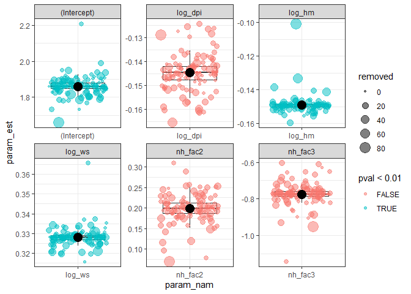
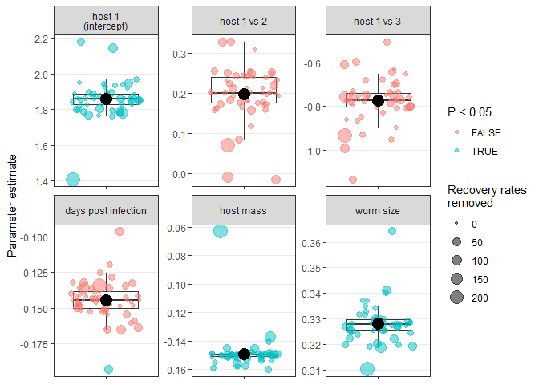
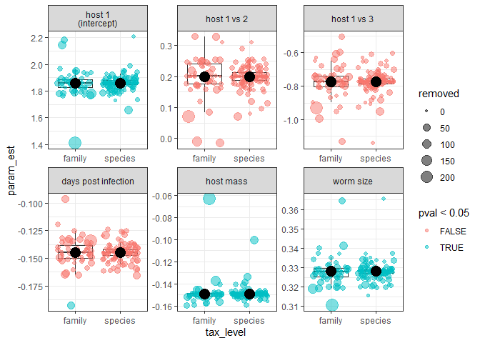

There are taxonomic biases in the recovery rate data (see [here](explore_biases_fam_lev.md)). One might therefore wonder whether our conclusions are dependent on particular taxa. To assess this, we take a "leave-one-out" approach. That is, we loop through our data, leaving out one species at a time.

We loop through the unique species (not stages) in the data, so excluding some species might have a bigger impact than others, because they represent multiple stages. At each iteration, we remove one species, fit a mixed model, and extract the parameters and p-values. The model includes random slopes for study and just the fixed, main effects of time post infection, host number, worm size, and host mass.

Here is the distibution of the parameter estimates when we "leave one species out". The significance of the parameters did not change in any cases. Parameter magnitude was also rather consistent, though the host mass and worm size parameters seem much higher when we left one species out.

<!-- -->
Here are the species that cause the biggest changes in parameter estimates. The host mass effect is weaker (less negative) when Toxascaris leonina is removed. This makes sense because its infectivity was higher in rodents than carnivores (cats and dogs) at the same life stage. The worm size effect is stronger when Taenia hydatigena is removed. This worm also makes sense, because the larvae are quite big, but much of the cysts are fluid filled, so the actual infecting larva is smaller, perhaps resulting in low infectivity.

|param_nam |  param_est|     pval|leave_out          | removed|tax_level |
|:---------|----------:|--------:|:------------------|-------:|:---------|
|log_ws    |  0.3656515| 1.00e-07|Taenia hydatigena  |       7|species   |
|log_hm    | -0.1009045| 8.96e-05|Toxascaris leonina |      83|species   |

Are these patterns the same if we exclude higher taxonomic grouping from the data? Some higher taxa (families) are [overrepresented in the data](explore_biases_fam_lev.md), so instead of species, let's now leave one family out at a time.

Again the parameter estimates do not change signs when we exclude a family.

<!-- -->

Also, the families that most impact worm size and host size parameters remain the same.

|param_nam |  param_est|      pval|leave_out   | removed|tax_level |
|:---------|----------:|---------:|:-----------|-------:|:---------|
|log_ws    |  0.3642443| 0.0000003|Taeniidae   |      41|family    |
|log_hm    | -0.0628486| 0.0274883|Toxocaridae |     222|family    |

We can join together the output from either leaving species and families out of the data. The trends are quite comparable.

<!-- -->

